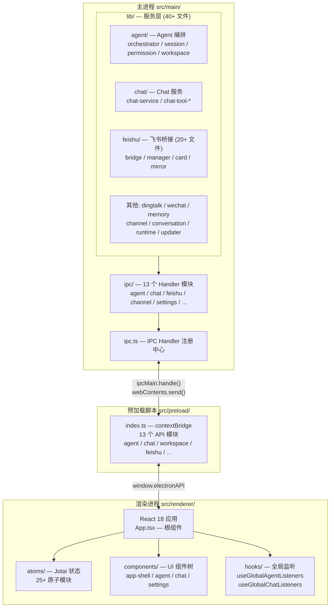
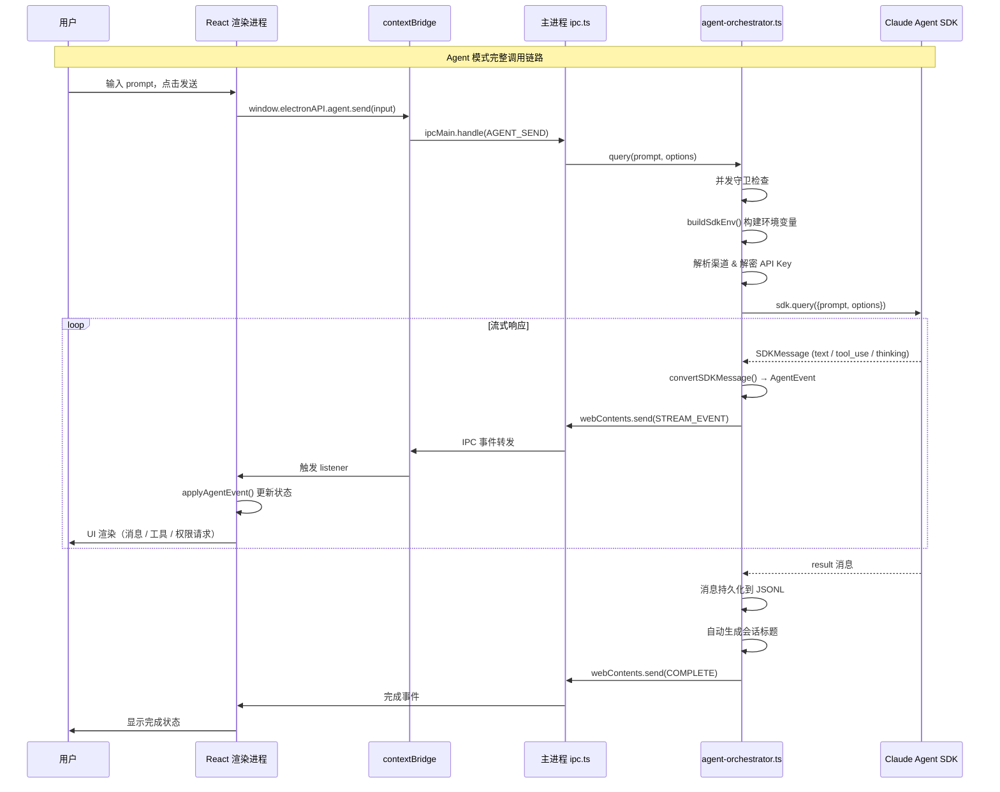

# @proma/electron

Proma Electron 桌面应用主体。集成所有内部包，提供 Chat/Agent 双模式、飞书/钉钉/微信桥接、工作区管理和完整的桌面体验。

## 架构图

## 数据流向图

```mermaid
flowchart LR
    %% 完整数据路径
    user["用户输入"] --> input["ChatInput / AgentInput<br/>React 组件"]
    input --> ipc_call["window.electronAPI.*<br/>IPC 调用"]
    ipc_call --> handler["ipc.ts Handler<br/>主进程处理"]
    handler --> service["chat-service.ts<br/>或 agent-orchestrator.ts"]
    service --> backend["Agent SDK<br/>或 Provider Adapter"]
    backend --> stream["流式响应<br/>webContents.send()"]
    stream --> listener["useGlobalAgentListeners<br/>useGlobalChatListeners"]
    listener --> jotai["store.set(atoms)<br/>Jotai 状态更新"]
    jotai --> rerender["React 重渲染<br/>消息列表 / 工具活动"]
    rerender --> user
```

## 关键时序图

## 重要代码文件导航

### 主进程入口

| 文件 | 职责 |
|------|------|
| `src/main/index.ts` | Electron 主进程入口：单实例锁、userData 隔离、文件关联、协议注册 |
| `src/main/ipc.ts` | IPC Handler 注册中心，聚合所有 ipc/ 模块 |
| `src/main/menu.ts` | 原生菜单栏（macOS 应用菜单 + 快捷键） |
| `src/main/tray.ts` | 系统托盘（图标 + 右键菜单） |

### Agent 核心

| 文件 | 职责 |
|------|------|
| `src/main/lib/agent/agent-orchestrator.ts` | Agent 核心编排层：并发守卫、渠道查找、SDK 调用、事件流转换、自动标题 |
| `src/main/lib/agent/agent-service.ts` | Agent 服务入口：session 生命周期管理 |
| `src/main/lib/agent/agent-session-manager.ts` | Agent 会话 CRUD、JSONL 消息持久化 |
| `src/main/lib/agent/agent-prompt-builder.ts` | 系统提示词构建：动态上下文、工作区注入 |
| `src/main/lib/agent/agent-permission-service.ts` | 工具权限检查：safe/ask/allow-all 模式 |
| `src/main/lib/agent/agent-workspace-manager.ts` | 工作区管理：MCP、Skills、工作区 CRUD |
| `src/main/lib/agent/agent-event-bus.ts` | Agent 事件总线：解耦事件发布与订阅 |
| `src/main/lib/adapters/claude-agent-adapter.ts` | SDK 适配器实现，对接 `@anthropic-ai/claude-agent-sdk` |

### Chat 核心

| 文件 | 职责 |
|------|------|
| `src/main/lib/chat/chat-service.ts` | Chat 流式编排：Provider 适配器集成、消息持久化、AbortController |
| `src/main/lib/conversation/conversation-manager.ts` | 对话 CRUD、JSONL 存储、置顶、上下文分割 |

### 集成服务

| 文件 | 职责 |
|------|------|
| `src/main/lib/feishu/feishu-bridge.ts` | 飞书桥接核心 |
| `src/main/lib/feishu/feishu-bridge-manager.ts` | 飞书多 Bot 桥接管理 |
| `src/main/lib/dingtalk/dingtalk-bridge.ts` | 钉钉桥接 |
| `src/main/lib/wechat/wechat-bridge.ts` | 微信 iLink 桥接 |
| `src/main/lib/memory/memory-service.ts` | 跨会话记忆存储与检索 |
| `src/main/lib/integration/doubao-asr-service.ts` | 豆包流式语音识别 |

### 预加载脚本

| 文件 | 职责 |
|------|------|
| `src/preload/index.ts` | contextBridge 主入口，聚合所有 API 模块 |
| `src/preload/agent-sessions.ts` | Agent 会话相关 API 暴露 |
| `src/preload/chat.ts` | Chat 相关 API 暴露 |
| `src/preload/agent-workspace.ts` | 工作区 & MCP & Skills API 暴露 |

### 渲染进程

| 文件 | 职责 |
|------|------|
| `src/renderer/main.tsx` | React 根挂载 + 初始化组件（主题、更新器、Agent 监听） |
| `src/renderer/App.tsx` | 根组件：三面板布局 + Provider 层级 + 迁移/新手引导 |
| `src/renderer/atoms/agent-atoms.ts` | Agent 状态：会话列表、流式状态、权限/AskUser 队列 |
| `src/renderer/atoms/chat-atoms.ts` | Chat 状态：对话列表、流式状态、模型选择、并排模式 |
| `src/renderer/hooks/useGlobalAgentListeners.ts` | 全局 Agent IPC 监听器：永不销毁，后台会话事件不丢失 |
| `src/renderer/hooks/useGlobalChatListeners.ts` | 全局 Chat IPC 监听器 |
| `src/renderer/components/agent/AgentView.tsx` | Agent 主视图 |
| `src/renderer/components/chat/ChatView.tsx` | Chat 主视图 |
| `src/renderer/components/app-shell/AppShell.tsx` | 三面板外壳布局 |
| `src/renderer/components/settings/` | 设置面板（General/Agent/Appearance/Feishu/Proxy 等 30+ 页面） |

### 配置 & 构建

| 文件 | 职责 |
|------|------|
| `package.json` | 包配置：依赖、脚本、optionalDependencies（SDK 平台子包） |
| `electron-builder.yml` | 打包配置：ASAR、平台目标、SDK native binary 解压 |
| `vite.config.ts` | Vite 构建配置：alias、HMR 端口 |
| `tailwind.config.js` | Tailwind CSS 配置：dark mode='class' |
