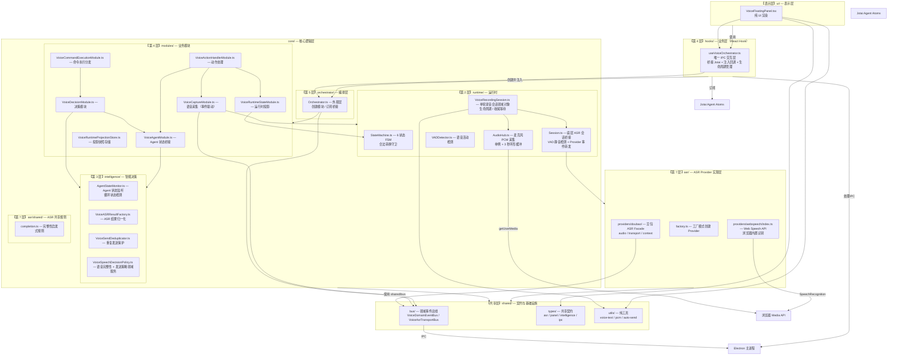
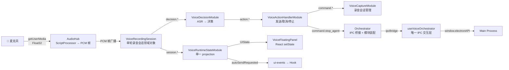
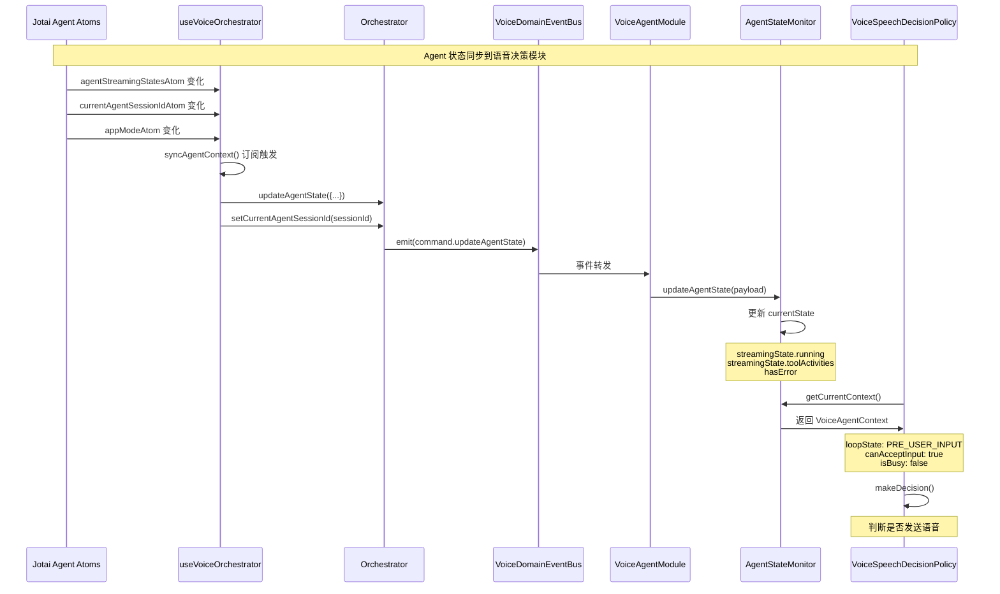
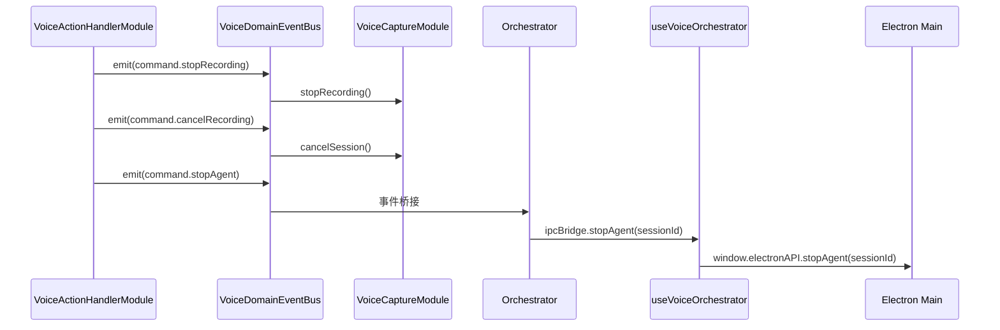
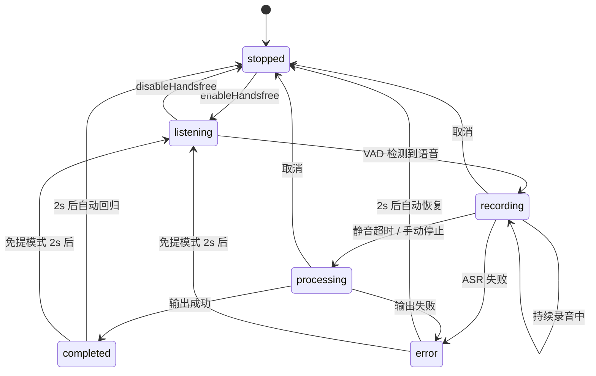
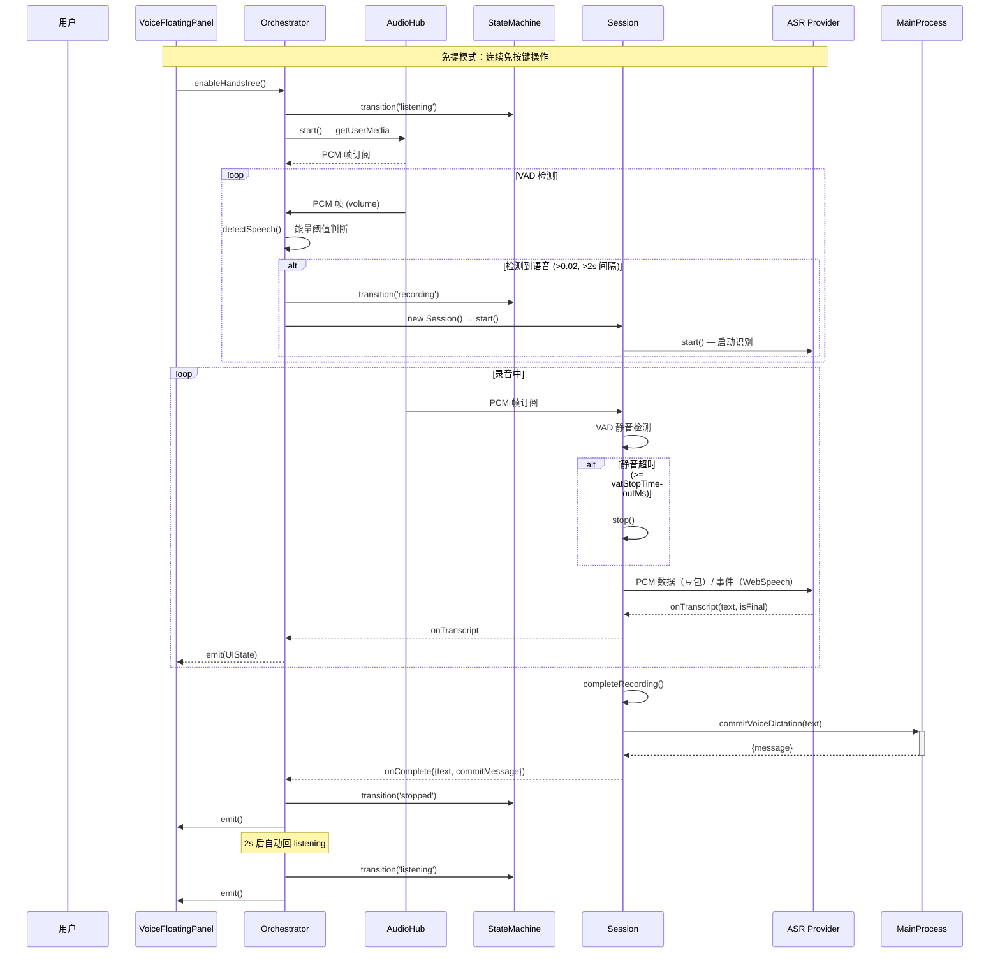
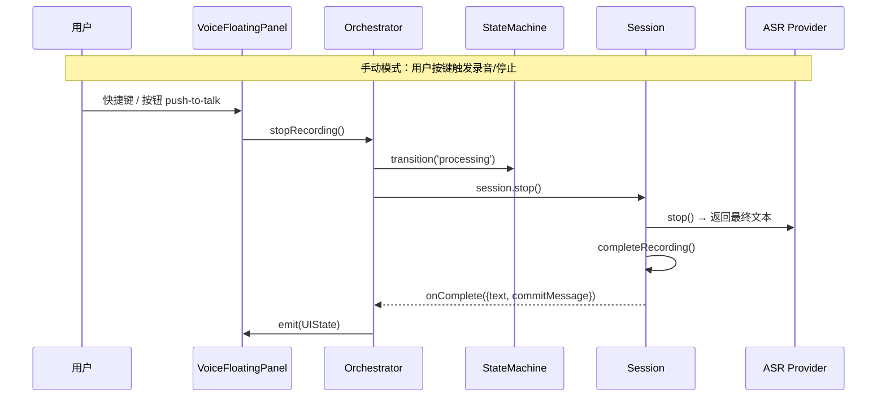
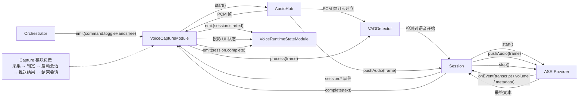

# 语音模块 — Voice Dictation

基于状态机的语音听写模块，支持免提模式和 VAD（语音活动检测）。

## 架构图

## 数据流向图

## Agent 状态同步

语音模块通过事件驱动机制实时监听 Agent 运行状态，用于智能决策何时发送语音文本。

### 状态同步链路

### 命令执行与 IPC 桥接

### 状态判断逻辑

`AgentStateMonitor.detectLoopState()` 根据综合状态判断 Agent 循环状态：

| 状态条件 | 返回的循环状态 | 可接受输入 |
|---------|---------------|----------|
| `hasError === true` | `ERROR_STATE` | ✅ 是 |
| `!running && content === ''` | `PRE_USER_INPUT` | ✅ 是 |
| `running && toolActivities.length > 0` | `TOOL_EXECUTING` | ❌ 否 |
| `running` | `LLM_PROCESSING` | ❌ 否 |
| 有内容但流式结束 | `POST_PROCESSING` | ❌ 否 |

### 关键设计

- **解耦架构**：语音模块通过事件总线与 Agent 状态管理解耦
- **被动更新**：`AgentStateMonitor` 被动接收更新，不主动轮询，并输出 `VoiceAgentContext` 只读快照
- **Hook 桥接**：`useVoiceOrchestrator` Hook 从 Jotai atoms 读取状态并发布事件
- **UI 纯渲染**：`VoiceFloatingPanel` 只负责渲染，业务逻辑在 Hook 中
- **实时响应**：Jotai atoms 变化立即触发 `syncAgentContext()` → 状态同步

## 状态机图

## 关键时序图

### 免提模式自动录音

### 手动录音模式

### Capture 模块时间轴

## 文件职责导航

| 文件 | 职责 |
|------|------|
| `shared/bus/AbstractTypedEventBus.ts` | 通用 typed event bus 基类，统一 `on / emit / clear` 形状 |
| `shared/bus/VoiceDomainEventBus.ts` | 语音领域总线：连接采集、决策、动作、UI 桥接命令 |
| `shared/bus/VoiceAsrTransportBus.ts` | ASR 传输总线：Provider ↔ 主进程的请求/响应通道 |
| `shared/bus/SessionEventBus.ts` | 会话事件总线：Session 内部事件分发 |
| `shared/types/asr.ts` | ASR Provider 接口、事件映射、事件桥接 helper |
| `shared/types/panel.ts` | 面板状态、PCM 帧、Session/UI 通信接口 |
| `shared/types/intelligence.ts` | ASR 结果、AgentContext、VoiceAgentContext、Decision、LogContext 共享契约 |
| `shared/types/voice-dictation-ipc.ts` | hook 层注入的 IPC 回调契约 |
| `shared/utils/voice-text.ts` | 语音文本值对象：归一化、标点、未完成表达判断 |
| `shared/utils/pcm.ts` | PCM 采样率转换、缓冲合并、分片 |
| `shared/utils/auto-send.ts` | 语音文本自动发送判断（always / smart / AI） |
| `core/state/VoiceStateMachine.ts` | 6 状态有限状态机，严格守卫合法转换 |
| `core/state/VoiceRuntimeProjection.ts` | 运行时投影快照，统一承载 UI/上下文写入 |
| `core/state/VoiceRuntimeProjectionStore.ts` | 投影快照存储：统一更新、读取和上下文构造 |
| `core/runtime/AudioHub.ts` | 麦克风 PCM 采集单例，3 秒环形缓冲 |
| `core/runtime/VoiceRecordingSession.ts` | 单轮录音会话领域对象：状态、收尾等待、停止/取消 |
| `core/runtime/Session.ts` | 底层 ASR 会话桥接，内置 VAD 事件转发 |
| `asr/shared/completion.ts` | ASR 文本完整性共享规则：WebSpeech 提升 / 统一判定 |
| `core/intelligence/VoiceASRResultFactory.ts` | ASR 结果工厂：归一化 Provider 元数据 |
| `core/intelligence/VoiceSendDeduplicator.ts` | 发送去重器：短时重复文本保护 |
| `core/intelligence/VoiceSpeechDecisionPolicy.ts` | 语音决策领域服务：语音完整性判断 + 发送策略 |
| `core/orchestrator/Orchestrator.ts` | 外观层：创建模块、桥接事件、接收 hook 注入 IPC |
| `core/intelligence/AgentStateMonitor.ts` | Agent 状态监听器：循环状态检测与只读快照输出 |
| `core/modules/VoiceAgentModule.ts` | Agent 状态桥接模块：维护 Agent 会话 ID，提供 Agent 上下文 |
| `core/modules/VoiceDecisionModule.ts` | 决策模块：ASR 结果 → 决策事件 |
| `core/modules/VoiceCommandExecutionModule.ts` | 决策动作分发：根据发送策略分发动作事件 |
| `core/modules/VoiceActionHandlerModule.ts` | 动作处理模块：执行发送文本、处理即时指令、发布停止命令 |
| `core/modules/VoiceCaptureModule.ts` | 语音采集模块：管理麦克风采集、VAD、录音会话生命周期 |
| `hooks/useVoiceOrchestrator.ts` | 业务层 Hook：唯一 IPC 交互层，桥接 Jotai 与 Orchestrator |
| `ui/VoiceFloatingPanel.tsx` | 纯 UI 渲染组件：通过 Hook 获取状态，只负责渲染 |
| `asr/index.ts` | ASR 目录入口，汇总 provider 与共享类型 |
| `asr/factory.ts` | ASR Provider 工厂函数 |
| `asr/providers/webspeech/index.ts` | Web Speech API 实现，浏览器内置语音识别（零 IPC） |
| `asr/providers/doubao/index.ts` | 豆包 ASR 门面，组合 audio / transport / context |
| `asr/providers/doubao/audio.ts` | PCM 缓冲、分片、发送层 |
| `asr/providers/doubao/transport.ts` | 主进程桥接层，处理 start / state / transcript |
| `asr/providers/doubao/context.ts` | 豆包音频/传输共享上下文 |

## 核心设计原则

1. **单次录音单 Session** — 每轮录音创建一个独立的 Session 实例，不跨轮泄漏状态
2. **AudioHub 单例** — 整个应用只有一个 `getUserMedia` 调用，VAD 和 Session 通过 `subscribe()` 接收 PCM 帧
3. **FSM 严格守卫** — 每个状态转换都经过 `VALID_TRANSITIONS` 表校验，拒绝非法跳转
4. **Hook 业务隔离** — 业务逻辑封装在 `useVoiceOrchestrator` Hook 中，UI 组件只做纯渲染
5. **Orchestrator 中控** — 负责模块装配、事件桥接和生命周期管理，不直接承载业务规则
6. **单一投影写入** — `VoiceRuntimeStateModule` 通过 `VoiceRuntimeProjection` 统一管理 UI/上下文写入
7. **静音检测与自动重连** — 免提模式下 VAD 检测到语音自动启动录音，完成后 2 秒自动回归 listening 状态
