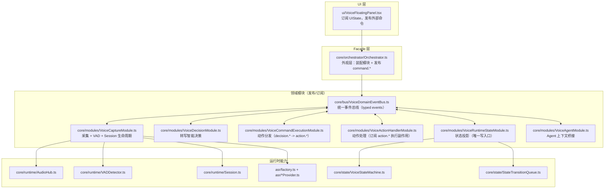
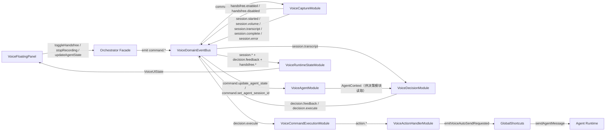
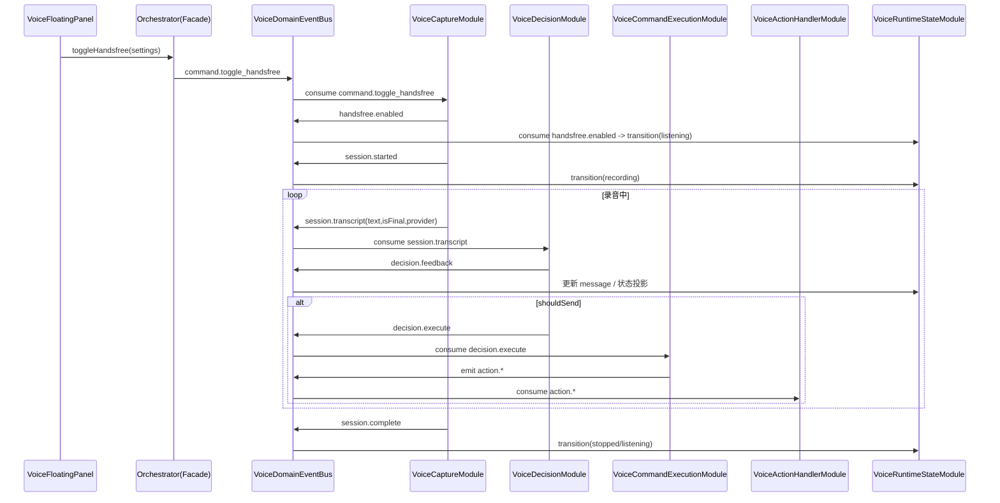

# 语音模块 — Voice Dictation

当前语音模块已从“单体 Orchestrator 编排”演进为“**事件总线 + 模块发布/订阅**”架构。  
`core/orchestrator/Orchestrator.ts` 仅作为 Facade，对外保持 API，不再承载业务流程。

## 架构图（模块关系）

## 数据流向图（事件驱动）

## 关键时序图（免提到自动发送）

## 重要文件导航（按职责）

| 文件 | 职责 |
|---|---|
| `core/orchestrator/Orchestrator.ts` | Facade：对外 API、模块装配、生命周期管理 |
| `core/bus/VoiceDomainEventBus.ts` | 统一领域事件契约与发布/订阅实现 |
| `core/bus/SessionEventBus.ts` | 单轮录音会话事件总线 |
| `core/modules/VoiceCaptureModule.ts` | 采集/VAD/Session 链路，发布 `session.*` |
| `core/modules/VoiceDecisionModule.ts` | 消费 `session.transcript`，发布 `decision.*` |
| `core/modules/VoiceCommandExecutionModule.ts` | 消费 `decision.execute`，发布 `action.*` |
| `core/modules/VoiceActionHandlerModule.ts` | 消费 `action.*`，执行发送/打断/状态迁移 |
| `core/modules/VoiceRuntimeStateModule.ts` | 状态机投影（唯一状态写入口） |
| `core/modules/VoiceAgentModule.ts` | Agent 状态桥接，提供 `AgentContext` |
| `core/runtime/AudioHub.ts` | 麦克风 PCM 采集与帧广播 |
| `core/runtime/VADDetector.ts` | 自适应语音活动检测 |
| `core/runtime/Session.ts` | 单轮录音会话生命周期 |
| `core/state/VoiceStateMachine.ts` | 语音状态机 |
| `core/state/StateTransitionQueue.ts` | 状态迁移排队执行 |
| `asr/factory.ts` | ASR Provider 工厂 |
| `asr/doubao.ts` | 豆包 ASR Provider |
| `asr/webspeech.ts` | WebSpeech Provider |
| `ui-events/voice-dictation-events.ts` | UI 侧全局事件（设置变更、自动发送请求） |
| `ui-events/log-events.ts` | 日志事件发射/订阅工具 |

## 当前设计原则

1. **Facade 最小化**：Facade 只发布命令，不直接执行业务分支。  
2. **总线协作**：模块间不互相调用实现，统一经 `VoiceDomainEventBus` 协作。  
3. **状态单写口**：状态写入只在 `VoiceRuntimeStateModule`，降低竞态。  
4. **动作事件收口**：发送/打断等副作用统一由 `action.*` 事件链处理。  
5. **运行时与策略分层**：采集链路（Capture）与决策链路（Decision）解耦。  
