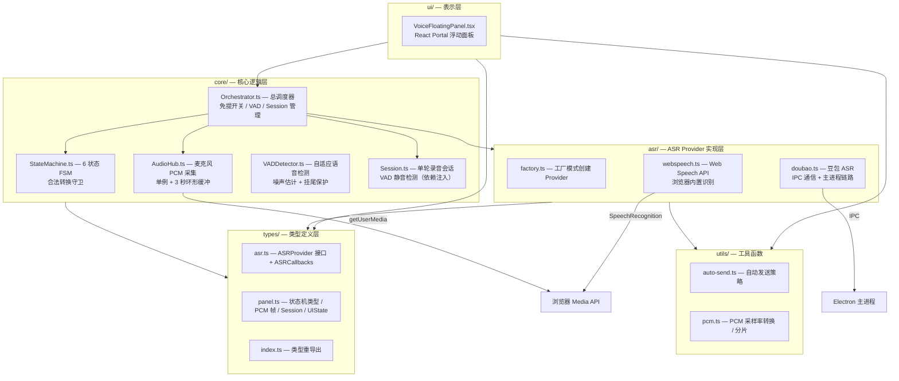
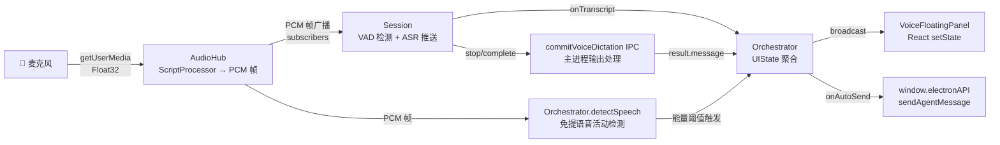
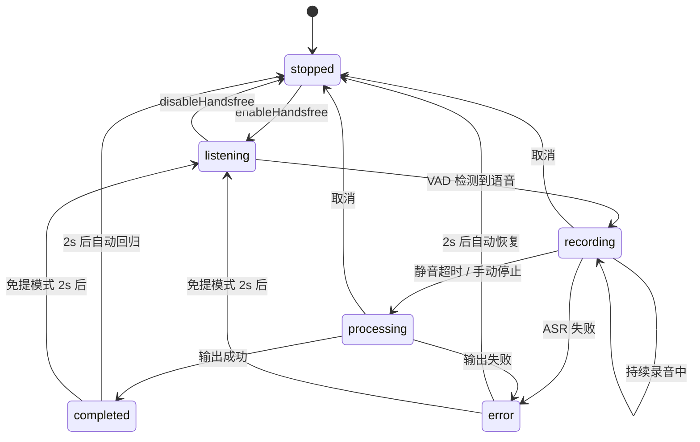
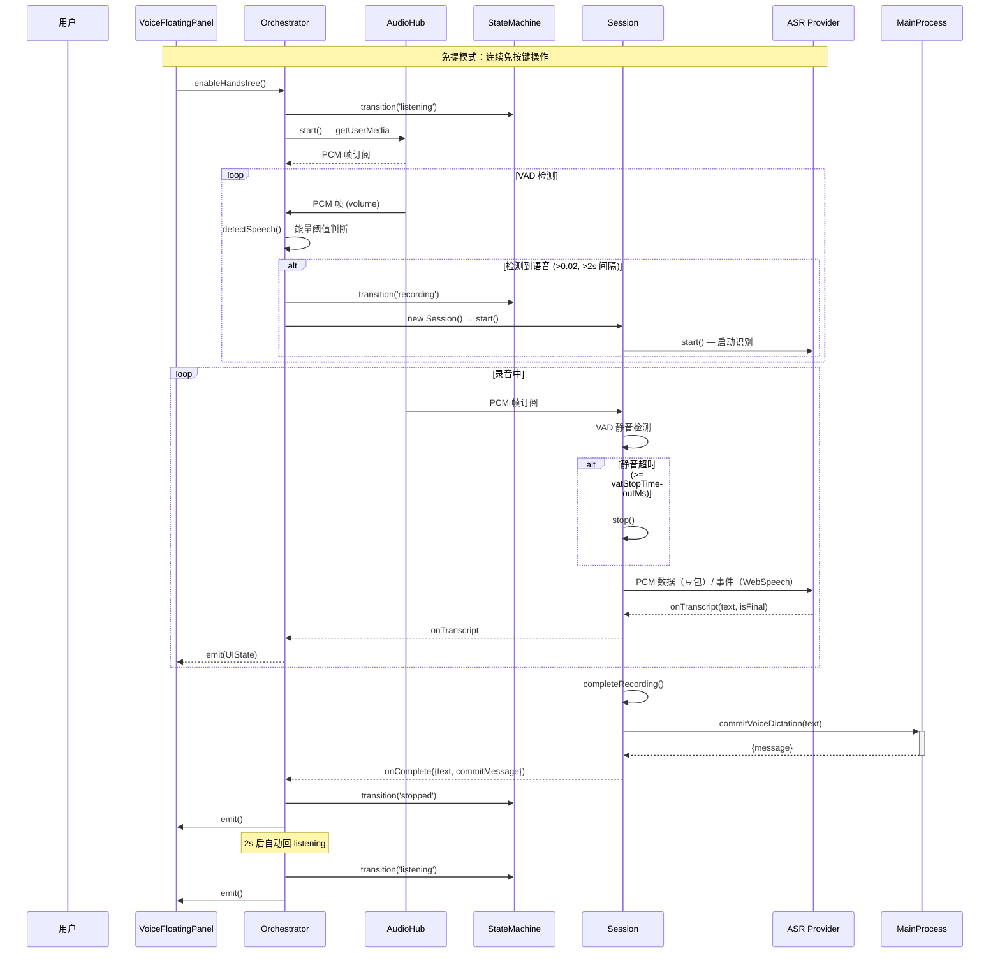
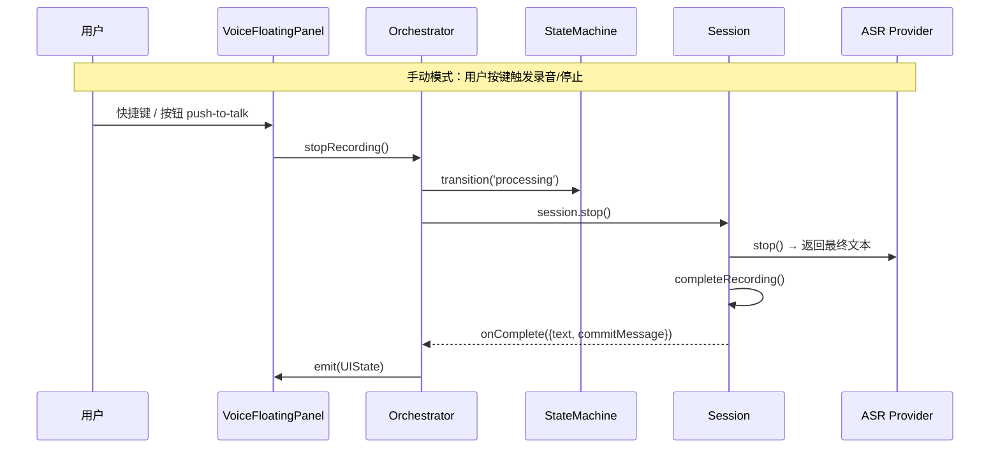

# 语音模块 — Voice Dictation

基于状态机的语音听写模块，支持免提模式和 VAD（语音活动检测）。

## 架构图



## 数据流向图



## 状态机图



## 关键时序图

### 免提模式自动录音



### 手动录音模式



## 文件职责导航

| 文件 | 职责 |
|------|------|
| `types/asr.ts` | ASR Provider 接口定义（ASRProvider / ASRCallbacks / ASRProviderType） |
| `types/panel.ts` | 面板状态机类型（PanelState / DetectorState / VoiceUIState）、PCM 帧、Session/UI 通信接口 |
| `types/index.ts` | 类型重导出入口 |
| `core/StateMachine.ts` | 6 状态有限状态机，严格守卫合法转换 |
| `core/AudioHub.ts` | 麦克风 PCM 采集单例，3 秒环形缓冲，发布-订阅模式 |
| `core/VADDetector.ts` | 自适应 VAD：噪声底噪 EMA 估计、连续帧确认、挂尾保护 |
| `core/Session.ts` | 单轮录音会话生命周期管理（start→stop→complete→dispose），通过 VADDetector.isSpeaking 做静音检测 |
| `core/Orchestrator.ts` | 总调度器：AudioHub 持有、免提开关、VADDetector 管理、Session 创建/销毁、UIState 广播、ASR Provider 创建 |
| `asr/factory.ts` | ASR Provider 工厂函数 |
| `asr/webspeech.ts` | Web Speech API 实现，浏览器内置语音识别（零 IPC） |
| `asr/doubao.ts` | 豆包 ASR 实现，通过 IPC 与主进程通信 |
| `ui/VoiceFloatingPanel.tsx` | React Portal 浮动面板 UI，纯状态观察者 |
| `utils/auto-send.ts` | 语音识别文本自动发送判断（always / smart / AI 三种策略） |
| `utils/pcm.ts` | PCM 音频工具函数：采样率转换、缓冲合并、分片 |

## 依赖关系图（修复后）

```
types/  ←  asr/  ←  core/Orchestrator  →  utils/
          ↑              │
          │              ├→ core/AudioHub      (只依赖 types)
          │              ├→ core/StateMachine   (只依赖 types)
          │              ├→ core/Session        (依赖 types + 注入的 subscribe/provider)
          │              └→ asr/factory → {DoubaoProvider, WebSpeechProvider}
          │
          └— core/Orchestrator 是唯一的"知情人"，负责组装所有依赖

Session 不再 import:
  ✗ import type { AudioHub }           ← 同级横向依赖
  ✗ import { createASRProvider }       ← 向下游直接调用
  ✗ import 来自 utils/pcm              ← 未使用代码

Session 的依赖全部来自 types/ + 构造函数注入:
  ✓ type PcmSubscriber — 由 subscribe 函数类型携带
  ✓ type ASRProvider   — 由 provider 参数携带
  ✓ VoiceDictationSettings, SessionCallbacks
```

## 核心设计原则

1. **单次录音单 Session** — 每轮录音创建一个独立的 Session 实例，不跨轮泄漏状态
2. **AudioHub 单例** — 整个应用只有一个 `getUserMedia` 调用，VAD 和 Session 通过 `subscribe()` 接收 PCM 帧
3. **FSM 严格守卫** — 每个状态转换都经过 `VALID_TRANSITIONS` 表校验，拒绝非法跳转
4. **Orchestrator 中控** — 所有状态的变更和 UI 广播都经过 Orchestrator，React 层只做纯渲染
5. **依赖倒置** — Session 不依赖具体实现（AudioHub / VADDetector / ASR Provider），通过构造函数注入 `subscribe` 函数、`VADDetector` 和 `ASRProvider` 接口。Orchestrator 负责组装所有依赖，`core/` 内部不产生同级横向依赖
6. **静音检测与自动重连** — 免提模式下 VAD 检测到语音自动启动录音，完成后 2 秒自动回归 listening 状态
