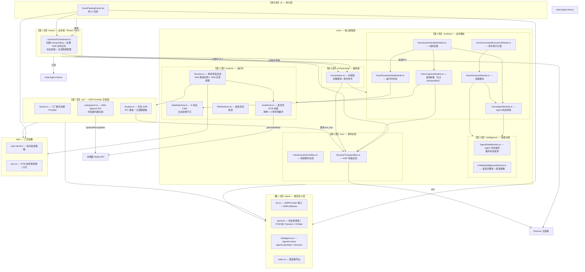
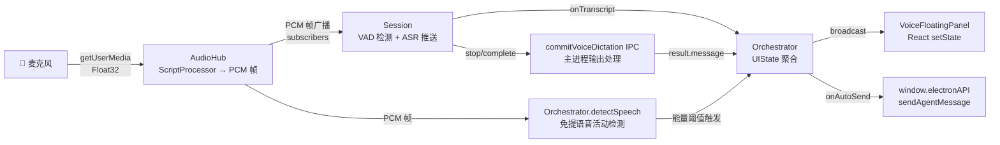
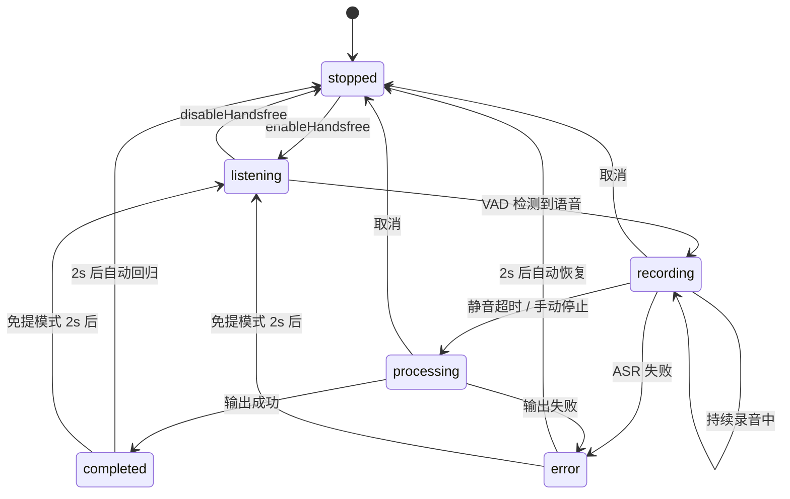
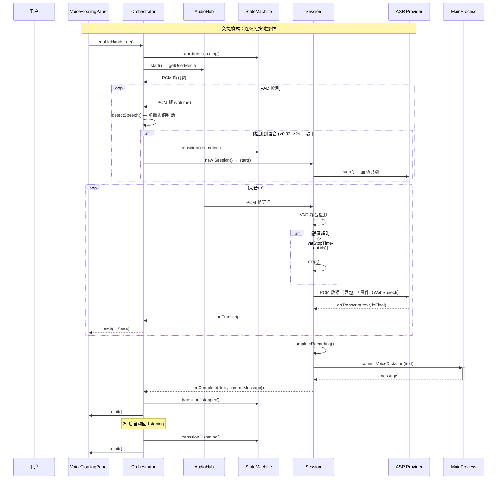
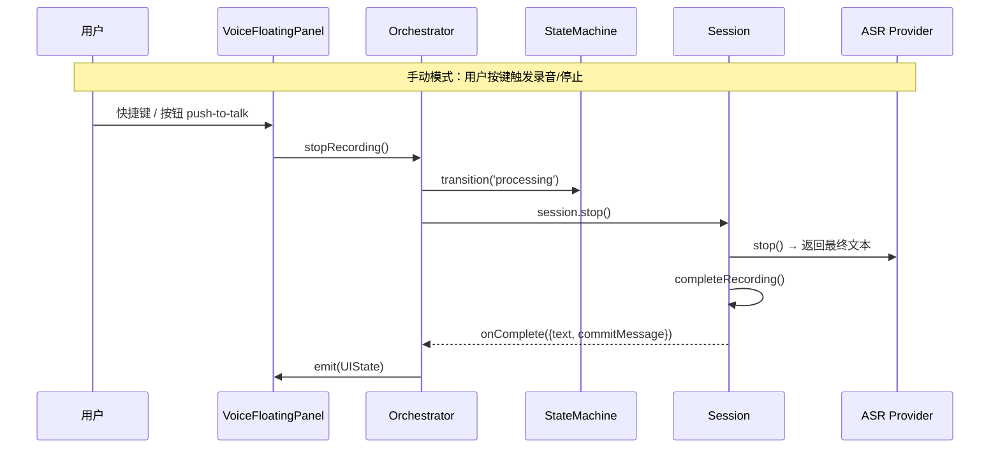

# 语音模块 — Voice Dictation

基于状态机的语音听写模块，支持免提模式和 VAD（语音活动检测）。

## 架构图

## 数据流向图

## Agent 状态同步

语音模块通过事件驱动机制实时监听 Agent 运行状态，用于智能决策何时发送语音文本。

### 状态同步链路

### 状态判断逻辑

`AgentStateMonitor.detectLoopState()` 根据综合状态判断 Agent 循环状态：

| 状态条件 | 返回的循环状态 | 可接受输入 |
|---------|---------------|----------|
| `hasError === true` | `ERROR_STATE` | ✅ 是 |
| `!running && content === ''` | `PRE_USER_INPUT` | ✅ 是 |
| `running && toolActivities.length > 0` | `TOOL_EXECUTING` | ❌ 否 |
| `running` | `LLM_PROCESSING` | ❌ 否 |
| 有内容但流式结束 | `POST_PROCESSING` | ❌ 否 |

### 关键设计

- **解耦架构**：语音模块通过事件总线与 Agent 状态管理解耦
- **被动更新**：`AgentStateMonitor` 被动接收更新，不主动轮询
- **Hook 桥接**：`useVoiceOrchestrator` Hook 从 Jotai atoms 读取状态并发布事件
- **UI 纯渲染**：`VoiceFloatingPanel` 只负责渲染，业务逻辑在 Hook 中
- **实时响应**：Jotai atoms 变化立即触发 `syncAgentContext()` → 状态同步

## 状态机图

## 关键时序图

### 免提模式自动录音

### 手动录音模式

## 文件职责导航

| 文件 | 职责 |
|------|------|
| `types/asr.ts` | ASR Provider 接口定义（ASRProvider / ASRCallbacks / ASRProviderType） |
| `types/panel.ts` | 面板状态机类型（PanelState / DetectorState / VoiceUIState）、PCM 帧、Session/UI 通信接口 |
| `types/index.ts` | 类型重导出入口 |
| `core/StateMachine.ts` | 6 状态有限状态机，严格守卫合法转换 |
| `core/AudioHub.ts` | 麦克风 PCM 采集单例，3 秒环形缓冲，发布-订阅模式 |
| `core/Session.ts` | 单轮录音会话生命周期管理（start→stop→complete→dispose），内置 VAD 静音检测 |
| `core/Orchestrator.ts` | 总调度器：AudioHub 持有、免提开关、VAD 语音活动检测、Session 创建/销毁、UIState 广播 |
| `core/intelligence/AgentStateMonitor.ts` | Agent 状态监听器：实时监听 Agent 对话状态、精确检测循环状态、判断用户输入时机 |
| `core/intelligence/UnifiedIntelligenceDetector.ts` | 智能决策引擎：语音完整性检测 + 自动发送策略判断 |
| `core/modules/VoiceAgentModule.ts` | Agent 状态桥接模块：订阅领域事件，维护 Agent 会话 ID，提供 Agent 上下文 |
| `core/modules/VoiceDecisionModule.ts` | 决策模块：ASR 结果 → 决策事件（是否发送、发送策略） |
| `core/modules/VoiceCommandExecutionModule.ts` | 决策动作分发：根据发送策略分发到不同动作处理器 |
| `core/modules/VoiceActionHandlerModule.ts` | 动作处理模块：执行发送文本、处理即时指令、停止 Agent |
| `core/modules/VoiceCaptureModule.ts` | 语音采集模块：接受外部注入的 transportBus，管理麦克风采集、VAD 检测、录音会话生命周期 |
| `core/orchestrator/Orchestrator.ts` | 外观层（Facade）：创建各模块、发布命令到事件总线、管理生命周期、接受 transportBus 注入 |
| `core/bus/VoiceAsrTransportBus.ts` | ASR 对外交互总线：处理 Provider 与主进程间的异步请求/响应 |
| `hooks/useVoiceOrchestrator.ts` | 业务层 Hook：创建 transportBus、处理 ASR 对外交互（IPC 请求/事件）、创建和管理 Orchestrator 生命周期、桥接 Jotai Agent Atoms |
| `ui/VoiceFloatingPanel.tsx` | 纯 UI 渲染组件：通过 Hook 获取状态，只负责渲染 |
| `asr/factory.ts` | ASR Provider 工厂函数 |
| `asr/webspeech.ts` | Web Speech API 实现，浏览器内置语音识别（零 IPC） |
| `asr/doubao.ts` | 豆包 ASR 实现，通过 VoiceAsrTransportBus 与主进程通信 |
| `utils/auto-send.ts` | 语音识别文本自动发送判断（always / smart / AI 三种策略） |
| `utils/pcm.ts` | PCM 音频工具函数：采样率转换、缓冲合并、分片 |

## 核心设计原则

1. **单次录音单 Session** — 每轮录音创建一个独立的 Session 实例，不跨轮泄漏状态
2. **AudioHub 单例** — 整个应用只有一个 `getUserMedia` 调用，VAD 和 Session 通过 `subscribe()` 接收 PCM 帧
3. **FSM 严格守卫** — 每个状态转换都经过 `VALID_TRANSITIONS` 表校验，拒绝非法跳转
4. **Hook 业务隔离** — 业务逻辑封装在 `useVoiceOrchestrator` Hook 中，UI 组件只做纯渲染
5. **Orchestrator 中控** — 所有状态的变更和 UI 广播都经过 Orchestrator
6. **静音检测与自动重连** — 免提模式下 VAD 检测到语音自动启动录音，完成后 2 秒自动回归 listening 状态
