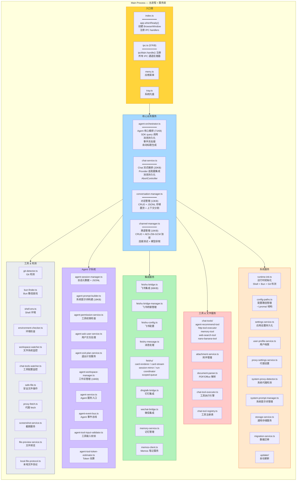

# 06 — 主进程 + 服务层

> **目录**: [`apps/electron/src/main/`](../../apps/electron/src/main/)
> **上游**: [05-electron-app](./05-electron-app.md)
> **下游**: [07-electron-preload](./07-electron-preload.md) · [08-electron-renderer](./08-electron-renderer.md)

## 架构图



## 服务分层详解

### 入口层

| 文件 | 大小 | 职责 |
|------|------|------|
| [`index.ts`](../../apps/electron/src/main/index.ts) | — | app.whenReady()、创建窗口、注册所有 IPC |
| [`ipc.ts`](../../apps/electron/src/main/ipc.ts) | 57KB | 所有 `ipcMain.handle()` 处理器注册 |
| [`menu.ts`](../../apps/electron/src/main/menu.ts) | — | 应用菜单定义 |
| [`tray.ts`](../../apps/electron/src/main/tray.ts) | — | 系统托盘图标和菜单 |

### 核心业务服务

| 服务 | 文件 | 大小 | 核心职责 |
|------|------|------|----------|
| Agent 编排 | [`agent-orchestrator.ts`](../../apps/electron/src/main/lib/agent-orchestrator.ts) | 71KB | SDK query() 调用、并发守卫、消息持久化、事件流处理、自动标题 |
| Chat 编排 | [`chat-service.ts`](../../apps/electron/src/main/lib/chat-service.ts) | 20KB | Provider 适配器流式调用、消息持久化、AbortController |
| 对话管理 | [`conversation-manager.ts`](../../apps/electron/src/main/lib/conversation-manager.ts) | 13KB | 对话 CRUD、JSONL 存储、置顶、上下文分割 |
| 渠道管理 | [`channel-manager.ts`](../../apps/electron/src/main/lib/channel-manager.ts) | 16KB | 渠道 CRUD、API Key AES-256-GCM 加密、连接测试 |

### Agent 子系统

| 服务 | 文件 | 职责 |
|------|------|------|
| 会话管理 | [`agent-session-manager.ts`](../../apps/electron/src/main/lib/agent-session-manager.ts) | SDK 消息持久化、会话元数据 CRUD、JSONL 存储 |
| 提示词构建 | [`agent-prompt-builder.ts`](../../apps/electron/src/main/lib/agent-prompt-builder.ts) | 动态上下文构建、内置 Agent 构建 |
| 权限管理 | [`agent-permission-service.ts`](../../apps/electron/src/main/lib/agent-permission-service.ts) | 工具权限检查、权限模式管理 |
| 用户交互 | [`agent-ask-user-service.ts`](../../apps/electron/src/main/lib/agent-ask-user-service.ts) | AskUser 请求处理 |
| 工作区管理 | [`agent-workspace-manager.ts`](../../apps/electron/src/main/lib/agent-workspace-manager.ts) | 工作区 CRUD、MCP/Skills 配置 |
| 事件总线 | [`agent-event-bus.ts`](../../apps/electron/src/main/lib/agent-event-bus.ts) | Agent 事件发布/订阅 |
| 输入校验 | [`agent-tool-input-validator.ts`](../../apps/electron/src/main/lib/agent-tool-input-validator.ts) | 工具调用参数校验 |
| Token 估算 | [`agent-tool-token-estimator.ts`](../../apps/electron/src/main/lib/agent-tool-token-estimator.ts) | Token 用量估算 |

### 集成服务

| 服务 | 文件 | 说明 |
|------|------|------|
| 飞书桥接 | [`feishu-bridge.ts`](../../apps/electron/src/main/lib/feishu-bridge.ts) | 消息同步、任务通知、OAuth 认证 |
| 飞书管理 | [`feishu-bridge-manager.ts`](../../apps/electron/src/main/lib/feishu-bridge-manager.ts) | 桥接生命周期管理 |
| 飞书卡片 | [`feishu/`](../../apps/electron/src/main/lib/feishu/) | card-renderer、card-stream、run-coordinator、scoped-queue |
| 钉钉 | [`dingtalk-bridge.ts`](../../apps/electron/src/main/lib/dingtalk-bridge.ts) | 钉钉消息集成 |
| 微信 | [`wechat-bridge.ts`](../../apps/electron/src/main/lib/wechat-bridge.ts) | 微信消息集成 |
| 记忆服务 | [`memory-service.ts`](../../apps/electron/src/main/lib/memory-service.ts) | 跨会话记忆存储与检索 |

## 核心数据流

```
Renderer (window.electronAPI.xxx)
    │
    ▼
ipc.ts (ipcMain.handle)
    │
    ├─ Chat 请求 → chat-service.ts
    │   └─ provider-registry.getAdapter() → SSE Stream → webContents.send()
    │
    ├─ Agent 请求 → agent-service.ts → agent-orchestrator.ts
    │   └─ sdk.query() → SDKMessage 流 → convertSDKMessage() → webContents.send()
    │
    └─ 配置请求 → channel-manager / settings-service / ...
        └─ ~/.proma/ 文件读写 → 返回结果
```

---

## IPC 通信四层链路（Preload 桥接层）

```
 ┌──────────────────────────────────────────────────────────────────┐
 │ ① shared/ 类型定义                                               │
 │   IPC_CHANNELS, CHAT_IPC_CHANNELS, AGENT_IPC_CHANNELS ...         │
 │   Request/Response 类型接口                                       │
 └────────────────────────────┬─────────────────────────────────────┘
                              │ 被 ②③④ 三重引用
 ┌────────────────────────────▼─────────────────────────────────────┐
 │ ② main/ipc.ts (主进程)                                           │
 │   ipcMain.handle(CHAT_IPC_CHANNELS.SEND_MESSAGE, async (e, req)   │
 │     => chatService.sendMessage(req))                               │
 └────────────────────────────┬─────────────────────────────────────┘
                              │ IPC 通道
 ┌────────────────────────────▼─────────────────────────────────────┐
 │ ③ preload/index.ts (桥接)                                        │
 │   contextBridge.exposeInMainWorld('electronAPI', {                │
 │     sendMessage: (req: SendMessageRequest) =>                     │
 │       ipcRenderer.invoke(CHAT_IPC_CHANNELS.SEND_MESSAGE, req),    │
 │   })                                                              │
 └────────────────────────────┬─────────────────────────────────────┘
                              │ contextBridge
 ┌────────────────────────────▼─────────────────────────────────────┐
 │ ④ renderer/ (渲染进程)                                           │
 │   const result = await window.electronAPI.sendMessage(req);       │
 │   // 类型安全，IDE 自动补全                                       │
 └──────────────────────────────────────────────────────────────────┘
```

### Preload 暴露的 API 分组

| API 分组 | 示例方法 | 对应 IPC 通道组 |
|----------|----------|-----------------|
| **运行时** | `getRuntimeInfo()`, `checkGit()` | `IPC_CHANNELS` |
| **Chat** | `sendMessage()`, `stopGeneration()` | `CHAT_IPC_CHANNELS` |
| **Agent** | `sendAgentInput()`, `stopAgent()` | `AGENT_IPC_CHANNELS` |
| **渠道** | `addChannel()`, `testConnection()` | `CHANNEL_IPC_CHANNELS` |
| **对话** | `getConversations()`, `deleteConversation()` | `CONVERSATION_IPC_CHANNELS` |
| **Agent 会话** | `getAgentSessions()`, `deleteSession()` | `AGENT_SESSION_IPC_CHANNELS` |
| **设置** | `getSettings()`, `updateSettings()` | `SETTINGS_IPC_CHANNELS` |
| **文件** | `openFileDialog()`, `readFile()` | `FILE_IPC_CHANNELS` |
| **飞书** | `connectFeishu()`, `syncMessages()` | `FEISHU_IPC_CHANNELS` |
| **代理** | `getProxySettings()`, `setProxy()` | `PROXY_IPC_CHANNELS` |
| **更新** | `checkForUpdates()`, `installUpdate()` | `UPDATER_IPC_CHANNELS` |

### 核心约束

- **Preload 不能直接访问 Node.js API**（安全隔离）
- **所有通信必须通过 `ipcRenderer.invoke` / `ipcRenderer.on`**
- **`contextBridge` 确保渲染进程无法直接访问 `require`**
- **类型安全由 `@proma/shared` 的类型定义保障**

---

<p align="center">
<b>⬇ 下游</b>: <a href="./08-electron-renderer.md">08-electron-renderer</a> ·
<a href="./10-voice-dictation-ipc.md">10-voice-dictation-ipc</a>
</p>
