# 08 — 渲染进程 React UI

> **目录**: [`apps/electron/src/renderer/`](../../apps/electron/src/renderer/)
> **上游**: [05-electron-app](./05-electron-app.md) · [07-electron-preload](./07-electron-preload.md)

## 架构图

```mermaid
graph TB
    subgraph Renderer["Renderer — React UI + Jotai 状态管理"]
        direction TB

        subgraph Entry["入口"]
            main_tsx["main.tsx<br/>━━━━━━━━━━<br/>ReactDOM.createRoot<br/>初始化组件挂载"]
            app_tsx["App.tsx<br/>━━━━━━━━━━<br/>应用根组件<br/>路由 + 全局 Provider"]
        end

        subgraph InitComponents["初始化组件 (main.tsx 挂载)"]
            theme_init["ThemeInitializer<br/>加载主题 + 系统主题监听"]
            agent_settings_init["AgentSettingsInitializer<br/>加载 Agent 渠道/模型/工作区"]
            agent_listeners_init["AgentListenersInitializer<br/>挂载 useGlobalAgentListeners"]
            updater_init["UpdaterInitializer<br/>订阅自动更新事件"]
        end

        subgraph AppShell["app-shell/ — 三面板布局"]
            app_shell["AppShell.tsx<br/>━━━━━━━━━━<br/>三面板布局容器"]
            left_sidebar["LeftSidebar.tsx<br/>模式切换 + 对话列表<br/>日期分组 + 流式指示器"]
            nav_panel["NavigatorPanel.tsx<br/>标签页导航"]
            right_panel["RightSidePanel.tsx<br/>详情/文件浏览器"]
            search["SearchDialog.tsx<br/>全局搜索"]
        end

        subgraph ChatComponents["chat/ — Chat 模式"]
            chat_view["ChatView.tsx<br/>消息加载 + 流式订阅"]
            chat_header["ChatHeader.tsx<br/>模型选择 + 上下文设置"]
            chat_input["ChatInput.tsx<br/>TipTap 富文本编辑器"]
            chat_msgs["ChatMessages.tsx<br/>消息列表 + 自动滚动"]
            parallel["ParallelChatMessages.tsx<br/>并排对比模式"]
            model_selector["ModelSelector.tsx<br/>模型选择器"]
            context_popover["ContextSettingsPopover.tsx<br/>上下文设置弹窗"]
            sys_prompt_sel["SystemPromptSelector.tsx<br/>系统提示词选择"]
            tool_selector["ToolSelectorPopover.tsx<br/>工具选择器"]
        end

        subgraph AgentComponents["agent/ — Agent 模式"]
            agent_view["AgentView.tsx<br/>纯展示 + 交互"]
            agent_header["AgentHeader.tsx<br/>渠道/模型选择"]
            agent_msgs["AgentMessages.tsx<br/>消息列表 + 工具活动"]
            sdk_renderer["SDKMessageRenderer.tsx<br/>SDK 消息渲染"]
            tool_activity["Tool Blocks<br/>工具调用展示"]
            perm_banner["PermissionBanner.tsx<br/>权限请求 UI"]
            ask_banner["AskUserBanner.tsx<br/>问答请求 UI"]
            task_card["TaskProgressCard.tsx<br/>任务进度卡片"]
            active_tasks["ActiveTasksBar.tsx<br/>活跃任务栏"]
            bg_tasks["BackgroundTasksPanel.tsx<br/>后台任务面板"]
            ws_selector["WorkspaceSelector.tsx<br/>工作区切换"]
            perm_mode["PermissionModeSelector.tsx<br/>权限模式切换"]
        end

        subgraph AIElements["ai-elements/ — AI 展示组件"]
            msg["message.tsx<br/>消息渲染"]
            reasoning["reasoning.tsx<br/>推理过程折叠"]
            ctx_divider["context-divider.tsx<br/>上下文分割线"]
            rich_input["rich-text-input.tsx<br/>富文本输入"]
            sticky["sticky-user-message.tsx<br/>用户消息固定"]
            minimap["scroll-minimap.tsx<br/>滚动缩略图"]
            speech["speech-button.tsx<br/>语音输入按钮"]
        end

        subgraph SettingsComponents["settings/ — 设置面板"]
            settings_panel["SettingsPanel.tsx<br/>设置面板容器"]
            general["GeneralSettings.tsx<br/>用户档案"]
            appearance["AppearanceSettings.tsx<br/>主题设置"]
            channel_settings["ChannelSettings.tsx<br/>渠道管理"]
            channel_form["ChannelForm.tsx<br/>Provider 配置"]
            agent_settings["AgentSettings.tsx<br/>Agent 渠道/工作区/MCP"]
            mcp_form["McpServerForm.tsx<br/>MCP 服务器配置"]
            feishu_settings["FeishuSettings.tsx<br/>飞书集成"]
            about["AboutSettings.tsx<br/>版本/更新"]
            prompts["PromptSettings.tsx<br/>系统提示词"]
            proxy["ProxySettings.tsx<br/>代理设置"]
            shortcut["ShortcutSettings.tsx<br/>快捷键设置"]
            memory_s["MemorySettings.tsx<br/>记忆设置"]
            storage_s["StorageSettings.tsx<br/>存储设置"]
            tool_s["ToolSettings.tsx<br/>工具设置"]
        end

        subgraph Atoms["atoms/ — Jotai 状态管理"]
            chat_atoms["chat-atoms.ts<br/>对话列表/消息/流式状态<br/>模型选择/上下文/附件"]
            agent_atoms["agent-atoms.ts<br/>Agent 会话/流式状态<br/>权限/问答请求队列"]
            active_view["active-view.ts<br/>主面板视图切换"]
            app_mode["app-mode.ts<br/>Chat / Agent 模式"]
            theme["theme.ts<br/>light / dark / system"]
            user_profile["user-profile.ts<br/>用户档案"]
            settings_tab["settings-tab.ts<br/>设置页标签"]
            updater_a["updater.ts<br/>自动更新状态"]
            sidebar["sidebar-atoms.ts<br/>侧边栏状态"]
            search_a["search-atoms.ts<br/>搜索状态"]
            tab["tab-atoms.ts<br/>标签页管理"]
            preview["preview-atoms.ts<br/>预览状态"]
            feishu_a["feishu-atoms.ts<br/>飞书状态"]
            dingtalk_a["dingtalk-atoms.ts<br/>钉钉状态"]
            wechat_a["wechat-atoms.ts<br/>微信状态"]
            env["environment.ts<br/>环境状态"]
            ui_prefs["ui-preferences.ts<br/>UI 偏好设置"]
            draft["draft-session-atoms.ts<br/>草稿会话"]
            short_a["shortcut-atoms.ts<br/>快捷键状态"]
            sp_a["system-prompt-atoms.ts<br/>系统提示词状态"]
        end

        subgraph HooksLayer["hooks/ — 全局 Hooks"]
            global_agent["useGlobalAgentListeners.ts<br/>━━━━━━━━━━<br/>全局 Agent IPC 监听<br/>永不销毁<br/>直接操作 atoms"]
            global_chat["useGlobalChatListeners.ts<br/>━━━━━━━━━━<br/>全局 Chat IPC 监听"]
            bg_tasks_hook["useBackgroundTasks.ts<br/>后台任务管理"]
            create_session["useCreateSession.ts<br/>创建会话"]
            open_session["useOpenSession.ts<br/>打开会话"]
            close_tab["useCloseTab.tsx<br/>关闭标签页"]
            conv_settings["useConversationSettings.ts<br/>对话设置"]
            ws_actions["useWorkspaceActions.ts<br/>工作区操作"]
            scroll_mem["useScrollPositionMemory.ts<br/>滚动位置记忆"]
            migration["useMigrationImport.ts<br/>迁移导入"]
        end

        Entry --> InitComponents
        Entry --> AppShell
        AppShell --> ChatComponents
        AppShell --> AgentComponents
        AppShell --> SettingsComponents
        ChatComponents --> AIElements
        AgentComponents --> AIElements
        ChatComponents --> Atoms
        AgentComponents --> Atoms
        SettingsComponents --> Atoms
        Atoms --> HooksLayer
        HooksLayer --> Entry
    end

    style Entry fill:#ffd43b,stroke:#f08c00
    style InitComponents fill:#ffe8cc,stroke:#e8590c
    style AppShell fill:#a5d8ff,stroke:#1971c2
    style ChatComponents fill:#b2f2bb,stroke:#2f9e44
    style AgentComponents fill:#d0bfff,stroke:#7048e8
    style AIElements fill:#ffc9c9,stroke:#e03131
    style SettingsComponents fill:#e9ecef,stroke:#495057
    style Atoms fill:#fff3cd,stroke:#ffc107
    style HooksLayer fill:#c3fae8,stroke:#12b886
```



## 初始化组件职责

这 4 个组件在 [`main.tsx`](../../apps/electron/src/renderer/main.tsx) 顶层挂载，确保全局功能不随路由切换丢失：

| 组件 | 职责 | 文件 |
|------|------|------|
| `ThemeInitializer` | 从主进程加载主题、监听系统主题变化、同步到 DOM | — |
| `AgentSettingsInitializer` | 加载 Agent 渠道/模型/工作区、订阅 MCP/文件变化 | — |
| `AgentListenersInitializer` | 挂载 `useGlobalAgentListeners`，永不销毁 | [`hooks/useGlobalAgentListeners.ts`](../../apps/electron/src/renderer/hooks/useGlobalAgentListeners.ts) |
| `UpdaterInitializer` | 订阅主进程推送的更新状态 | — |

## Jotai Atoms 全览

### Chat 域

| Atom 文件 | 状态 |
|-----------|------|
| [`chat-atoms.ts`](../../apps/electron/src/renderer/atoms/chat-atoms.ts) | 对话列表、当前消息、流式状态（Map 支持多对话并行）、模型选择、上下文设置、并排模式、思考模式、待上传附件 |

### Agent 域

| Atom 文件 | 状态 |
|-----------|------|
| [`agent-atoms.ts`](../../apps/electron/src/renderer/atoms/agent-atoms.ts) | Agent 会话列表、当前会话、流式状态（`AgentStreamState`）、工作区选择、渠道选择、权限/AskUser 请求队列（按 sessionId Map） |

### 全局域

| Atom 文件 | 状态 |
|-----------|------|
| [`app-mode.ts`](../../apps/electron/src/renderer/atoms/app-mode.ts) | Chat / Agent 模式切换 |
| [`active-view.ts`](../../apps/electron/src/renderer/atoms/active-view.ts) | 主面板视图（conversations / settings） |
| [`theme.ts`](../../apps/electron/src/renderer/atoms/theme.ts) | light / dark / system |
| [`user-profile.ts`](../../apps/electron/src/renderer/atoms/user-profile.ts) | 用户姓名 + 头像 |
| [`sidebar-atoms.ts`](../../apps/electron/src/renderer/atoms/sidebar-atoms.ts) | 侧边栏展开/折叠 |
| [`tab-atoms.ts`](../../apps/electron/src/renderer/atoms/tab-atoms.ts) | 多标签页管理 |
| [`search-atoms.ts`](../../apps/electron/src/renderer/atoms/search-atoms.ts) | 全局搜索状态 |

### 渠道/平台域

| Atom 文件 | 状态 |
|-----------|------|
| [`feishu-atoms.ts`](../../apps/electron/src/renderer/atoms/feishu-atoms.ts) | 飞书连接/同步状态 |
| [`dingtalk-atoms.ts`](../../apps/electron/src/renderer/atoms/dingtalk-atoms.ts) | 钉钉连接状态 |
| [`wechat-atoms.ts`](../../apps/electron/src/renderer/atoms/wechat-atoms.ts) | 微信连接状态 |
| [`proxy-atoms.ts`](../../apps/electron/src/renderer/atoms/proxy-atoms.ts) | 代理配置状态 |

## 全局 Hooks 关键设计

### useGlobalAgentListeners

```
main.tsx (顶层挂载)
    │
    ▼
useGlobalAgentListeners()
    │
    ├─ ipcRenderer.on('agent:stream-event', handler)
    │   └─ store.set(agentAtoms.sessionState, newState)
    │
    ├─ ipcRenderer.on('agent:complete', handler)
    │   └─ store.set(agentAtoms.sessionState, 'idle')
    │
    ├─ ipcRenderer.on('agent:permission-request', handler)
    │   └─ store.set(agentAtoms.pendingPermissions, [...])
    │
    └─ ipcRenderer.on('agent:ask-user', handler)
        └─ store.set(agentAtoms.askUserRequests, [...])
```

**关键设计意图**：使用 `useStore()` 直接操作 atoms，不通过 `useSetAtom`，确保组件销毁后监听器仍有效。永不随路由切换销毁。

---

<p align="center">
<b>⬆ 上游</b>: <a href="./05-electron-app.md">05-electron-app</a> ·
<a href="./07-electron-preload.md">07-electron-preload</a>
</p>
