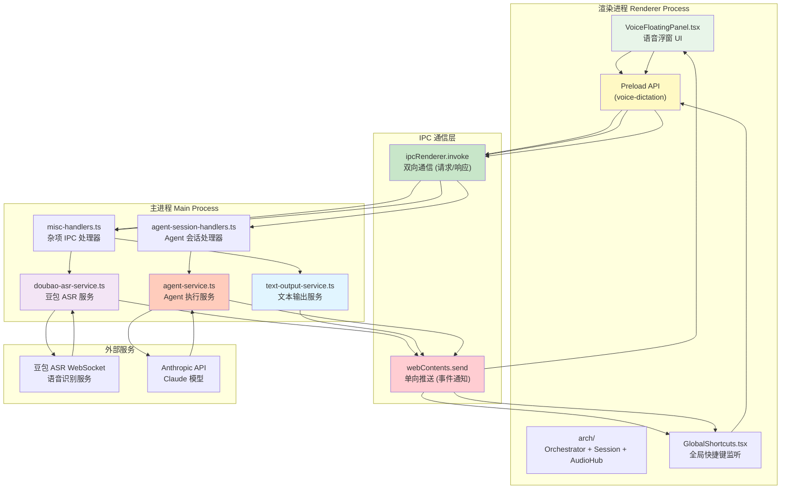
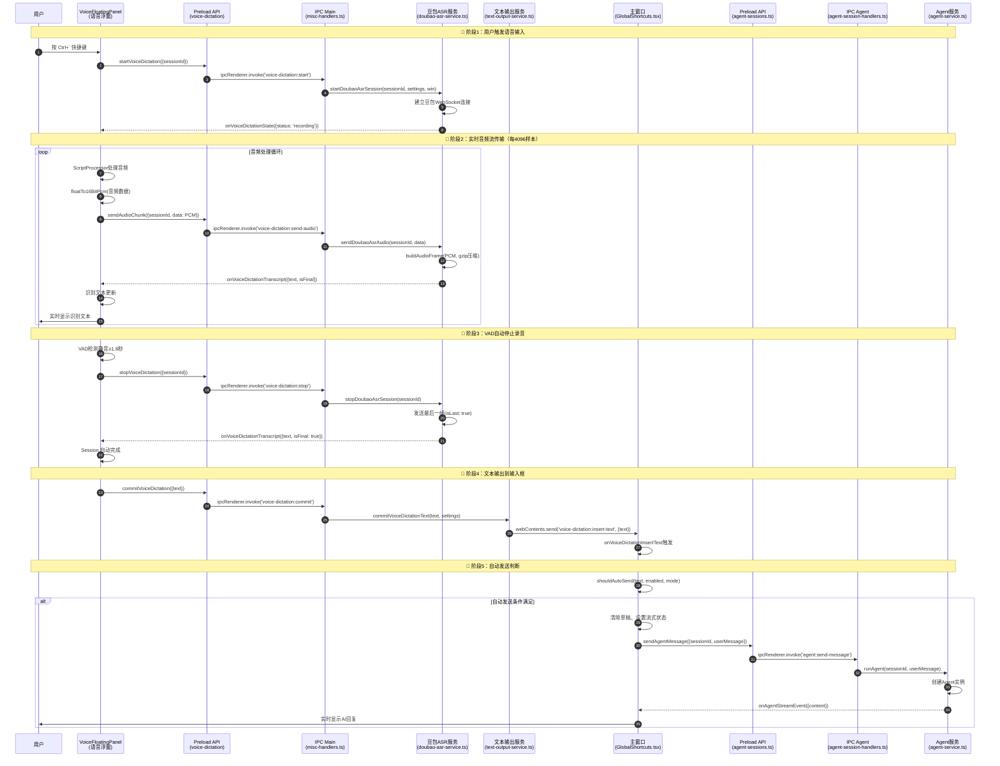

# 10 — 语音输入 IPC 架构

> **目录**: [`apps/electron/src/`](../../apps/electron/src/)
> **上游**: [06-electron-main](./06-electron-main.md) · [07-electron-preload](./07-electron-preload.md) · [08-electron-renderer](./08-electron-renderer.md)
> **相关**: [语音免提优化计划](../plans/2026-05-30-voice-handsfree.md)

## 概述

Proma 的语音输入功能通过 Electron 的 IPC（进程间通信）实现了**渲染进程**（语音浮窗）与**主进程**（豆包 ASR 服务）之间的高效音频流传输，并最终将识别结果自动发送给 Agent 执行任务。

本文档详细说明了语音发送消息到 Agent 的完整 IPC 调用链、关键代码位置和数据流向。

## 架构图



## 完整时序图



## 核心 IPC 通道

### 语音输入相关通道

| 通道名称 | 方向 | 代码位置 | 作用 |
|---------|------|---------|------|
| `voice-dictation:start` | 渲染→主 | `misc-handlers.ts:213-220` | 启动豆包ASR WebSocket连接 |
| `voice-dictation:send-audio` | 渲染→主 | `misc-handlers.ts:223-229` | 发送PCM音频帧（gzip压缩） |
| `voice-dictation:stop` | 渲染→主 | `misc-handlers.ts:231-237` | 停止ASR会话，发送最后一帧 |
| `voice-dictation:transcript` | 主→渲染 | `doubao-asr-service.ts:386-390` | 推送识别文本（isFinal标志） |
| `voice-dictation:state` | 主→渲染 | `doubao-asr-service.ts:354-374` | 推送连接状态变化 |
| `voice-dictation:commit` | 渲染→主 | `misc-handlers.ts:247-254` | 提交最终识别文本 |
| `voice-dictation:insert-text` | 主→渲染 | `text-output-service.ts:37` | **单向推送**：将文本插入Proma输入框 |

### Agent 相关通道

| 通道名称 | 方向 | 代码位置 | 作用 |
|---------|------|---------|------|
| `agent:send-message` | 渲染→主 | `agent-session-handlers.ts` | 发送消息给Agent，启动执行 |
| `agent:stream-event` | 主→渲染 | `agent-service.ts` | **单向推送**：流式返回AI内容 |
| `agent:stream-complete` | 主→渲染 | `agent-service.ts` | **单向推送**：Agent执行完成 |
| `agent:stream-error` | 主→渲染 | `agent-service.ts` | **单向推送**：Agent执行错误 |

## 关键代码解析

### 1. Orchestrator 音频编排与 VAD

**文件位置**: `apps/electron/src/renderer/components/voice-dictation/core/Orchestrator.ts:62-83`

```typescript
async enableHandsfree(): Promise<void> {
  if (!this.fsm.transition('listening')) return
  try { await this.hub.start() } catch { ... }

  this.unsubVAD = this.hub.subscribe((frame: PcmFrame) => {
    this.volume = frame.peak
    this.emit()
    this.detectSpeech(frame)
  })
}
```

VoicedDictationApp 旧版单体中的音频采集 + VAD 内联逻辑，已被重构为独立的 OO 架构：
- **AudioHub**: 麦克风单例，PCM 帧广播给所有订阅者
- **StateMachine**: 严格守卫状态转换，阻止竞态
- **Session**: 每次录音独立的生命周期管理

### 2. 文本输出的智能路由

**文件位置**: `apps/electron/src/main/lib/text/text-output-service.ts:22-50`

```typescript
export async function commitVoiceDictationText(
  text: string,
  settings: VoiceDictationSettings,
): Promise<VoiceDictationCommitResult> {
  const trimmed = text.trim()
  
  // 判断目标位置
  const shouldWriteProma =
    settings.outputMode === 'proma-input' ||
    (settings.outputMode === 'auto' && targetWasPromaInput)

  if (shouldWriteProma && mainWindow && !mainWindow.isDestroyed()) {
    // 关键：通过webContents.send单向推送，不等待返回
    mainWindow.webContents.send(VOICE_DICTATION_IPC_CHANNELS.INSERT_TEXT, { text: trimmed })
    return { mode: 'proma-input', success: true, message: '已写入 Proma 输入框' }
  }

  // 降级策略：光标位置或剪贴板
  if (settings.outputMode === 'auto') {
    const result = await pasteTextAtCurrentCursor(trimmed)
    return result.success ? result : { mode: 'clipboard', success: true }
  }

  clipboard.writeText(trimmed)
  return { mode: 'clipboard', success: true }
}
```

**作用**: 根据用户设置智能选择文本插入位置，优先写入 Proma 输入框以触发自动发送。

### 3. 自动发送的无缝集成（挂载点）

**文件位置**: `apps/electron/src/renderer/components/voice-dictation/ui/VoiceFloatingPanel.tsx:30-48`

```typescript
orch.onAutoSend = (text: string) => {
  if (store.get(appModeAtom) !== 'agent') return
  const channelId = store.get(agentChannelIdAtom)
  const sessionId = store.get(currentAgentSessionIdAtom)
  if (!sessionId || !channelId) return

  // 清除草稿、设置流式状态、乐观插入用户消息
  store.set(agentSessionDraftsAtom, (prev) => { ... })
  store.set(agentStreamingStatesAtom, (prev) => { ... })
  store.set(liveMessagesMapAtom, (prev) => { ... })

  window.electronAPI.sendAgentMessage({ sessionId, userMessage: text, channelId, ... })
}
```

自动发送回调在 `VoiceFloatingPanel` 中注册到 `Orchestrator.onAutoSend`，GlobalShortcuts 仅负责辅助路径（外部写入光标）的自动发送。

## 数据流向

```
用户语音 (麦克风)
    ↓
音频采集 (Web Audio API)
    ↓
PCM 转换 (float → 16-bit)
    ↓
IPC 调用 (voice-dictation:send-audio)
    ↓
豆包 ASR 服务 (gzip 压缩)
    ↓
WebSocket 上传
    ↓
豆包 ASR 识别
    ↓
IPC 推送 (voice-dictation:transcript)
    ↓
识别文本更新
    ↓
VAD 自动停止 (静音 ≥ 1.8s)
    ↓
IPC 调用 (voice-dictation:commit)
    ↓
文本输出服务 (text-output-service)
    ↓
IPC 推送 (voice-dictation:insert-text)
    ↓
全局快捷键监听 (GlobalShortcuts.tsx)
    ↓
自动发送判断 (voice-auto-send)
    ↓
IPC 调用 (agent:send-message)
    ↓
Agent 服务 (agent-service.ts)
    ↓
Claude API 调用
    ↓
IPC 推送 (agent:stream-event)
    ↓
Jotai Atom 更新
    ↓
React 重渲染
    ↓
用户看到 AI 回复
```

## 性能优化

### 1. 音频数据流水线

```
音频采集 → PCM转换 → 队列缓冲 → gzip压缩 → WebSocket发送
   ↓         ↓         ↓         ↓           ↓
每40ms    每帧立即    最多60帧   实时压缩    流式上传
```

**防止阻塞**:
- 音频处理和 VAD 检测在同一个回调中并行执行
- 音频帧入队异步发送，不阻塞音频采集

### 2. 双向通信 vs 单向推送

| 通信模式 | IPC 方法 | 使用场景 | 性能 |
|---------|---------|---------|------|
| **双向** | `invoke/handle` | 需要返回值的请求 | 较低（等待响应） |
| **单向** | `send/on` | 事件通知、流式数据 | 较高（不等待） |

**关键优势**:
- 单向推送 `webContents.send()` 不等待渲染进程响应，性能更高
- 流式数据通过单向通道实时推送，用户体验流畅

## 安全机制

### 1. 路径白名单校验

**文件位置**: `apps/electron/src/main/ipc/helpers.ts:82-90`

```typescript
export function isPathAllowed(filePath: string, options?: FileAccessOptions): boolean {
  const resolved = realpathSync(resolve(filePath))
  return getAuthorizedRoots(options).some((root) => isUnderRoot(resolved, root))
}
```

**作用**: 所有文件操作都通过路径白名单校验，防止路径遍历攻击。

### 2. API Key 加密存储

**实现位置**: `apps/electron/src/main/lib/channel/channel-manager.ts`

**作用**: 所有 API Key 在存储前自动加密（使用系统密钥轮），仅在需要时解密到内存。

### 3. 环境变量隔离

**文件位置**: `apps/electron/src/main/index.ts:74-81`

```typescript
for (const key of Object.keys(process.env)) {
  if (key.startsWith('ANTHROPIC_')) {
    delete process.env[key]
  }
}
```

**作用**: 启动时清理 `ANTHROPIC_*` 环境变量，防止终端环境干扰应用的认证流程。

## 相关文件索引

### 核心文件

| 功能模块 | 文件路径 | 说明 |
|---------|---------|------|
| 语音浮窗 UI | `apps/electron/src/renderer/components/voice-dictation/ui/VoiceFloatingPanel.tsx` + `core/` | OO 架构语音浮窗（Orchestrator + AudioHub + StateMachine + Session）|
| 豆包 ASR 服务 | `apps/electron/src/main/lib/integration/doubao-asr-service.ts` | WebSocket 连接和协议处理 |
| 文本输出服务 | `apps/electron/src/main/lib/text/text-output-service.ts` | 文本插入路由逻辑 |
| 自动发送判断 | `apps/electron/src/renderer/components/voice-dictation/utils/auto-send.ts` | 文本完整性判断 |
| 全局快捷键 | `apps/electron/src/renderer/components/shortcuts/GlobalShortcuts.tsx` | IPC 事件监听和自动发送 |
| IPC 处理器 | `apps/electron/src/main/ipc/misc-handlers.ts` | 语音输入 IPC 通道注册 |
| Agent 服务 | `apps/electron/src/main/lib/agent/agent-service.ts` | Agent 执行和流式返回 |

### 类型定义

| 模块 | 文件路径 |
|------|---------|
| 语音输入类型 | `apps/electron/src/types/settings.ts:302-339` |
| Agent 类型 | `packages/shared/src/types/agent.ts` |
| IPC 通道常量 | `packages/shared/src/types/channels.ts` |

## 豆包 ASR 协议细节

### WebSocket 连接端点

- **异步模式**: `wss://openspeech.bytedance.com/api/v3/sauc/bigmodel_async`
- **双工模式**: `wss://openspeech.bytedance.com/api/v3/sauc/bigmodel`

### 配置参数

```json
{
  "audio": {
    "format": "pcm", "codec": "raw", "rate": 16000,
    "bits": 16, "channel": 1, "language": "zh-CN"
  },
  "request": {
    "model_name": "bigmodel", "enable_punc": true,
    "enable_itn": true, "end_window_size": 5000
  }
}
```

### 音频帧格式

- **Header**: 协议版本、消息类型、序列标志
- **Size**: 负载大小（4字节）
- **Payload**: gzip 压缩的 PCM 音频数据
- 每帧都压缩以减少网络传输，最后一帧设置 `isLast` 标志
- 使用二进制协议（非 JSON）

### 连接测试

```typescript
// 测试豆包 ASR 连接（仅验证握手和鉴权）
await testDoubaoAsrConnection(settings)
// 返回: { success: boolean, message: string }
```

### 已知限制

- **网络超时**: 连接超时 10 秒，可能需要根据网络调整
- **音频队列**: 最多缓冲 60 帧，超过后丢弃旧帧
- **并发限制**: 当前不支持同时多个 ASR 会话

---

## 扩展阅读

- [语音免提优化实施计划](../plans/2026-05-30-voice-handsfree.md) - VAD 自动停止、语义自动发送、唤醒词检测
- [Electron 主进程架构](./06-electron-main.md) - 主进程服务层整体架构
- [Electron Renderer 架构](./08-electron-renderer.md) - React UI 和状态管理
