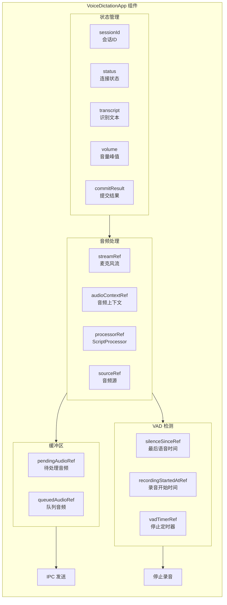
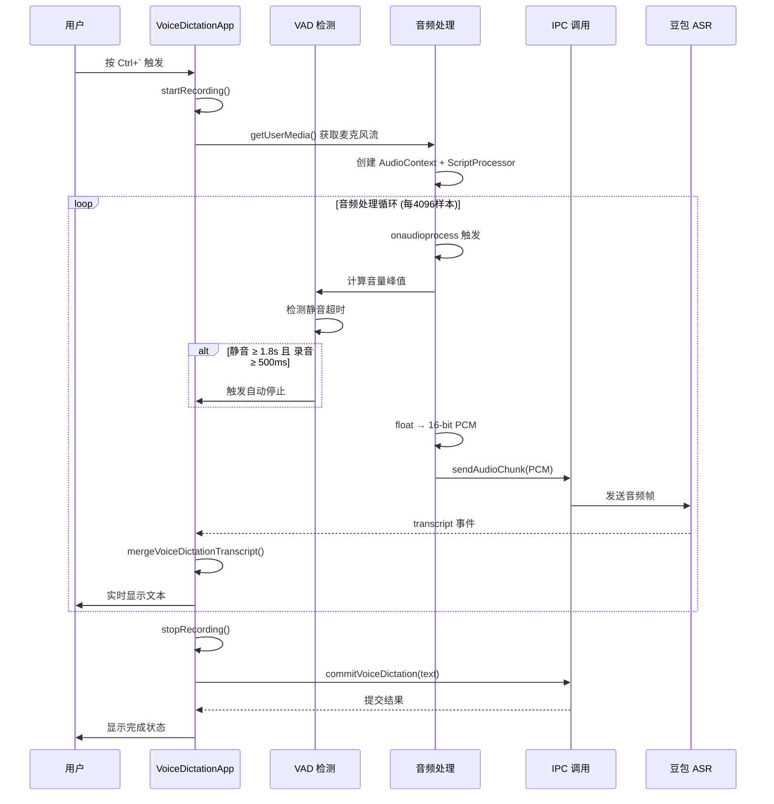
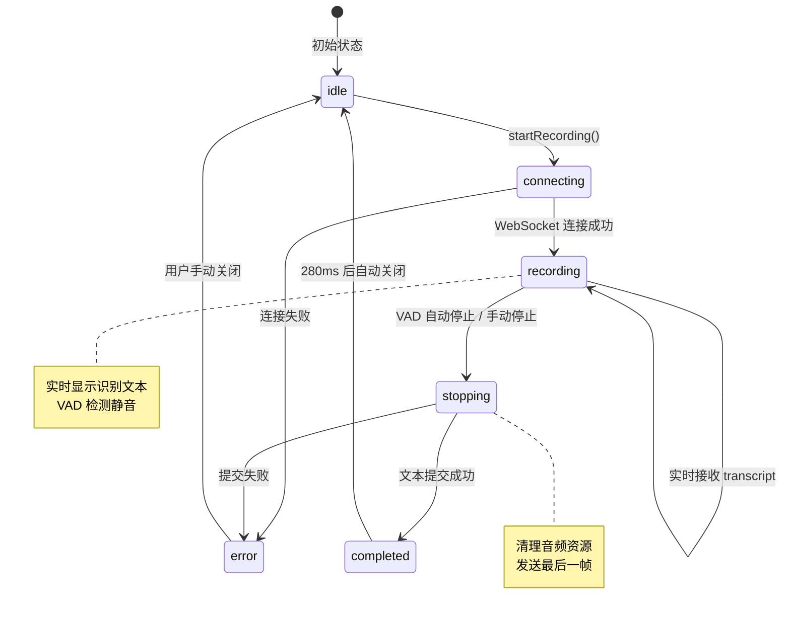

# VoiceDictationApp - 语音输入浮窗

> **代码位置**: `apps/electron/src/renderer/components/voice-dictation/VoiceDictationApp.tsx`  
> **组件类型**: React 功能组件  
> **行数**: ~626 行

## 📋 概述

VoiceDictationApp 是 Proma 的语音输入浮窗主组件，负责：
- 麦克风音频采集和 Web Audio API 处理
- PCM 音频转换和 IPC 发送
- VAD（语音活动检测）自动停止
- 实时识别文本显示和合并
- 文本提交和自动发送

## 🏗️ 组件架构



## 🔄 核心流程

### 完整工作流程



### VAD 自动停止机制

```mermaid
flowchart TD
    A[onaudioprocess 触发] --> B[计算音量峰值]
    B --> C{峰值 >= 0.01?}
    
    C -->|是| D[刷新 silenceSinceRef = now]
    C -->|否| E[检查静音时长]
    
    E --> F{静音 >= 1.8s?<br/>AND 录音 >= 500ms?}
    F -->|是| G[设置 setTimeout 停止]
    F -->|否| H[继续录音]
    
    D --> H
    G --> I[stopRecording()]
    H --> B
```

## 💡 核心代码解析

### 1. 音频处理与 VAD 并行执行 (248-299 行)

```typescript
processor.onaudioprocess = (event) => {
  const input = event.inputBuffer.getChannelData(0)
  
  // 1. 计算音量峰值（用于VAD和可视化）
  let peak = 0
  for (let i = 0; i < input.length; i += 1) {
    peak = Math.max(peak, Math.abs(input[i] ?? 0))
  }
  setVolume(Math.min(1, peak * 4))  // 更新可视化

  // 2. VAD静音检测（并行进行）
  const VAD_THRESHOLD = 0.01
  const now = Date.now()
  if (peak >= VAD_THRESHOLD) {
    silenceSinceRef.current = now  // 检测到语音，刷新时间戳
  }
  
  // 3. 检查静音超时
  if (timeoutMs > 0 && 
      now - silenceSinceRef.current >= timeoutMs &&
      now - recordingStartedAtRef.current >= minRecordMs) {
    vadTimerRef.current = setTimeout(() => {
      stopRecording().catch(() => {})
    }, 0)
  }

  // 4. PCM转换和发送（继续执行，不阻塞VAD）
  const pcm = floatTo16BitPcm(input, audioContext.sampleRate)
  sendAudioChunk(sessionIdRef.current, pcm)
}
```

**关键设计**:
- **并行处理**: VAD 检测和音频发送在同一回调中并行执行
- **非阻塞**: VAD 超时使用 `setTimeout`，不阻塞音频处理
- **防止误触发**: 最短录音时长（500ms）和静音阈值（0.01）双重保护

### 2. 文本合并状态机 (433-447 行)

```typescript
const cleanupTranscript = window.electronAPI.onVoiceDictationTranscript((event) => {
  if (event.sessionId !== sessionIdRef.current) return
  
  // 调用文本合并状态机
  const mergedTranscript = mergeVoiceDictationTranscript(
    transcriptMergeStateRef.current,  // 状态
    event.text,                        // 新文本
    event.isFinal,                      // 是否最终
    event.sessionId,                    // 会话ID
  )
  
  // 更新状态和UI
  transcriptMergeStateRef.current = mergedTranscript.state
  setTranscript(mergedTranscript.text)
  transcriptRef.current = mergedTranscript.text
  
  // 最终识别结果触发提交
  if (event.isFinal) {
    scheduleCommit(FINAL_COMMIT_DELAY_MS)
  }
})
```

**关键点**:
- 使用状态机处理增量文本更新
- 防止 ASR 回退导致的文本重复
- 最终结果自动触发提交

### 3. 文本提交与自动发送 (138-169 行)

```typescript
const commitAndHide = async () => {
  if (commitInFlightRef.current) return  // 防止重复提交
  commitInFlightRef.current = true
  
  const text = transcriptRef.current.trim()
  if (!text) {
    setStatus('idle')
    setMessage('没有识别到语音内容')
    cleanupAudio()
    setTimeout(() => window.electronAPI.hideVoiceDictation(), 180)
    return
  }

  setStatus('stopping')
  setMessage('正在输出文本...')
  
  try {
    // 提交到主进程，由主进程路由到输入框
    const result = await window.electronAPI.commitVoiceDictation({ text })
    setCommitResult(result)
    setStatus('completed')
    setMessage(result.message)
    cleanupAudio()
    setTimeout(() => window.electronAPI.hideVoiceDictation(), 280)
  } catch (error) {
    // 错误处理
  }
}
```

**流程**:
1. 防止重复提交
2. 文本验证
3. IPC 调用 `commitVoiceDictation`
4. 主进程通过 `INSERT_TEXT` 通道推送到输入框
5. GlobalShortcuts 监听到插入事件，触发自动发送

## 🔌 IPC 通道

### 发送（渲染进程 → 主进程）

| 通道 | 调用时机 | 数据 |
|------|---------|------|
| `voice-dictation:start` | 开始录音 | `{ sessionId }` |
| `voice-dictation:send-audio` | 音频帧 | `{ sessionId, data: ArrayBuffer }` |
| `voice-dictation:stop` | 停止录音 | `{ sessionId }` |
| `voice-dictation:commit` | 提交文本 | `{ text: string }` |
| `voice-dictation:hide` | 隐藏浮窗 | - |

### 接收（主进程 → 渲染进程）

| 通道 | 监听方式 | 数据 |
|------|---------|------|
| `voice-dictation:shown` | `onVoiceDictationShown` | - |
| `voice-dictation:toggle-stop` | `onVoiceDictationToggleStop` | - |
| `voice-dictation:transcript` | `onVoiceDictationTranscript` | `{ sessionId, text, isFinal }` |
| `voice-dictation:state` | `onVoiceDictationState` | `{ sessionId, status, message }` |

## 🎨 UI 状态

### 状态机



### 状态对应的 UI

| 状态 | 图标 | 消息 | 交互 |
|------|------|------|------|
| `idle` | 🎤 Mic | "按快捷键开始语音输入" | 禁用 |
| `connecting` | ⏳ Loader2 | "正在连接..." | 禁用 |
| `recording` | 🔊 音量波形 | "正在听写" | 停止按钮 |
| `stopping` | ⏳ Loader2 | "正在收尾识别..." | 禁用 |
| `completed` | ✅ Check | "已写入 Proma 输入框" | 关闭按钮 |
| `error` | ❌ X | 错误信息 | 关闭按钮 |

## 🎯 关键 Props 和 State

### 核心 State

```typescript
const [sessionId, setSessionId] = useState<string | null>(null)
const [status, setStatus] = useState<VoiceDictationStateEvent['status']>('idle')
const [message, setMessage] = useState('按快捷键开始语音输入')
const [transcript, setTranscript] = useState('')
const [commitResult, setCommitResult] = useState<VoiceDictationCommitResult | null>(null)
const [volume, setVolume] = useState(0)
```

### 核心 Ref（避免重渲染）

```typescript
const sessionIdRef = useRef<string | null>(null)
const transcriptRef = useRef('')
const streamRef = useRef<MediaStream | null>(null)
const audioContextRef = useRef<AudioContext | null>(null)
const silenceSinceRef = useRef<number>(-1)  // VAD: 最后语音时间
const recordingStartedAtRef = useRef<number>(0)  // VAD: 录音开始时间
const vadTimerRef = useRef<ReturnType<typeof setTimeout> | null>(null)
```

## 🔗 依赖关系

### 依赖的组件

- **[useVoiceWindowLayout](./use-voice-window-layout.ts)** - 窗口布局计算
- **[voice-audio-utils](./voice-audio-utils.ts)** - 音频处理工具
- **[voice-transcript-merge](./voice-transcript-merge.ts)** - 文本合并状态机

### 被依赖的组件

- **[GlobalShortcuts](../shortcuts/GlobalShortcuts.tsx)** - 监听 `INSERT_TEXT` 事件
- **[Agent Service](../../../main/lib/agent/agent-service.ts)** - 自动发送消息

### IPC 依赖

- **[Doubao ASR Service](../../../main/lib/integration/doubao-asr-service.ts)** - 语音识别
- **[Text Output Service](../../../main/lib/text/text-output-service.ts)** - 文本输出

## 🧪 测试场景

### 功能测试

1. **基本录音**: 按 Ctrl+` → 说话 → 自动停止 → 文本插入
2. **手动停止**: 说话中按 Ctrl+` → 立即停止
3. **VAD 触发**: 说话 → 停顿 1.8s → 自动停止
4. **防误触发**: 录音 < 500ms → 不自动停止
5. **错误处理**: 麦克风权限拒绝 → 显示错误提示

### 边界测试

1. **网络超时**: 连接豆包 ASR 超时 10s → 错误提示
2. **静音环境**: 完全静音 → 无文本生成
3. **长时间录音**: 录音 > 5 分钟 → 正常处理
4. **快速连续**: 连续多次触发 → 防重复提交

## 🐛 已知问题

1. **音频队列溢出**: 高性能机器可能产生音频帧过快，导致队列溢出
2. **VAD 阈值固定**: 0.01 阈值可能在噪音环境下不够准确
3. **WebSocket 心跳**: 长时间连接可能需要心跳保活

## 📚 相关文档

- [豆包 ASR 服务](../../../main/lib/integration/README.md) - 语音识别服务
- [文本输出服务](../../../main/lib/text/text-output-service.md) - 文本路由和插入
- [自动发送逻辑](./voice-auto-send.md) - 文本完整性判断
- [语音免提优化计划](../../../../plans/2026-05-30-voice-handsfree.md) - 功能扩展计划

---

**最后更新**: 2026-05-31  
**组件版本**: 1.0  
**维护者**: Proma Team
