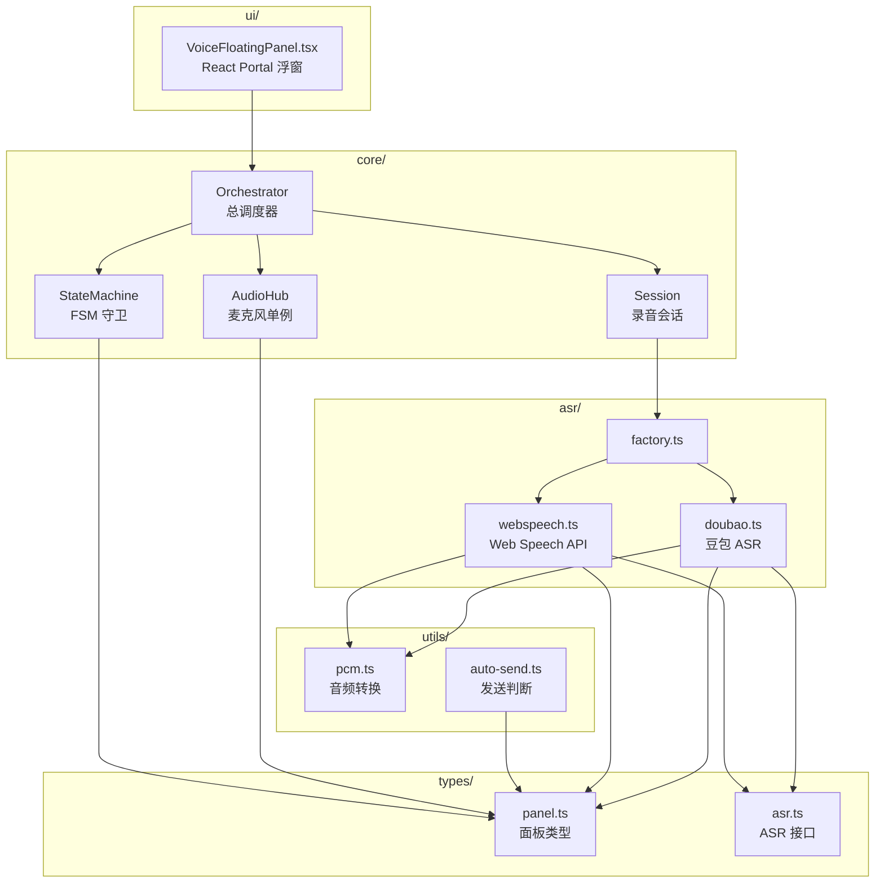

# VoiceFloatingPanel — 语音浮窗（OO 架构）

> **入口位置**: `apps/electron/src/renderer/components/voice-dictation/ui/VoiceFloatingPanel.tsx`
> **相关组件**: [GlobalShortcuts](../shortcuts/GlobalShortcuts.md)、[voice-auto-send](./voice-auto-send.md)

## 概述

VoiceFloatingPanel 是一个嵌入主窗口的 Portal 浮窗，采用 OO 分层架构替代了旧版 VoiceDictationApp 的单体实现。

**目录即架构** — 依赖方向自上而下：

```
voice-dictation/
├── types/       ← 零依赖：纯类型定义
├── utils/       ← 依赖 types/
├── asr/         ← 依赖 types/ + utils/
├── core/        ← 依赖 types/ + utils/ + asr/
└── ui/          ← 依赖 core/ + utils/
```

## 架构图



## 数据流

```
麦克风 -> AudioHub (PCM 帧广播)
        |-- Session (-> ASR Provider -> IPC -> 主进程 -> 转写文本)
        |   `-- onComplete -> Orchestrator -> onAutoSend
        `-- VAD (Orchestrator.detectSpeech) -> 峰值判断 -> startSession
```

## 状态机

```
stopped -> listening(免提) -> recording(检测到语音) -> processing(转写中)
       -> completed / error -> stopped -> ...(循环)
```

## 核心文件

| 层 | 文件 | 职责 |
|----|------|------|
| types/ | panel.ts | PanelState / PcmFrame / SessionResult / VoiceUIState |
| types/ | asr.ts | ASRProvider / ASRCallbacks 接口 |
| utils/ | pcm.ts | 浮点->16-bit PCM 转换、缓冲合并、分片 |
| utils/ | auto-send.ts | shouldAutoSend() always/smart/ai 三种模式 |
| asr/ | factory.ts | ASR Provider 工厂 |
| asr/ | doubao.ts | 豆包 ASR（IPC -> 主进程 doubao-asr-service） |
| asr/ | webspeech.ts | 浏览器 SpeechRecognition |
| core/ | AudioHub.ts | 麦克风单例管理，PCM 帧广播 |
| core/ | StateMachine.ts | 有限状态机，严格守卫非法转换 |
| core/ | Session.ts | 单次录音会话生命周期（ASR + VAD 静音检测） |
| core/ | Orchestrator.ts | 总调度器，VAD 检测 + 免提开关 + UI 状态广播 |
| ui/ | VoiceFloatingPanel.tsx | React Portal 浮窗，创建 Orchestrator、注入回调 |
