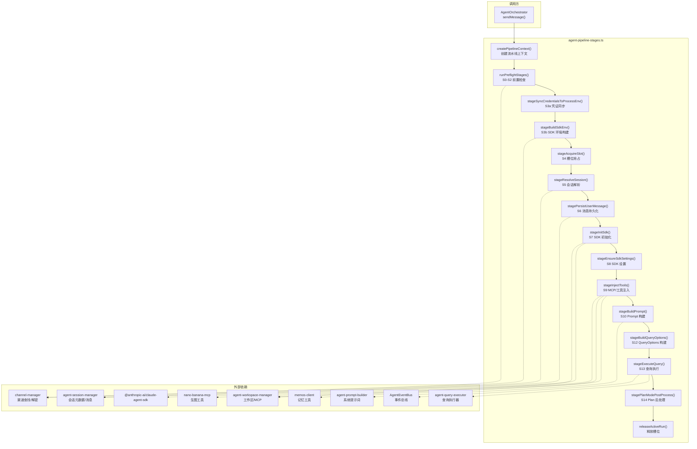
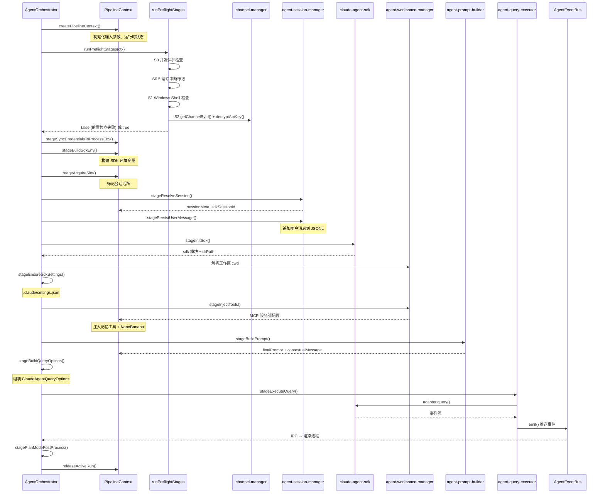

# agent-pipeline-stages.ts — Agent 编排流水线阶段

> **代码位置**: `apps/electron/src/main/lib/agent/agent-pipeline-stages.ts`
> **代码行数**: ~751 行
> **复杂度**: 高（P0）
> **相关模块**: [agent-orchestrator](../main/lib/agent/agent-orchestrator.ts)、[agent-query-executor](./agent-query-executor.md)、[agent-session-manager](./agent-session-manager.md)、[agent-workspace-manager](./agent-workspace-manager.md)

## 概述

`agent-pipeline-stages.ts` 是 Agent 编排层的**流水线阶段函数集合**。它从 `agent-orchestrator.ts` 的 `sendMessage` 方法中提取而来，将一次 Agent 消息处理拆分为 14 个独立的阶段函数（S0-S14）。每个阶段接收 `PipelineContext` 上下文对象，执行一个独立的步骤，修改上下文状态或在前置条件不满足时提前返回错误。

这种设计遵循**中间件/管道模式**：编排器按顺序调用各阶段，每个阶段职责单一、可独立测试。`PipelineContext` 是贯穿整个流水线的共享状态容器，由 `createPipelineContext()` 工厂函数创建，包含输入参数、运行时状态和最终执行所需的所有中间产物。

文件还包含三个内部工具注入函数（`buildMcpServers`、`injectMemoryTools`、`injectNanoBananaTools`），用于在查询前动态构建 MCP 服务器配置。

## 架构图



## 核心流程

### 主要流程图



## 关键文件

| 文件 | 行数 | 作用 | 关键函数/接口 |
|------|------|------|--------------|
| `agent-pipeline-stages.ts` | ~751 | Agent 管道阶段函数集合 | `PipelineContext`, `createPipelineContext()`, `runPreflightStages()`, `stageBuildSdkEnv()`, `stageInitSdk()`, `stageInjectTools()`, `stageBuildPrompt()`, `stageBuildQueryOptions()`, `stageExecuteQuery()` |
| `agent-orchestrator.ts` | ~246 | 编排器主类，按序调用管道阶段 | `AgentOrchestrator.sendMessage()` |
| `agent-query-executor.ts` | ~700+ | 查询执行器，自动重试和事件流处理 | `executeQuery()`, `QueryExecutorDeps` |
| `agent-event-bus.ts` | ~93 | 事件总线，中间件链式分发 | `AgentEventBus.emit()` |
| `agent-orchestrator-utils.ts` | ~数百 | 工具函数：SDK 路径、prompt 构建、重试 | `resolveSDKCliPath()`, `buildContextPrompt()`, `collectAttachedDirectories()` |
| `agent-prompt-builder.ts` | ~数百 | 系统提示词和动态上下文构建 | `buildSystemPrompt()`, `buildDynamicContext()`, `buildBuiltinAgents()` |
| `agent-session-manager.ts` | ~1499 | Agent 会话 CRUD 和消息持久化 | `getAgentSessionMeta()`, `appendSDKMessages()`, `updateAgentSessionMeta()` |
| `agent-workspace-manager.ts` | ~1130 | 工作区管理和 MCP 配置 | `getAgentWorkspace()`, `getWorkspaceMcpConfig()`, `ensurePluginManifest()` |

## 核心代码解析

### 关键代码片段 1 — PipelineContext 上下文对象

**文件位置**: `agent-pipeline-stages.ts:39-115`

**作用**: 定义贯穿整个流水线的共享状态容器。分为"输入"（不可变，由调用方提供）和"运行时状态"（由各阶段函数逐步填充）两部分。

```typescript
export interface PipelineContext {
  // 输入（不可变）
  sessionId: string
  input: AgentSendInput
  callbacks: SessionCallbacks
  adapter: AgentProviderAdapter
  eventBus: AgentEventBus
  activeSessions: Map<string, number>
  sessionPermissionModes: Map<string, PromaPermissionMode>
  stoppedBySessions: Set<string>

  // 运行时状态（由阶段填充）
  channel: { id: string; provider: ProviderType; baseUrl?: string } | undefined
  apiKey: string
  sdkEnv: Record<string, string | undefined>
  sessionMeta: AgentSessionMeta | undefined
  existingSdkSessionId: string | undefined
  workspace: AgentWorkspace | undefined
  resolvedModel: string
  finalPrompt: string
  queryOptions: ClaudeAgentQueryOptions | undefined
  mcpServers: Record<string, Record<string, unknown>>
  // ...
}
```

**关键点**:
- `activeSessions` 是 `AgentOrchestrator` 的实例属性引用，`stageAcquireSlot()` 写入、`releaseActiveRun()` 清除，用于并发守卫
- `runGeneration` 以 `Date.now()` 生成，用于区分同一会话的多次运行，防止旧运行误删新槽位
- `executorState` 是 orchestrator 和 executor 之间的共享状态容器——`onSessionId` 回调写入 `capturedSdkSessionId`，executor 的重试逻辑读取它

### 关键代码片段 2 — MCP 服务器构建与工具注入

**文件位置**: `agent-pipeline-stages.ts:641-735`

**作用**: 在查询执行前，根据工作区 MCP 配置动态构建 MCP 服务器映射，并注入记忆工具（MemOS Cloud）和 NanoBanana 生图工具。

```typescript
function buildMcpServers(workspaceSlug: string | undefined): Record<string, Record<string, unknown>> {
  const mcpServers: Record<string, Record<string, unknown>> = {}
  if (!workspaceSlug) return mcpServers

  const mcpConfig = getWorkspaceMcpConfig(workspaceSlug)
  for (const [name, entry] of Object.entries(mcpConfig.servers ?? {})) {
    if (!entry.enabled) continue
    if (name === 'memos-cloud') continue  // 已由 injectMemoryTools 接管

    if (entry.type === 'stdio' && entry.command) {
      // stdio 类型：合并 PATH + 自定义 env
      mcpServers[name] = { type: 'stdio', command: entry.command, /* ... */ }
    } else if ((entry.type === 'http' || entry.type === 'sse') && entry.url) {
      // HTTP/SSE 类型
      mcpServers[name] = { type: entry.type, url: entry.url, /* ... */ }
    }
  }
  return mcpServers
}

async function injectMemoryTools(sdk, mcpServers, sessionId, eventBus): Promise<void> {
  // 使用 sdk.createSdkMcpServer 创建内存级 MCP 服务器
  // 注册 recall_memory 和 add_memory 两个工具
  const memosServer = sdk.createSdkMcpServer({
    name: 'mem', version: '1.0.0',
    tools: [/* recall_memory, add_memory */],
  })
  mcpServers['mem'] = memosServer
}
```

**关键点**:
- `memos-cloud` 被显式跳过——记忆功能由 `injectMemoryTools` 用 SDK 的 `createSdkMcpServer` API 在内存中创建，不走 stdio 子进程
- stdio 类型的 MCP 服务器会合并 `process.env.PATH`，确保子进程能找到系统命令
- 记忆工具使用 `zod` 做参数校验，通过 `searchMemory` / `addMemory` 调用 MemOS Cloud API

### 关键代码片段 3 — 前置检查（Preflight Stages）

**文件位置**: `agent-pipeline-stages.ts:123-186`

**作用**: 执行 S0-S2 三项前置检查，任何一项不通过则通过 `reportPreflightError` 上报结构化错误并终止流水线。

```typescript
export async function runPreflightStages(ctx: PipelineContext): Promise<boolean> {
  // S0: 并发保护 — 同一会话不允许并行请求
  if (ctx.activeSessions.has(ctx.sessionId)) { /* ... */ return false }

  // S0.5: 清除上一轮中断标记
  try { updateAgentSessionMeta(ctx.sessionId, { stoppedByUser: false }) } catch { /* ... */ }

  // S1: Windows Shell 检查 — 需要 Git Bash 或 WSL
  if (process.platform === 'win32') {
    const shellStatus = getRuntimeStatus()?.shell
    if (shellStatus && !shellStatus.gitBash?.available && !shellStatus.wsl?.available) {
      reportPreflightError(ctx, { code: 'windows_shell_missing', /* ... */ })
      return false
    }
  }

  // S2: 获取渠道信息 + 解密 API Key
  const channel = getChannelById(ctx.input.channelId)
  if (!channel) { reportPreflightError(ctx, { code: 'channel_not_found', /* ... */ }); return false }
  ctx.apiKey = decryptApiKey(ctx.input.channelId)  // 可能抛出异常
  // ...
}
```

**关键点**:
- `reportPreflightError` 将错误包装为 `SDKMessage` 并持久化到 JSONL，确保用户能在 UI 中看到具体的错误信息和操作建议
- 错误对象包含 `TypedError` 结构（code、title、message、details、actions），支持"打开环境检测"等可操作按钮
- Windows 平台对 Shell 环境有硬性要求，缺少 Git Bash 或 WSL 时会直接阻断流水线

### 关键代码片段 4 — SDK 环境变量构建

**文件位置**: `agent-pipeline-stages.ts:193-258`

**作用**: 构建 SDK 子进程的环境变量。遵循 SDK 0.2.113+ 的"替换"语义——先从 `process.env` 继承（剥离 `ANTHROPIC_*`），再注入认证信息和平台配置。

```typescript
export async function stageBuildSdkEnv(ctx: PipelineContext): Promise<void> {
  // 从 process.env 继承，清理 ANTHROPIC_ 前缀变量
  const cleanEnv: Record<string, string | undefined> = {}
  for (const [key, value] of Object.entries(process.env)) {
    if (!key.startsWith('ANTHROPIC_')) cleanEnv[key] = value
  }

  const sdkEnv = {
    ...cleanEnv,
    CLAUDE_CODE_MAX_OUTPUT_TOKENS: '64000',
    CLAUDE_CODE_ENABLE_TASKS: 'true',
    // ...
  }

  // 按 Provider 分支注入认证方式
  if (ctx.channel!.provider === 'kimi-coding') {
    sdkEnv.ANTHROPIC_AUTH_TOKEN = ctx.apiKey
    sdkEnv.ANTHROPIC_CUSTOM_HEADERS = 'User-Agent: KimiCLI/1.3'
  } else if (ctx.channel!.provider === 'minimax') {
    sdkEnv.ANTHROPIC_AUTH_TOKEN = ctx.apiKey
  } else {
    sdkEnv.ANTHROPIC_API_KEY = ctx.apiKey
  }
  // ...
}
```

**关键点**:
- 必须基于 `process.env` 合并，保证 `PATH` / `HOME` / `SHELL` 等关键变量继承到 SDK 子进程
- Kimi 和 MiniMax 使用 `ANTHROPIC_AUTH_TOKEN`（而非 `ANTHROPIC_API_KEY`），体现不同 Provider 的认证差异
- Windows 平台通过 `CLAUDE_CODE_SHELL` 指定 Git Bash 或 WSL 路径，并设置 `CLAUDE_BASH_NO_LOGIN=1` 避免登录 shell 延迟

## 依赖关系

### 依赖的模块

| 模块 | 路径 | 依赖原因 |
|------|------|---------|
| **agent-session-manager** | `./agent-session-manager` | 读写会话元数据、追加 SDK 消息到 JSONL |
| **agent-workspace-manager** | `./agent-workspace-manager` | 获取工作区信息、MCP 配置、Plugin Manifest |
| **agent-prompt-builder** | `./agent-prompt-builder` | 构建系统提示词、动态上下文、内置 Agent 列表 |
| **agent-query-executor** | `./agent-query-executor` | 委托查询执行（自动重试 + 事件流处理） |
| **agent-event-bus** | `./agent-event-bus` | 事件总线，推送模型解析、Prompt Suggestion 等事件 |
| **agent-orchestrator-utils** | `./agent-orchestrator-utils` | SDK CLI 路径解析、上下文 prompt 构建、附加目录收集 |
| **channel-manager** | `../channel/channel-manager` | 渠道查找、API Key 解密 |
| **config-paths** | `../storage/config-paths` | 工作区路径、会话路径、SDK 配置目录 |
| **settings-service** | `../storage/settings-service` | 读取应用设置（maxTurns、thinking、effort 等） |
| **runtime-init** | `../runtime/runtime-init` | 获取运行时状态（Shell 可用性） |
| **proxy-settings-service** | `../network/proxy-settings-service` | 获取有效代理 URL |
| **memory-service** | `../memory/memory-service` | 读取记忆配置（apiKey、baseUrl） |
| **memos-client** | `../memory/memos-client` | 记忆搜索和存储（recall_memory / add_memory 工具） |
| **nano-banana-mcp** | `../chat-tools/nano-banana-mcp` | 生图工具 MCP 服务器注入 |
| **claude-agent-adapter** | `../adapters/claude-agent-adapter` | `ClaudeAgentQueryOptions` 类型 |
| **@proma/shared** | `packages/shared` | 类型定义（`AgentSendInput`、`SDKMessage`、`TypedError` 等）和常量 |
| **@proma/core** | `packages/core` | `normalizeAnthropicBaseUrlForSdk()` |
| **@anthropic-ai/claude-agent-sdk** | 外部依赖 | 动态导入 SDK、`createSdkMcpServer()`、`tool()` API |

### 被依赖的模块

| 模块 | 路径 | 被依赖原因 |
|------|------|-----------|
| **agent-orchestrator** | `./agent-orchestrator` | 按 S0-S14 顺序调用所有导出的阶段函数 |
| **agent-service** | `./agent-service` | 创建 `AgentOrchestrator` 实例，间接使用 |

## 导出函数索引

| 函数 | 行号 | 阶段 | 职责 |
|------|------|------|------|
| `createPipelineContext()` | 74-115 | 初始化 | 创建 `PipelineContext` 共享状态容器 |
| `runPreflightStages()` | 123-186 | S0-S2 | 并发保护、Windows Shell 检查、渠道查找、API Key 解密 |
| `stageSyncCredentialsToProcessEnv()` | 263-280 | S3a | 同步凭证到 `process.env` |
| `stageBuildSdkEnv()` | 193-258 | S3b | 构建 SDK 子进程环境变量 |
| `stageAcquireSlot()` | 287-289 | S4 | 抢占会话槽位（并发守卫） |
| `stageResolveSession()` | 305-316 | S5 | 读取 SDK Session ID 和回退标记 |
| `stagePersistUserMessage()` | 323-332 | S6 | 持久化用户消息到 JSONL |
| `stageInitSdk()` | 344-389 | S7 | 动态导入 SDK、检查 Binary、确定工作区 cwd |
| `stageEnsureSdkSettings()` | 396-420 | S8 | 确保 `.claude/settings.json` 包含正确配置 |
| `stageInjectTools()` | 427-435 | S9 | 构建 MCP 服务器配置、注入记忆和生图工具 |
| `stageBuildPrompt()` | 442-480 | S10 | 构建最终 Prompt（动态上下文 + mentions + 引用会话 + 回填历史） |
| `stageBuildQueryOptions()` | 487-568 | S12 | 组装 `ClaudeAgentQueryOptions`（完整查询配置） |
| `stageExecuteQuery()` | 575-600 | S13 | 委托 `executeQuery` 执行查询 |
| `stagePlanModePostProcess()` | 607-616 | S14 | Plan 模式后处理：注入"接受计划"建议 |
| `releaseActiveRun()` | 294-298 | 清理 | 释放会话槽位和权限模式 |

## 数据流向

```
用户输入 (AgentSendInput)
  │
  ├─ S0-S2: 前置检查 ──→ 失败 → reportPreflightError → IPC 错误推送
  │                         │
  │                         ↓ 成功
  ├─ S3: 环境构建 ──→ sdkEnv (Record<string, string>)
  │
  ├─ S4: 槽位抢占 ──→ activeSessions.set()
  │
  ├─ S5: 会话解析 ──→ sessionMeta, sdkSessionId, rewindResumeAt
  │
  ├─ S6: 消息持久化 ──→ JSONL 追加用户消息
  │
  ├─ S7: SDK 初始化 ──→ sdk 模块 + cliPath + agentCwd
  │
  ├─ S8: SDK 设置 ──→ .claude/settings.json
  │
  ├─ S9: 工具注入 ──→ mcpServers (MCP配置 + 记忆工具 + 生图工具)
  │
  ├─ S10: Prompt 构建 ──→ finalPrompt + contextualMessage
  │
  ├─ S12: QueryOptions ──→ ClaudeAgentQueryOptions
  │
  ├─ S13: 查询执行 ──→ executeQuery() → SDK → 事件流 → EventBus → IPC
  │
  └─ S14: Plan 后处理 ──→ prompt_suggestion 事件
```

## 设计要点

1. **流水线模式**: 每个 `stage*` 函数只负责一个步骤，通过 `PipelineContext` 传递中间状态。编排器 (`AgentOrchestrator`) 控制调用顺序和错误处理。

2. **双轨 Prompt 构建**: 新会话使用 `buildContextPrompt()` 回填最近 20 条历史消息；Resume 会话直接传递用户消息（SDK 已有上下文）。

3. **Provider 适配**: `stageBuildSdkEnv` 和 `stageSyncCredentialsToProcessEnv` 按 Provider 类型（Anthropic / Kimi / MiniMax）分支处理认证方式和 Base URL。

4. **内存级 MCP 服务器**: 记忆工具通过 `sdk.createSdkMcpServer()` 在内存中创建，不需要启动子进程。MCP 配置中的 `memos-cloud` 条目被显式跳过以避免冲突。

5. **结构化错误上报**: `reportPreflightError` 将错误封装为带操作建议的 `TypedError`，持久化到 JSONL 并推送到 UI，用户可以看到具体的修复操作按钮。

6. **并发安全**: `activeSessions` Map + `runGeneration` 时间戳确保同一会话不会并行执行，`releaseActiveRun` 通过比较 `runGeneration` 防止误删新运行的槽位。
