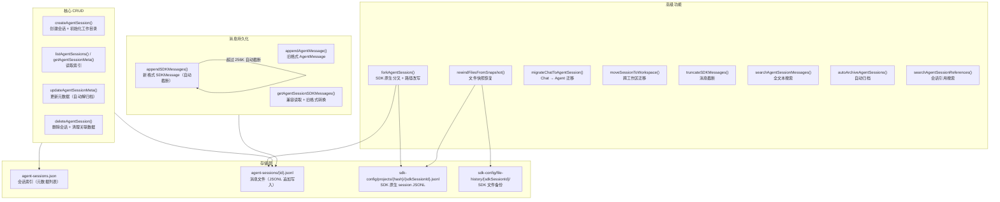
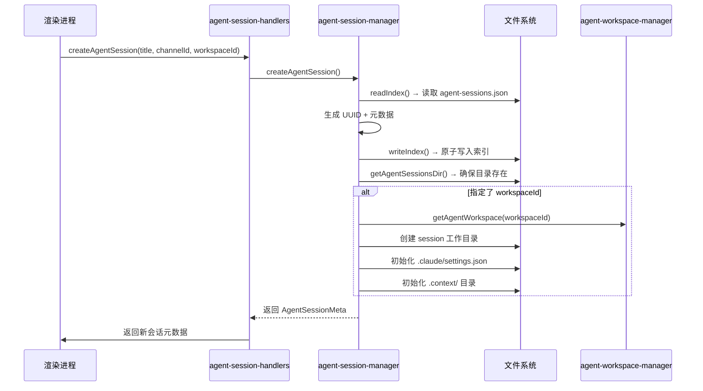
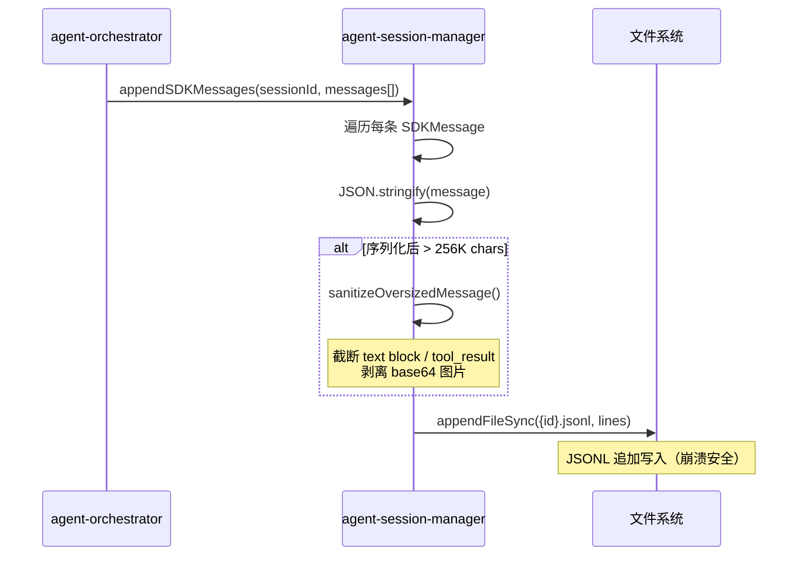
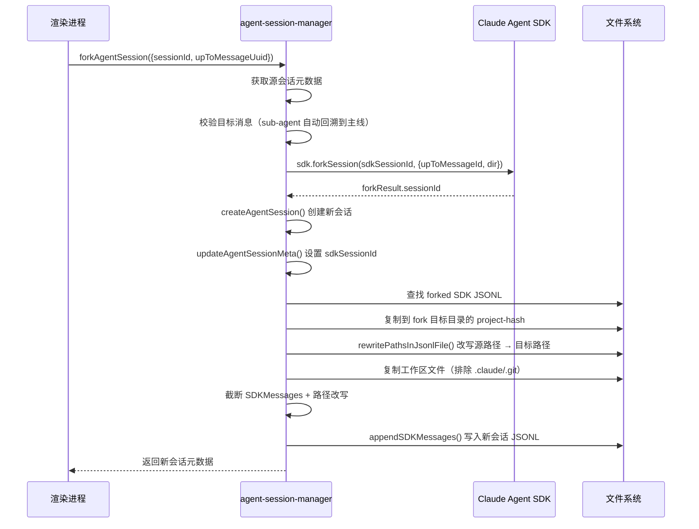
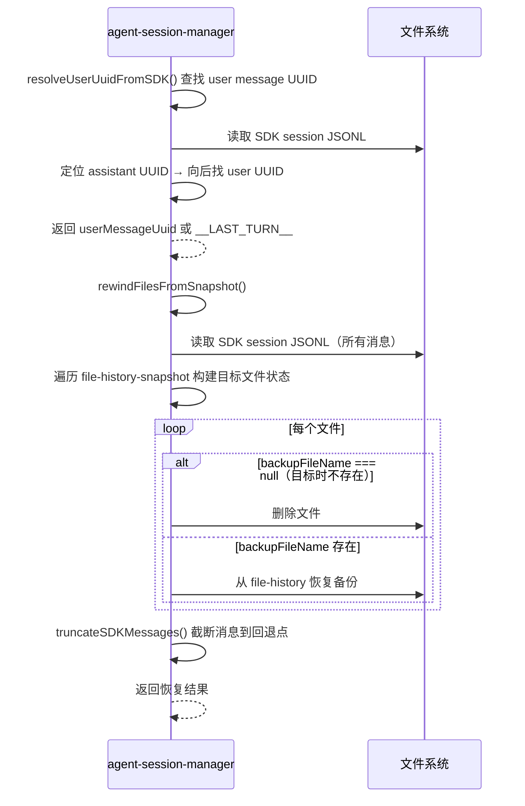

# agent-session-manager.ts

> **代码位置**: `apps/electron/src/main/lib/agent/agent-session-manager.ts`
> **代码行数**: ~1499 行
> **复杂度**: 极高
> **相关模块**: [agent-orchestrator](agent-orchestrator.md) | [agent-workspace-manager](agent-workspace-manager.md) | [agent-session-handlers](agent-session-handlers.md) | [conversation-manager](conversation-manager.md)

## 概述

Agent 会话管理器是 Proma Agent 模式的核心持久化层，负责 Agent 会话的全生命周期管理。它照搬 `conversation-manager.ts` 的 JSONL 存储模式，将会话索引（轻量元数据）与消息存储（逐行追加的 JSONL 文件）分离，实现高性能的追加写入和可靠的崩溃恢复。

该模块在系统架构中位于主进程服务层，被 IPC 处理器（`agent-session-handlers.ts`）和 Agent 编排层（`agent-orchestrator.ts`）直接调用。所有 Agent 会话的创建、读取、更新、删除、分叉（fork）、快照回退（rewind）、迁移和搜索功能都由此模块提供。它还负责与 Claude Agent SDK 的 session JSONL 和 file-history 系统交互，实现文件快照恢复等高级功能。

模块支持两种消息格式的兼容存储：旧版 `AgentMessage`（基于 `role` 字段）和 Phase 4 引入的新版 `SDKMessage`（基于 `type` 字段）。读取时自动检测格式并转换，保证 UI 展示的一致性。

## 架构图



## 核心流程

### 会话创建流程



### SDK 消息持久化流程



### Fork 会话流程



### 快照回退（Rewind）流程



## 关键文件

| 文件 | 行数 | 作用 | 关键函数/类 |
|------|------|------|------------|
| `agent-session-manager.ts` | ~1499 | Agent 会话 CRUD、消息持久化、fork、rewind、搜索 | `createAgentSession()`, `forkAgentSession()`, `rewindFilesFromSnapshot()`, `searchAgentSessionMessages()` |
| `agent-session-handlers.ts` | ~200 | IPC 处理器，桥接渲染进程与会话管理器 | `registerAgentSessionHandlers()` |
| `agent-orchestrator.ts` | ~1800 | Agent 编排层，调用 `appendSDKMessages()` 持久化流式消息 | `query()` |
| `agent-orchestrator-utils.ts` | ~300 | 编排工具函数，读取会话元数据和 SDK 消息 | `getAgentSessionMeta()`, `getAgentSessionSDKMessages()` |
| `agent-workspace-manager.ts` | ~1130 | 工作区管理，提供 `getAgentWorkspace()` | `getAgentWorkspace()` |
| `config-paths.ts` | ~300 | 存储路径管理 | `getAgentSessionsIndexPath()`, `getAgentSessionsDir()`, `getAgentSessionMessagesPath()` |
| `safe-file.ts` | ~60 | 原子 JSON 文件读写 | `writeJsonFileAtomic()`, `readJsonFileSafe()` |
| `conversation-manager.ts` | ~480 | Chat 对话管理（设计参照） | `getConversationMessages()` |

## 核心代码解析

### 1. 会话索引读写与崩溃安全

**文件位置**: `agent-session-manager.ts:44-78`

会话索引采用 `writeJsonFileAtomic` + `readJsonFileSafe` 的崩溃安全模式。写入时先写临时文件再原子重命名（POSIX rename 是原子操作），并在写入前自动保留 `.bak` 备份。读取时按主文件 → `.tmp` 残留 → `.bak` 回退的三层容错策略，最大限度防止数据丢失。

```typescript
// 索引文件格式
interface AgentSessionsIndex {
  version: number        // 配置版本号（当前为 1）
  sessions: AgentSessionMeta[]  // 会话元数据列表
}

// 写入：原子操作 + .bak 备份
function writeIndex(index: AgentSessionsIndex): void {
  const indexPath = getAgentSessionsIndexPath()  // ~/.proma/agent-sessions.json
  writeJsonFileAtomic(indexPath, index)          // write-to-temp → rename
}

// 读取：三层容错（主 → .tmp → .bak → 空索引）
function readIndex(): AgentSessionsIndex {
  const data = readJsonFileSafe<AgentSessionsIndex>(indexPath)
  if (data) return data
  return { version: INDEX_VERSION, sessions: [] }  // 文件不存在时返回空索引
}
```

**关键点**:
- 每次 CRUD 操作都涉及 `readIndex()` → 修改 → `writeIndex()` 的完整读写周期，适合低并发的主进程场景
- 索引文件仅存轻量元数据（不含消息内容），文件体积可控

### 2. 超大消息自动截断

**文件位置**: `agent-session-manager.ts:204-283`

SDK 消息持久化时，单条消息序列化后超过 256K chars 会触发自动截断。截断逻辑处理三类膨胀源：超长 text block、超大 tool_result 内容、内嵌 base64 图片数据。

```typescript
const MAX_SDK_MESSAGE_LENGTH = 256 * 1024  // ~256K chars

function sanitizeOversizedMessage(msg: SDKMessage, originalLength: number): SDKMessage {
  const truncationNote = `\n[内容已截断: 原始 ${(originalLength / 1024).toFixed(0)}K chars 超出存储限制]`

  // 深拷贝后遍历 content blocks
  for (const block of content) {
    // 1. 截断超长 text block（保留前 2000 字符 + 截断标记）
    if (block.type === 'text' && block.text.length > threshold) { ... }

    // 2. 截断超大 tool_result 内容
    if (block.type === 'tool_result') { ... }

    // 3. 剥离 base64 图片数据（替换为 _truncated 标记）
    if (item?.type === 'image' && item.source?.data) {
      return { type: 'image', _truncated: true, _originalLength: dataLen }
    }
  }
}
```

**关键点**:
- 截断保留元数据结构，只缩减内容字段，UI 仍可渲染消息骨架
- base64 图片剥离后用 `_truncated: true` 标记，渲染器可显示占位提示
- 截断阈值取 `MAX_SDK_MESSAGE_LENGTH / 2`，为 JSON 序列化开销留出余量

### 3. Fork 会话路径改写

**文件位置**: `agent-session-manager.ts:832-890`

Fork 会话时，源会话的所有绝对路径（工作目录、工具调用中的文件路径）需要改写为新会话目录。通过 JSON 序列化 → 字符串替换 → 反序列化的方式实现深度替换，覆盖所有嵌套结构。

```typescript
// 字符串级别的路径替换（处理原始路径和 JSON 转义路径）
function rewriteSourceToDest(content: string, sourceDir: string, destDir: string): string {
  const normalizedSource = sourceDir.replace(/[\\/]+$/, '')
  const normalizedDest = destDir.replace(/[\\/]+$/, '')
  let rewritten = content.split(normalizedSource).join(normalizedDest)
  // Windows 路径在 JSON 中双反斜杠转义，额外处理一次
  if (normalizedSource.includes('\\')) {
    rewritten = rewritten.split(sourceEscaped).join(destEscaped)
  }
  return rewritten
}
```

**关键点**:
- 同时处理 SDK JSONL 文件和 Proma JSONL 消息中的路径
- Windows 路径在 JSON 中被转义为双反斜杠，需要单独处理
- 失败时返回原消息，保证 fork 整体不被打断

## 依赖关系

### 依赖的模块

| 模块 | 路径 | 依赖原因 |
|------|------|----------|
| `@proma/shared` | `packages/shared/` | 类型定义：`AgentSessionMeta`, `AgentMessage`, `SDKMessage`, `ForkSessionInput` 等 |
| `config-paths` | `lib/storage/config-paths.ts` | 存储路径解析：索引文件路径、消息目录、工作目录、SDK 配置目录 |
| `safe-file` | `lib/safe-file.ts` | 原子 JSON 读写：`writeJsonFileAtomic()`, `readJsonFileSafe()` |
| `agent-workspace-manager` | `lib/agent/agent-workspace-manager.ts` | 工作区查询：`getAgentWorkspace()` 用于查找工作区 slug 和目录 |
| `conversation-manager` | `lib/conversation/conversation-manager.ts` | Chat 迁移：`getConversationMessages()` 读取 Chat 消息用于迁移 |
| `nano-banana-mcp` | `lib/chat-tools/nano-banana-mcp.ts` | 清理关联数据：`clearNanoBananaAgentHistory()` 删除会话时清理生图历史 |
| `@anthropic-ai/claude-agent-sdk` | 外部依赖 | SDK 原生 fork：`sdk.forkSession()` 创建分叉会话 |

### 被依赖的模块

| 模块 | 路径 | 被依赖原因 |
|------|------|------------|
| `agent-session-handlers` | `ipc/agent-session-handlers.ts` | IPC 桥接：所有会话 CRUD 操作的入口 |
| `agent-orchestrator` | `lib/agent/agent-orchestrator.ts` | 消息持久化：`appendSDKMessages()` 在流式响应中追加消息 |
| `agent-orchestrator-utils` | `lib/agent/agent-orchestrator-utils.ts` | 工具函数：读取会话元数据和 SDK 消息 |
| `agent-service` | `lib/agent/agent-service.ts` | 服务入口：会话生命周期管理 |
| `ipc.ts` | `main/ipc.ts` | 注册入口：导入 `autoArchiveAgentSessions()` |
| `migration-service` | `lib/storage/migration-service.ts` | 数据迁移：导入和导出会话数据 |

## IPC 通道

| 通道名称 | 方向 | 对应函数 | 作用 |
|---------|------|---------|------|
| `agent:list-sessions` | 渲染→主 | `listAgentSessions()` | 获取会话列表 |
| `agent:create-session` | 渲染→主 | `createAgentSession()` | 创建新会话 |
| `agent:get-sdk-messages` | 渲染→主 | `getAgentSessionSDKMessages()` | 获取 SDKMessage 列表 |
| `agent:update-title` | 渲染→主 | `updateAgentSessionMeta({title})` | 更新会话标题 |
| `agent:delete-session` | 渲染→主 | `deleteAgentSession()` | 删除会话 |
| `agent:migrate-chat-to-agent` | 渲染→主 | `migrateChatToAgentSession()` | Chat → Agent 迁移 |
| `agent:toggle-pin` | 渲染→主 | `updateAgentSessionMeta({pinned})` | 置顶/取消置顶 |
| `agent:toggle-manual-working` | 渲染→主 | `updateAgentSessionMeta({stoppedByUser})` | 切换手动工作中状态 |
| `agent:toggle-archive` | 渲染→主 | `updateAgentSessionMeta({archived})` | 归档/取消归档 |
| `agent:search-messages` | 渲染→主 | `searchAgentSessionMessages()` | 搜索消息内容 |
| `agent:search-session-references` | 渲染→主 | `searchAgentSessionReferences()` | 搜索可引用的会话 |
| `agent:move-session-to-workspace` | 渲染→主 | `moveSessionToWorkspace()` | 迁移到另一工作区 |
| `agent:fork-session` | 渲染→主 | `forkAgentSession()` | 分叉会话 |
| `agent:rewind-session` | 渲染→主 | `rewindAgentSession()` + `rewindFilesFromSnapshot()` + `truncateSDKMessages()` | 快照回退 |

## 数据流向

```
用户操作（UI）
    ↓
agent-session-handlers.ts（IPC 桥接）
    ↓
agent-session-manager.ts（核心逻辑）
    ├→ agent-sessions.json（索引读写，writeJsonFileAtomic 原子操作）
    ├→ agent-sessions/{id}.jsonl（消息追加，appendFileSync）
    ├→ sdk-config/projects/{hash}/{sdkSessionId}.jsonl（SDK session，只读查询）
    ├→ sdk-config/file-history/{sdkSessionId}/（SDK 备份，rewind 时读取恢复）
    ├→ agent-workspace-manager.ts（工作区查询，getAgentWorkspace）
    └→ @anthropic-ai/claude-agent-sdk（fork 时调用 forkSession）
```

## 数据存储结构

```
~/.proma/
├── agent-sessions.json              # 会话索引（AgentSessionsIndex）
├── agent-sessions/
│   ├── {session-uuid-1}.jsonl       # 每会话一个 JSONL 文件
│   └── {session-uuid-2}.jsonl       # 逐行追加，每行一个 JSON 对象
├── sdk-config/
│   ├── projects/
│   │   └── {project-hash}/          # SDK 按项目目录 hash 组织
│   │       └── {sdkSessionId}.jsonl  # SDK 原生 session JSONL
│   └── file-history/
│       └── {sdkSessionId}/          # SDK 文件备份目录
│           └── {backup-file}        # 工具修改前的文件备份
└── agent-workspaces/
    └── {workspace-slug}/
        └── {session-uuid}/          # 会话工作目录
            ├── .claude/settings.json # SDK 配置（plansDirectory: .context）
            └── .context/            # 会话上下文目录
```

## 导出函数索引

### 核心 CRUD

| 函数 | 行号 | 签名 | 说明 |
|------|------|------|------|
| `listAgentSessions` | 83 | `() => AgentSessionMeta[]` | 按 updatedAt 降序返回所有会话 |
| `getAgentSessionMeta` | 91 | `(id: string) => AgentSessionMeta \| undefined` | 获取单个会话元数据 |
| `createAgentSession` | 99 | `(title?, channelId?, workspaceId?) => AgentSessionMeta` | 创建新会话（含工作目录初始化） |
| `updateAgentSessionMeta` | 378 | `(id, updates) => AgentSessionMeta` | 更新元数据（自动解归档） |
| `deleteAgentSession` | 410 | `(id: string) => void` | 删除会话及关联数据 |

### 消息持久化

| 函数 | 行号 | 签名 | 说明 |
|------|------|------|------|
| `getAgentSessionMessages` | 162 | `(id) => AgentMessage[]` | 读取旧格式消息 |
| `appendAgentMessage` | 182 | `(id, message) => void` | 追加旧格式消息 |
| `appendSDKMessages` | 215 | `(id, messages[]) => void` | 追加新格式 SDKMessage（自动截断） |
| `getAgentSessionSDKMessages` | 291 | `(id) => SDKMessage[]` | 读取消息（自动兼容旧格式） |

### 迁移与工作区

| 函数 | 行号 | 签名 | 说明 |
|------|------|------|------|
| `moveSessionToWorkspace` | 506 | `(sessionId, targetWorkspaceId) => AgentSessionMeta` | 迁移到另一工作区 |
| `migrateChatToAgentSession` | 578 | `(conversationId, agentSessionId) => void` | Chat → Agent 消息迁移 |

### Fork 与 Rewind

| 函数 | 行号 | 签名 | 说明 |
|------|------|------|------|
| `forkAgentSession` | 621 | `(input: ForkSessionInput) => Promise<AgentSessionMeta>` | SDK 原生分叉 + 路径改写 |
| `truncateSDKMessages` | 900 | `(id, upToUuidInclusive) => SDKMessage[]` | 截断消息到指定 UUID |
| `resolveUserUuidFromSDK` | 935 | `(sdkSessionId, assistantUuid, ...) => string \| undefined` | 解析 user message UUID |
| `rewindFilesFromSnapshot` | 1067 | `(...) => { canRewind, filesChanged }` | 文件快照恢复 |

### 搜索与归档

| 函数 | 行号 | 签名 | 说明 |
|------|------|------|------|
| `autoArchiveAgentSessions` | 1257 | `(daysThreshold) => number` | 自动归档过期会话 |
| `searchAgentSessionMessages` | 1286 | `(query) => Promise<AgentMessageSearchResult[]>` | 全文本消息搜索 |
| `searchAgentSessionReferences` | 1447 | `(input) => AgentSessionReferenceSearchResult[]` | 工作区内会话引用搜索 |

## 已知设计决策

1. **JSONL 追加模式**: 消息采用追加写入而非全量重写，保证写入性能和崩溃安全。代价是删除/截断消息需要全量重写文件。

2. **索引文件全局锁**: 所有 CRUD 操作通过 `readIndex()` → 修改 → `writeIndex()` 的模式实现，无显式锁。适合 Electron 单进程主线程的串行执行模型，但如果未来引入多线程/Worker 需要重新评估。

3. **SDK 配置目录模块级设置**: `CLAUDE_CONFIG_DIR` 在模块加载时一次性设置到 `process.env`（第 28-30 行），避免异步调用中临时修改/恢复导致的并发安全问题。

4. **旧格式自动转换**: 读取时通过检测 `role` vs `type` 字段判断新旧格式，旧 `AgentMessage` 自动转为近似 `SDKMessage`，确保 UI 渲染一致。

5. **Fork 路径改写策略**: 通过 JSON 序列化 → 字符串替换 → 反序列化实现深度路径替换，而非逐字段遍历。这是权衡正确性和维护性的实用选择。
