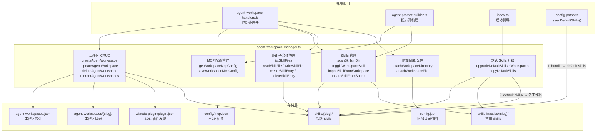
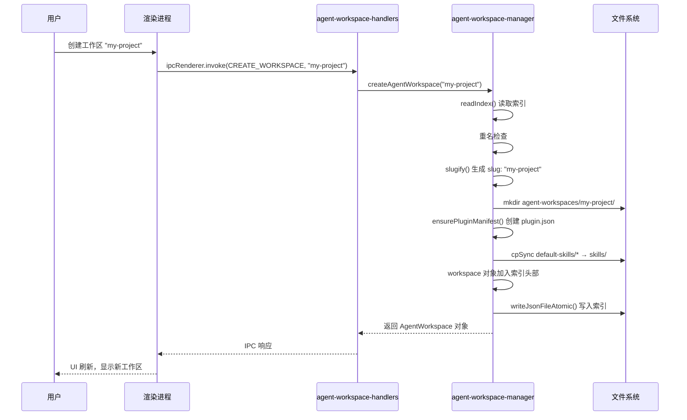
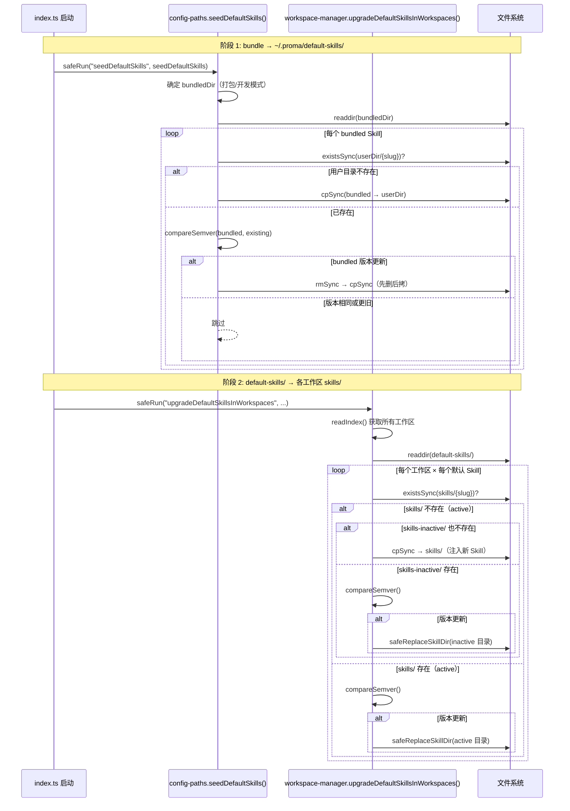
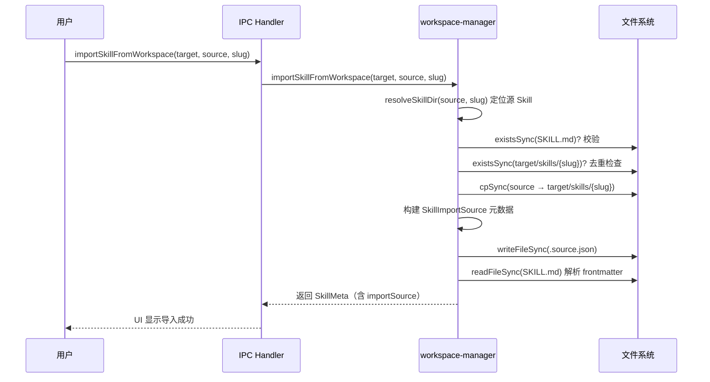

# agent-workspace-manager

> **代码位置**: `apps/electron/src/main/lib/agent/agent-workspace-manager.ts`
> **代码行数**: ~1130 行
> **复杂度**: 高
> **相关模块**: [config-paths](../electron/src/main/lib/storage/config-paths.ts)（路径常量）、[agent-workspace-handlers](../electron/src/main/ipc/agent-workspace-handlers.ts)（IPC 处理器）

## 概述

`agent-workspace-manager.ts` 是 Proma Agent 工作区管理的核心服务模块，负责工作区的完整生命周期管理。工作区是 Agent 模式的基本隔离单元：每个工作区拥有独立的 MCP Server 配置、Skills 集合、附加目录和会话数据，对应 `~/.proma/agent-workspaces/{slug}/` 下的一个物理目录。

该模块涵盖六大职责领域：(1) 工作区 CRUD（创建、读取、更新、删除、排序）；(2) MCP Server 配置读写；(3) Skills 目录扫描、启用/禁用切换、跨工作区导入与同步更新；(4) 默认 Skills 版本管理与自动升级（`seedDefaultSkills` → `upgradeDefaultSkillsInWorkspaces` 两阶段同步链路）；(5) Skill 子文件树管理（浏览、读写、创建、删除、重命名）；(6) 工作区附加目录与文件的挂载管理。

模块采用纯文件系统存储策略（JSON 索引 + JSONL 日志 + 目录结构），无本地数据库依赖。索引文件 `agent-workspaces.json` 仅存储轻量元数据（id / name / slug / 时间戳），全部数据通过文件系统目录结构组织。

## 架构图



## 核心流程

### 工作区创建流程



### 默认 Skills 两阶段同步流程（启动时）



### Skill 跨工作区导入流程



## 关键文件

| 文件 | 行数 | 作用 | 关键函数/类 |
|------|------|------|------------|
| `agent-workspace-manager.ts` | ~1130 | 工作区管理核心：CRUD、MCP、Skills、默认 Skills 升级 | `createAgentWorkspace()`, `upgradeDefaultSkillsInWorkspaces()`, `importSkillFromWorkspace()` |
| `config-paths.ts` | ~500 | 配置路径常量 + `seedDefaultSkills()` | `getAgentWorkspacePath()`, `getWorkspaceSkillsDir()`, `seedDefaultSkills()` |
| `agent-workspace-handlers.ts` | ~200 | IPC 处理器，桥接渲染进程调用 | `registerAgentWorkspaceHandlers()` |
| `agent-workspace.ts`（preload） | ~60 | Preload 层 API 暴露 | `listAgentWorkspaces`, `getWorkspaceMcpConfig` 等 |
| `agent.ts`（shared types） | ~1400 | IPC 通道常量 + 类型定义 | `AGENT_IPC_CHANNELS`, `AgentWorkspace`, `SkillMeta` |
| `agent-prompt-builder.ts` | ~500 | 提示词构建时读取 MCP/Skills 列表 | 调用 `getWorkspaceMcpConfig()`, `getWorkspaceSkills()` |

## 核心代码解析

### 默认 Skills 版本管理（两阶段同步链路）

**文件位置**: `agent-workspace-manager.ts:284-418`（升级逻辑）、`config-paths.ts:440-489`（种子逻辑）

Proma 的默认 Skills 采用两阶段同步机制，在应用启动时由 `index.ts` 依次调用：

1. **`seedDefaultSkills()`**（config-paths.ts）：将 app bundle 中的 Skills 同步到 `~/.proma/default-skills/`。打包模式从 `process.resourcesPath/default-skills` 读取，开发模式从源码 `default-skills/` 读取。通过 semver 比较决定是否覆盖——仅当 bundled 版本更高时才执行"先删后拷"操作，避免每次启动全量复制 4MB+ 文件阻塞主进程。

2. **`upgradeDefaultSkillsInWorkspaces()`**（本文件）：将 `default-skills/` 中的 Skills 同步到每个工作区的 `skills/` 或 `skills-inactive/` 目录。三种场景：
   - **缺失**：注入到 `skills/`（active），确保升级后新增的内置 Skill 对老用户立即可用
   - **已存在 active**：比较版本，bundled 更新时通过 `safeReplaceSkillDir()` 覆盖
   - **已存在 inactive**：同理在 inactive 目录中原地更新，保留用户的停用决定

```typescript
// agent-workspace-manager.ts:293-369 — 核心升级逻辑
export function upgradeDefaultSkillsInWorkspaces(): void {
  const defaultDir = getDefaultSkillsDir()
  const defaultSkills = new Map<string, DefaultSkillInfo>()
  // ... 扫描 defaultDir ...

  for (const workspace of index.workspaces) {
    for (const [slug, info] of defaultSkills) {
      const activePath = join(activeDir, slug)
      const inactivePath = join(inactiveDir, slug)

      if (existsSync(activePath)) {
        // 版本比较，仅 bundled 更新时替换
        if (compareSemver(info.version, currentVer) > 0) {
          safeReplaceSkillDir(info.sourcePath, activePath)
        }
        continue
      }

      if (existsSync(inactivePath)) {
        // inactive 也做版本升级，但保留在 inactive 目录
        // ...
        continue
      }

      // 完全缺失：注入到 active
      cpSync(info.sourcePath, activePath, { recursive: true, filter: skillCopyFilter })
    }
  }
}
```

**关键点**:
- `safeReplaceSkillDir()` 采用"先 rmSync 再 cpSync"策略，解决 `.git/objects/` 下 0444 只读文件导致 cpSync EACCES 失败的问题
- `skillCopyFilter()` 跳过 `.git`、`node_modules`、`dist` 等防御性目录，防止同步链路被意外大文件炸掉
- 单个 Skill 失败不影响其他 Skill 同步，错误被吞掉以保证启动流程不被阻断

### Skill 目录扫描与 frontmatter 解析

**文件位置**: `agent-workspace-manager.ts:474-531`

Skills 的元数据存储在每个 Skill 目录的 `SKILL.md` YAML frontmatter 中。`parseSkillFrontmatter()` 实现了一个轻量级 YAML 解析器，支持单行值、block scalar（`|` / `>`）和多行缩进三种格式。解析结果为 `SkillMeta` 对象（slug / name / description / icon / version / enabled）。

```typescript
// agent-workspace-manager.ts:482-531 — frontmatter 解析
function parseSkillFrontmatter(content: string, slug: string, enabled: boolean): SkillMeta {
  const meta: SkillMeta = { slug, name: slug, enabled }
  const fmMatch = content.match(/^---\s*\n([\s\S]*?)\n---/)
  if (!fmMatch) return meta

  const yaml = fmMatch[1]
  const validKeys = new Set(['name', 'description', 'icon', 'version'])
  let currentKey = ''
  let isFolded = false

  for (const line of yaml.split('\n')) {
    // ... 行解析逻辑：处理 block scalar (|/>)、缩进续行、单行键值对 ...
  }
  // 将解析结果填入 meta
}
```

**关键点**:
- 不依赖外部 YAML 库，手动解析减少依赖体积
- `validKeys` 白名单过滤非法键，防御性处理格式错误
- `scanSkillsInDir()` 同时扫描 active/inactive 目录，对导入的 Skill 自动读取 `.source.json` 检测版本更新

### Skill 子文件安全管理

**文件位置**: `agent-workspace-manager.ts:816-900`

Skill 目录下除 `SKILL.md` 外可包含任意子文件（代码、配置等）。模块提供了完整的文件树浏览和 CRUD 操作，并内置多层安全防护：

- **路径穿越防护**：`resolveSkillChildPath()` 将相对路径 resolve 后检查是否在 Skill 根目录内，拒绝 `..` 路径和绝对路径
- **SKILL.md 保护**：子文件操作接口禁止直接读写 `SKILL.md`，必须通过专用的 `readWorkspaceSkillContent()` / `writeWorkspaceSkillContent()`
- **二进制文件检测**：`isLikelyBinaryFile()` 读前 8KB 判断是否含 NUL 字节，二进制文件不返回文本内容
- **大小限制**：单文件上限 10MB，防止内存溢出
- **递归深度限制**：文件树遍历最大深度 8 层

## 依赖关系

### 依赖的模块

| 模块 | 依赖原因 |
|------|---------|
| `@proma/shared` | 类型定义：`AgentWorkspace`、`WorkspaceMcpConfig`、`SkillMeta`、`SkillImportSource`、`WorkspaceCapabilities`、`SkillFileNode`、`SkillFileContent` |
| `storage/config-paths` | 路径常量：`getAgentWorkspacesIndexPath`、`getAgentWorkspacePath`、`getWorkspaceMcpPath`、`getWorkspaceSkillsDir`、`getInactiveSkillsDir`、`getDefaultSkillsDir`、`parseSkillVersion` |
| `safe-file` | 原子写入：`writeJsonFileAtomic`、`readJsonFileSafe` |
| `node:fs` | 文件系统操作：readFileSync / writeFileSync / existsSync / readdirSync / cpSync / rmSync / renameSync 等 |
| `node:crypto` | UUID 生成：`randomUUID()` |
| `node:path` | 路径处理：join / resolve / relative / isAbsolute / dirname / basename |

### 被依赖的模块

| 模块 | 被依赖原因 |
|------|-----------|
| `ipc/agent-workspace-handlers.ts` | IPC 处理器调用本模块所有导出函数 |
| `agent/agent-prompt-builder.ts` | 提示词构建时读取 `getWorkspaceMcpConfig()` 和 `getWorkspaceSkills()` |
| `main/index.ts` | 启动时调用 `upgradeDefaultSkillsInWorkspaces()` 和 `ensureDefaultWorkspace()` |
| `feishu/messages/FeishuCommandHandler.ts` | 飞书命令处理中读取 `getWorkspaceCapabilities()` |
| `bridge/bridge-command-handler.ts` | 桥接命令处理中读取工作区状态 |
| `storage/migration-service.ts` | 数据迁移时读取工作区 Skills 和 MCP 配置 |

## IPC 通道

| 通道名称 | 方向 | 作用 |
|---------|------|------|
| `agent:list-workspaces` | 渲染 → 主 | 列出所有工作区 |
| `agent:create-workspace` | 渲染 → 主 | 创建工作区 |
| `agent:update-workspace` | 渲染 → 主 | 更新工作区名称 |
| `agent:delete-workspace` | 渲染 → 主 | 删除工作区 |
| `agent:reorder-workspaces` | 渲染 → 主 | 重排工作区顺序 |
| `agent:get-capabilities` | 渲染 → 主 | 获取工作区能力摘要 |
| `agent:get-mcp-config` | 渲染 → 主 | 获取 MCP 配置 |
| `agent:save-mcp-config` | 渲染 → 主 | 保存 MCP 配置 |
| `agent:test-mcp-server` | 渲染 → 主 | 测试 MCP 服务器连接 |
| `agent:get-skills` | 渲染 → 主 | 获取 Skills 列表 |
| `agent:get-skills-dir` | 渲染 → 主 | 获取 Skills 目录绝对路径 |
| `agent:delete-skill` | 渲染 → 主 | 删除 Skill |
| `agent:toggle-skill` | 渲染 → 主 | 切换 Skill 启用/禁用 |
| `agent:get-other-workspace-skills` | 渲染 → 主 | 获取其他工作区 Skills |
| `agent:import-skill-from-workspace` | 渲染 → 主 | 跨工作区导入 Skill |
| `agent:update-skill-from-source` | 渲染 → 主 | 从源工作区更新 Skill |
| `agent:read-skill-content` | 渲染 → 主 | 读取 SKILL.md 内容 |
| `agent:write-skill-content` | 渲染 → 主 | 写入 SKILL.md 内容 |
| `agent:list-skill-files` | 渲染 → 主 | 列出 Skill 子文件树 |
| `agent:read-skill-file` | 渲染 → 主 | 读取 Skill 子文件 |
| `agent:write-skill-file` | 渲染 → 主 | 写入 Skill 子文件 |
| `agent:create-skill-entry` | 渲染 → 主 | 创建 Skill 子文件/目录 |
| `agent:delete-skill-entry` | 渲染 → 主 | 删除 Skill 子文件/目录 |
| `agent:rename-skill-entry` | 渲染 → 主 | 重命名 Skill 子文件/目录 |

## 数据流向

```
用户操作（渲染进程）
  ↓ window.electronAPI.*
IPC 处理器（agent-workspace-handlers.ts）
  ↓ 函数调用
workspace-manager 方法
  ↓ node:fs 操作
~/.proma/ 文件系统
  ├── agent-workspaces.json      ← 工作区索引
  ├── default-skills/            ← bundled Skills 缓存
  └── agent-workspaces/{slug}/
      ├── .claude-plugin/plugin.json  ← SDK 插件发现
      ├── config/mcp.json             ← MCP Server 配置
      ├── config.json                 ← 附加目录/文件
      ├── skills/{skill}/             ← 活跃 Skills
      │   ├── SKILL.md                ← 元数据 frontmatter
      │   ├── .source.json            ← 导入来源（可选）
      │   └── ...                     ← 子文件
      └── skills-inactive/{skill}/    ← 禁用 Skills
```
