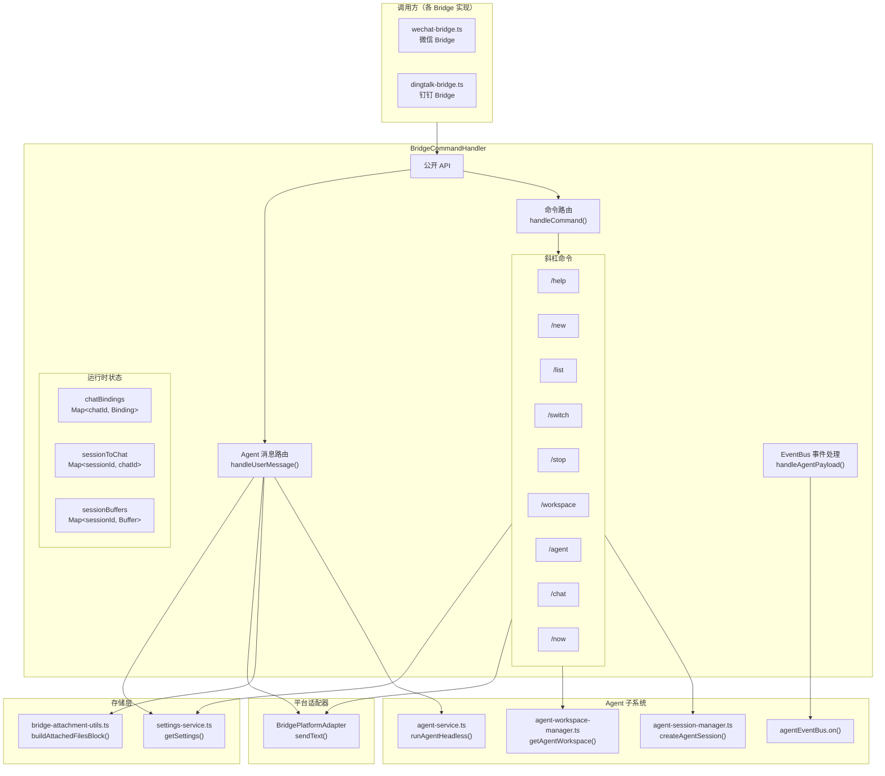
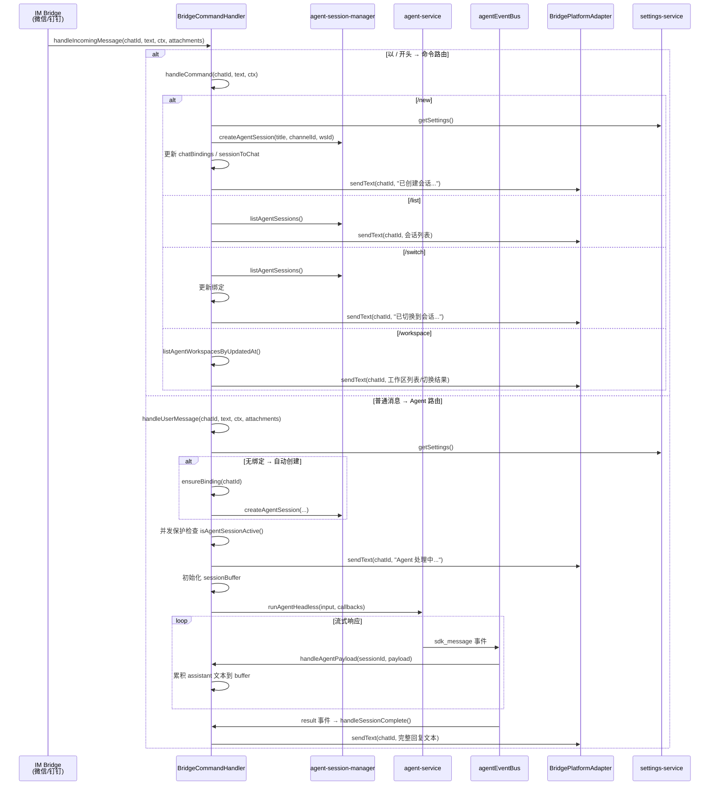

# Bridge Command Handler -- 通用 IM Bridge 命令处理器

> **代码位置**: `apps/electron/src/main/lib/bridge/bridge-command-handler.ts`
> **行数**: ~685 行
> **相关模块**: [bridge-attachment-utils](#关键文件), [bridge-registry](#关键文件), [agent-service](#依赖关系), [agent-session-manager](#依赖关系), [agent-workspace-manager](#依赖关系)

## 概述

`BridgeCommandHandler` 是一个通用 IM Bridge 命令处理器类，为微信、钉钉等第三方即时通讯平台提供统一的斜杠命令解析和 Agent 消息路由能力。各平台通过实现 `BridgePlatformAdapter` 接口接入，只需提供一个 `sendText()` 方法即可获得完整的命令系统和 Agent 交互功能。

该类承担三项核心职责。第一，**斜杠命令路由**：解析以 `/` 开头的命令消息（`/help`、`/new`、`/list`、`/switch`、`/stop`、`/workspace`、`/agent`、`/chat`、`/now`），执行会话管理、模式切换和工作区切换操作。第二，**Agent 消息路由**：普通消息自动绑定或创建 Agent 会话，通过 `runAgentHeadless()` 调用 Agent 服务，使用 EventBus 订阅流式响应并缓冲回复文本，完成后一次性发送给平台。第三，**会话绑定管理**：维护 `chatId → BridgeChatBinding` 映射和反向索引，将第三方聊天窗口与 Proma Agent 会话关联起来。

飞书 Bridge 使用独立的卡片消息格式和更细粒度的子模块架构（`FeishuCommandHandler`、`FeishuMessageRouter` 等），暂不接入此通用模块。

## 架构图



## 核心流程

### 消息处理时序图



### 斜杠命令一览

| 命令 | 参数 | 功能 |
|------|------|------|
| `/help` | 无 | 显示所有可用命令列表 |
| `/new [标题]` | 可选标题 | 创建新 Agent 会话并绑定到当前聊天 |
| `/list` | 无 | 按工作区分组列出会话（每工作区最多 5 条） |
| `/switch <序号>` | 序号或 ID 前缀 | 切换到指定序号的会话 |
| `/stop` | 无 | 停止当前正在运行的 Agent |
| `/workspace [名称]` | 可选序号或名称 | 无参数列出工作区，有参数切换工作区 |
| `/agent` | 无 | 切换到 Agent 模式 |
| `/chat` | 无 | 切换到 Chat 模式（暂未实现） |
| `/now` | 无 | 显示当前状态（会话、工作区、MCP、Skills、文件） |

## 关键文件

| 文件 | 行数 | 作用 | 关键函数/类 |
|------|------|------|------------|
| `bridge/bridge-command-handler.ts` | ~685 | 通用 IM Bridge 命令处理器，斜杠命令解析与 Agent 消息路由 | `BridgeCommandHandler` 类 |
| `bridge/bridge-attachment-utils.ts` | ~131 | Bridge 附件工具：图片/文件保存、MIME 推断、`<attached_files>` XML 构建 | `saveImageToSession()`, `saveFileToSession()`, `buildAttachedFilesBlock()` |
| `bridge/bridge-registry.ts` | ~61 | Bridge 生命周期注册表，统一管理启动/停止 | `registerBridge()`, `startAllBridges()`, `stopAllBridges()` |
| `dingtalk/dingtalk-bridge.ts` | ~400+ | 钉钉 Bridge 实现，通过 WebSocket 接收消息，使用 `BridgeCommandHandler` 路由 | `DingTalkBridge` 类 |
| `wechat/wechat-bridge.ts` | ~915 | 微信 Bridge 实现，通过 HTTP 长轮询接收消息，使用 `BridgeCommandHandler` 路由 | `WeChatBridge` 类 |

## 核心代码解析

### 自动会话绑定（ensureBinding）

**文件位置**: `bridge/bridge-command-handler.ts:128-157`

**作用**: 为第三方聊天窗口自动创建并绑定 Agent 会话。当 Bridge 收到图片/文件需要预先保存到磁盘时，需要先拿到 `sessionId` 和 `workspaceId`，此方法在消息到达前即可创建绑定。

```typescript
ensureBinding(chatId: string): BridgeChatBinding | null {
  const existing = this.chatBindings.get(chatId)
  if (existing) return existing

  const settings = getSettings()
  const channelId = settings.agentChannelId
  if (!channelId) return null

  const workspaceId = this.config.getDefaultWorkspaceId?.() ?? settings.agentWorkspaceId ?? ''

  const session = createAgentSession(
    `${this.config.platformName}会话`,
    channelId,
    workspaceId || undefined,
  )

  const binding: BridgeChatBinding = {
    chatId, sessionId: session.id,
    workspaceId, channelId,
    modelId: settings.agentModelId ?? undefined,
    mode: 'agent',
  }
  this.chatBindings.set(chatId, binding)
  this.sessionToChat.set(session.id, chatId)
  this.notifySessionCreated(session.id, session.title)
  return binding
}
```

**关键点**:
- 双向索引：`chatBindings`（正查）+ `sessionToChat`（反查），保证 EventBus 回调时能从 `sessionId` 找到目标 `chatId`
- 未配置 Agent 渠道时返回 `null`，调用方据此决定是否继续处理附件
- `notifySessionCreated()` 通过 IPC 通知渲染进程刷新会话列表

### Agent 消息路由与流式缓冲（handleUserMessage + handleAgentPayload）

**文件位置**: `bridge/bridge-command-handler.ts:548-671`

**作用**: 将用户消息发送给 Agent 服务，通过 EventBus 订阅流式响应，在缓冲中累积文本，待会话完成后一次性发送完整回复。这是与飞书 Bridge 的关键区别——飞书使用 `FeishuCardStreamer` 实时更新卡片消息，而通用 Bridge 采用"累积后一次发送"的简单策略。

```typescript
// handleUserMessage 中的关键片段
if (isAgentSessionActive(binding.sessionId)) {
  await this.send(chatId, '❌ 上一条消息仍在处理中，请稍候再试', contextData)
  return
}

// 初始化回复缓冲
this.sessionBuffers.set(binding.sessionId, {
  text: '', chatId, contextData, startedAt: Date.now(),
})

// 拼接附件引用到用户消息前
const fileReferences = attachments?.length
  ? buildAttachedFilesBlock(attachments.map(a => ({ label: a.label, path: a.absolutePath })))
  : ''
const userMessage = fileReferences + text.trim() || '请查看上面附加的文件。'

runAgentHeadless(input, { onError, onComplete, onTitleUpdated })
```

```typescript
// EventBus 流式缓冲
private handleAgentPayload(sessionId: string, payload: AgentStreamPayload): void {
  const buffer = this.sessionBuffers.get(sessionId)
  if (!buffer) return

  if (payload.kind === 'sdk_message') {
    if (msg.type === 'assistant') {
      // 累积 assistant 文本
      for (const block of aMsg.message?.content ?? []) {
        if (block.type === 'text' && block.text) buffer.text += block.text
      }
    }
    if (msg.type === 'result') this.handleSessionComplete(sessionId)
  }
}
```

**关键点**:
- **并发保护**：`isAgentSessionActive()` 检查防止同一会话并行请求，避免缓冲区混乱
- **附件处理**：`buildAttachedFilesBlock()` 将文件路径包装为 `<attached_files>` XML 块，Agent SDK 可读取文件内容
- **缓冲策略**：`SessionBuffer` 记录 `chatId` 和 `contextData`，确保回复能发送到正确的聊天窗口
- **超时安全**：缓冲记录 `startedAt`，可用于未来实现超时清理

## 依赖关系

### 依赖的模块

| 模块 | 依赖原因 |
|------|---------|
| `agent-service.ts` | 调用 `runAgentHeadless()` 运行 Agent、`agentEventBus.on()` 订阅流式事件、`stopAgent()` 停止 Agent、`isAgentSessionActive()` 检查并发 |
| `agent-session-manager.ts` | 调用 `createAgentSession()` 创建新会话、`listAgentSessions()` 列出会话、`getAgentSessionMeta()` 获取会话元数据 |
| `agent-workspace-manager.ts` | 调用 `listAgentWorkspacesByUpdatedAt()` 列出工作区、`getAgentWorkspace()` 获取工作区详情、`getWorkspaceCapabilities()` 获取 MCP/Skills 列表 |
| `storage/settings-service.ts` | 调用 `getSettings()` 获取 Agent 渠道、模型、工作区等默认配置 |
| `storage/config-paths.ts` | 调用 `getAgentWorkspacePath()` 获取工作区目录路径（`/now` 命令列出文件） |
| `bridge/bridge-attachment-utils.ts` | 调用 `buildAttachedFilesBlock()` 将附件引用拼接到用户消息 |

### 被依赖的模块

| 模块 | 被依赖原因 |
|------|-----------|
| `wechat/wechat-bridge.ts` | 导入 `BridgeCommandHandler` 和 `BridgeAttachment`，创建实例处理微信消息路由 |
| `dingtalk/dingtalk-bridge.ts` | 导入 `BridgeCommandHandler` 和 `BridgeAttachment`，创建实例处理钉钉消息路由 |
| `feishu/messages/FeishuMessageRouter.ts` | 导入 `bridge-attachment-utils.ts` 中的附件保存函数（间接依赖同目录模块） |

### 导出接口

| 接口 | 用途 |
|------|------|
| `BridgePlatformAdapter` | 平台适配器接口，各 Bridge 实现 `sendText()` 方法即可接入 |
| `BridgeAttachment` | 已保存到磁盘的附件引用（`absolutePath` + `label` + `kind`） |
| `BridgeCommandHandlerConfig` | 命令处理器配置（平台名、适配器、默认工作区回调等） |
| `BridgeChatBinding` | 聊天绑定（chatId、sessionId、workspaceId、channelId、mode） |
