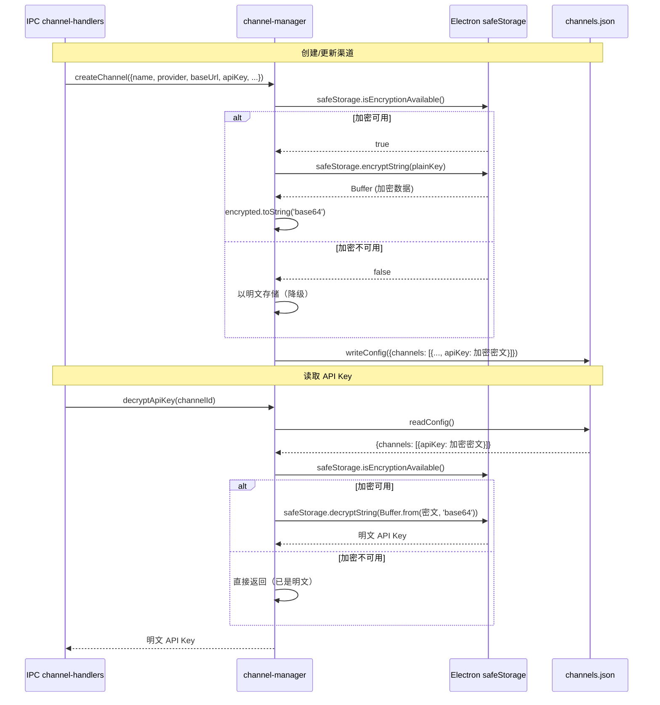
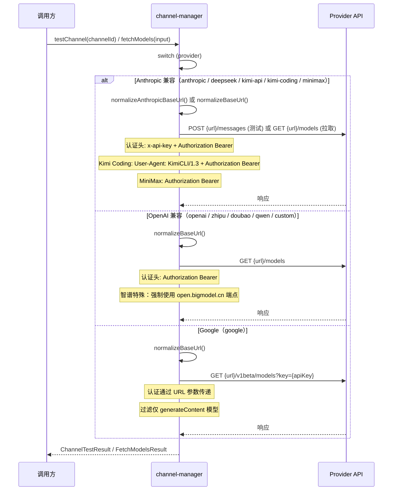

# Channel Manager -- 渠道管理与 API Key 加密服务

> **代码位置**: `apps/electron/src/main/lib/channel/channel-manager.ts`
> **行数**: ~729 行
> **相关模块**: [channel-handlers (IPC)](#依赖关系), [chat-service](#依赖关系), [agent-orchestrator](#依赖关系), [agent-pipeline-stages](#依赖关系), [proxy-settings-service](#依赖关系)

## 概述

`channel-manager.ts` 是渠道管理的核心服务，运行在 Electron 主进程中。它负责 AI Provider 渠道的完整生命周期管理：创建、读取、更新、删除（CRUD），以及 API Key 的加密存储与解密、连接测试、模型列表拉取。数据持久化到 `~/.proma/channels.json`。

该服务承担三项核心职责。第一，**渠道 CRUD**：管理用户配置的 AI Provider 渠道（Anthropic、OpenAI、DeepSeek、Kimi、智谱、豆包、通义千问、Google、Custom 等），首次使用时自动创建 DeepSeek 预设渠道。第二，**API Key 加密**：使用 Electron `safeStorage`（底层 macOS Keychain / Windows DPAPI / Linux Secret Service API）对 API Key 进行 OS 级加密，存储为 base64 编码的密文；仅在运行时按需解密，JSON 文件中不保留明文。第三，**Provider 分支路由**：连接测试和模型拉取按 Provider 类型走不同分支——Anthropic 兼容协议（Anthropic / DeepSeek / Kimi / MiniMax）、OpenAI 兼容协议（OpenAI / 智谱 / 豆包 / 通义 / Custom）、Google Generative AI 协议，每个分支有不同的 URL 规范、认证头和响应格式解析。

## 架构图

```mermaid
flowchart TB
    subgraph ChannelManager["channel-manager.ts"]
        direction TB

        subgraph CRUD["渠道 CRUD"]
            ListChannels["listChannels()<br/>获取所有渠道"]
            GetById["getChannelById()<br/>按 ID 获取"]
            Create["createChannel()<br/>创建渠道"]
            Update["updateChannel()<br/>更新渠道"]
            Delete["deleteChannel()<br/>删除渠道"]
        end

        subgraph Crypto["加密 / 解密"]
            Encrypt["encryptApiKey()<br/>safeStorage 加密"]
            Decrypt["decryptKey()<br/>safeStorage 解密"]
            DecryptApi["decryptApiKey()<br/>按渠道 ID 解密"]
        end

        subgraph Test["连接测试"]
            TestChannel["testChannel()<br/>按已保存渠道测试"]
            TestDirect["testChannelDirect()<br/>直接测试（明文凭据）"]
            TestAnthropic["testAnthropicCompatible()"]
            TestOpenAI["testOpenAICompatible()"]
            TestGoogle["testGoogle()"]
        end

        subgraph Models["模型拉取"]
            FetchModels["fetchModels()<br/>拉取可用模型"]
            RefreshAll["refreshAllChannelModels()<br/>批量刷新已启用渠道"]
            FetchAnthropic["fetchAnthropicCompatibleModels()"]
            FetchOpenAI["fetchOpenAICompatibleModels()"]
            FetchGoogle["fetchGoogleModels()"]
        end
    end

    subgraph Storage["存储"]
        ChannelsJson["~/.proma/channels.json<br/>渠道配置（API Key 加密态）"]
        SafeStorage["Electron safeStorage<br/>OS 级加密"]
    end

    subgraph Network["网络层"]
        ProxySettings["proxy-settings-service<br/>代理配置"]
        ProxyFetch["proxy-fetch<br/>代理 HTTP 请求"]
    end

    subgraph CoreUtils["@proma/core 工具"]
        NormalizeUrl["normalizeBaseUrl()<br/>normalizeAnthropicBaseUrl()<br/>normalizeVersionedAnthropicBaseUrl()"]
    end

    Create --> Encrypt
    Update --> Encrypt
    Encrypt --> SafeStorage
    Decrypt --> SafeStorage
    DecryptApi --> Decrypt

    TestChannel --> Decrypt
    TestChannel --> TestAnthropic
    TestChannel --> TestOpenAI
    TestChannel --> TestGoogle
    TestDirect --> TestAnthropic
    TestDirect --> TestOpenAI
    TestDirect --> TestGoogle

    FetchModels --> FetchAnthropic
    FetchModels --> FetchOpenAI
    FetchModels --> FetchGoogle
    RefreshAll --> FetchModels

    TestAnthropic --> ProxyFetch
    TestOpenAI --> ProxyFetch
    TestGoogle --> ProxyFetch
    FetchAnthropic --> ProxyFetch
    FetchOpenAI --> ProxyFetch
    FetchGoogle --> ProxyFetch
    ProxyFetch --> ProxySettings

    TestAnthropic --> NormalizeUrl
    FetchAnthropic --> NormalizeUrl

    ListChannels --> ChannelsJson
    Create --> ChannelsJson
    Update --> ChannelsJson
    Delete --> ChannelsJson
```



## 核心流程

### API Key 加密存储流程



### Provider 分支路由（连接测试 / 模型拉取）



## 关键文件

| 文件 | 行数 | 作用 | 关键函数/类 |
|------|------|------|------------|
| `channel/channel-manager.ts` | ~729 | 渠道 CRUD、API Key 加密/解密、连接测试、模型拉取 | `listChannels()`, `createChannel()`, `encryptApiKey()`, `testChannel()`, `fetchModels()` |
| `channel/channel-handlers.ts` (IPC) | ~80 | IPC 通道注册，桥接渲染进程与 channel-manager | `registerChannelHandlers()` |
| `preload/channels.ts` | ~29 | Preload 层渠道 API 暴露 | `listChannels`, `createChannel`, `decryptApiKey` 等 |
| `renderer/components/settings/ChannelSettings.tsx` | ~200+ | 渲染进程渠道设置 UI | 渠道列表管理组件 |
| `renderer/components/settings/ChannelForm.tsx` | ~400+ | 渲染进程渠道编辑表单 | 渠道创建/编辑表单 |
| `packages/shared/src/types/channel.ts` | ~210 | 渠道相关类型定义与 IPC 通道常量 | `Channel`, `ProviderType`, `CHANNEL_IPC_CHANNELS` |

## 核心代码解析

### API Key 加密与解密

**文件位置**: `channel/channel-manager.ts:75-104`

**作用**: 使用 Electron `safeStorage` 对 API Key 进行 OS 级加密存储。加密后的密文以 base64 编码写入 `channels.json`，运行时按需解密。当 `safeStorage` 不可用时降级为明文存储并输出警告。

```typescript
function encryptApiKey(plainKey: string): string {
  if (!safeStorage.isEncryptionAvailable()) {
    console.warn('[渠道管理] safeStorage 加密不可用，将以明文存储')
    return plainKey
  }
  const encrypted = safeStorage.encryptString(plainKey)
  return encrypted.toString('base64')
}

function decryptKey(encryptedKey: string): string {
  if (!safeStorage.isEncryptionAvailable()) {
    return encryptedKey  // 降级：假设存储的是明文
  }
  try {
    const buffer = Buffer.from(encryptedKey, 'base64')
    return safeStorage.decryptString(buffer)
  } catch (error) {
    console.error('[渠道管理] 解密 API Key 失败:', error)
    throw new Error('解密 API Key 失败')
  }
}
```

**关键点**:
- **OS 级加密**：macOS 使用 Keychain、Windows 使用 DPAPI、Linux 使用 Secret Service API，密钥绑定到当前用户和机器
- **降级策略**：`safeStorage` 不可用时（如某些 Linux 桌面环境缺少密钥环）降级为明文，通过 `console.warn` 提醒用户
- **数据格式**：加密后输出 base64 字符串，兼容 JSON 序列化；解密时先 `Buffer.from(base64)` 再传入 `safeStorage.decryptString()`
- **安全性**：`channels.json` 文件中 API Key 始终以密文形态存储；仅 `decryptApiKey()` 和内部测试/拉取函数会在运行时解密；渲染进程通过 IPC `channel:decrypt-key` 获取明文

### Provider 分支路由与连接测试

**文件位置**: `channel/channel-manager.ts:256-413`

**作用**: 根据 Provider 类型选择不同的 API 协议进行连接测试。核心是 `testChannel()` 中的 `switch` 分支，将 Provider 分为三大兼容阵营，每阵营有不同的 URL 规范、认证方式和测试策略。

```typescript
export async function testChannel(channelId: string): Promise<ChannelTestResult> {
  const config = readConfig()
  const channel = config.channels.find((c) => c.id === channelId)
  if (!channel) return { success: false, message: '渠道不存在' }

  const apiKey = decryptKey(channel.apiKey)
  const proxyUrl = await getEffectiveProxyUrl()

  switch (channel.provider) {
    case 'anthropic': case 'deepseek': case 'kimi-api': case 'kimi-coding': case 'minimax':
      return await testAnthropicCompatible(channel.baseUrl, apiKey, proxyUrl, channel.provider)
    case 'openai': case 'zhipu': case 'doubao': case 'qwen': case 'custom':
      return await testOpenAICompatible(channel.baseUrl, apiKey, proxyUrl)
    case 'google':
      return await testGoogle(channel.baseUrl, apiKey, proxyUrl)
    default:
      return { success: false, message: `不支持的供应商: ${channel.provider}` }
  }
}
```

**关键点**:
- **Anthropic 兼容**：向 `/messages` 端点发送最小请求（`max_tokens: 1`），收到任何 API 响应（包括非 200）即视为连接成功；DeepSeek/Kimi 无需 `/v1` 前缀；Kimi Coding 必须带 `User-Agent: KimiCLI/1.3` 否则 403
- **OpenAI 兼容**：向 `/models` 端点发送 GET 请求，验证 API Key 有效性；401 返回明确错误，其他错误状态返回失败
- **Google**：向 `/v1beta/models?key={apiKey}` 发送 GET 请求，API Key 通过 URL 参数传递而非 header；400/403 视为 Key 无效
- **代理支持**：所有网络请求通过 `getFetchFn(proxyUrl)` 走代理，适配企业网络环境

## 依赖关系

### 依赖的模块

| 模块 | 依赖原因 |
|------|---------|
| `electron` (`safeStorage`) | 使用 OS 级加密 API 对 API Key 加密/解密 |
| `@proma/shared` (`types/channel`) | 渠道相关类型：`Channel`, `ChannelCreateInput`, `ChannelUpdateInput`, `ChannelTestResult`, `ChannelModel`, `FetchModelsInput`, `FetchModelsResult`, `ProviderType` |
| `@proma/shared` (`PROVIDER_DEFAULT_URLS`) | 各 Provider 的默认 Base URL |
| `@proma/core` (`normalizeBaseUrl`, `normalizeAnthropicBaseUrl`, `normalizeVersionedAnthropicBaseUrl`) | Base URL 规范化处理（移除尾部斜杠、补全 `/v1` 等） |
| `network/proxy-settings-service.ts` | 获取系统代理配置 (`getEffectiveProxyUrl()`) |
| `network/proxy-fetch.ts` | 获取带代理支持的 fetch 函数 (`getFetchFn()`) |
| `storage/config-paths.ts` | 获取渠道配置文件路径 (`getChannelsPath()`) |

### 被依赖的模块

| 模块 | 被依赖原因 |
|------|-----------|
| `ipc/channel-handlers.ts` | IPC 层直接调用所有导出函数（`listChannels`, `createChannel`, `updateChannel`, `deleteChannel`, `decryptApiKey`, `testChannel`, `testChannelDirect`, `fetchModels`, `refreshAllChannelModels`） |
| `chat/chat-service.ts` | 调用 `listChannels()` 获取渠道列表、`decryptApiKey()` 解密 API Key 用于 Chat 流式调用 |
| `agent/agent-orchestrator.ts` | 调用 `listChannels()` 和 `decryptApiKey()` 获取 Agent 渠道配置和 API Key |
| `agent/agent-pipeline-stages.ts` | 调用 `getChannelById()`, `decryptApiKey()`, `listChannels()` 获取 Agent 管道中的渠道信息 |
| `storage/migration-service.ts` | 调用 `listChannels()` 和 `decryptApiKey()` 进行数据迁移时的渠道凭证读取 |

### IPC 通道

| 通道名称 | 方向 | 作用 |
|---------|------|------|
| `channel:list` | 渲染 -> 主 | 获取所有渠道列表 |
| `channel:create` | 渲染 -> 主 | 创建新渠道 |
| `channel:update` | 渲染 -> 主 | 更新渠道 |
| `channel:delete` | 渲染 -> 主 | 删除渠道 |
| `channel:decrypt-key` | 渲染 -> 主 | 解密获取明文 API Key |
| `channel:test` | 渲染 -> 主 | 测试已保存渠道的连接 |
| `channel:test-direct` | 渲染 -> 主 | 直接测试连接（传入明文凭据，无需已保存渠道） |
| `channel:fetch-models` | 渲染 -> 主 | 从 Provider API 拉取可用模型 |
| `channel:refresh-models` | 渲染 -> 主 | 批量刷新所有已启用渠道的模型列表 |
