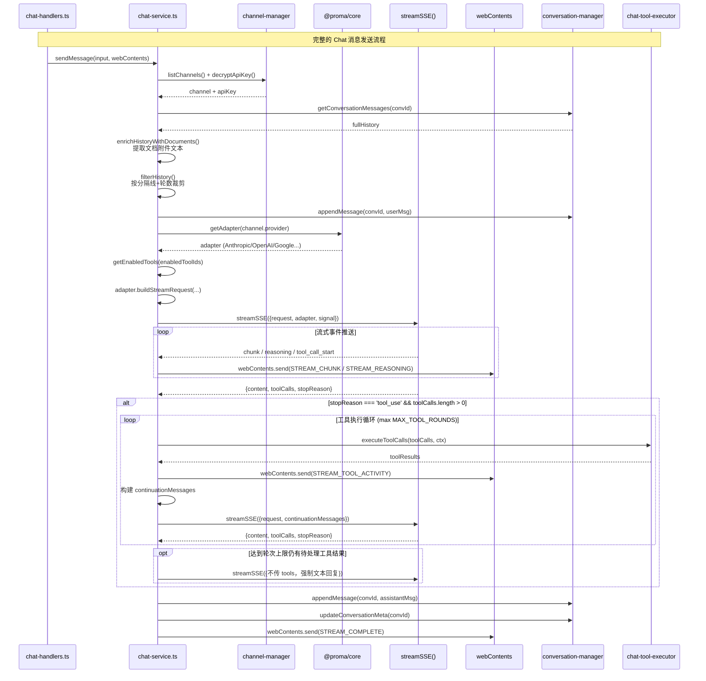
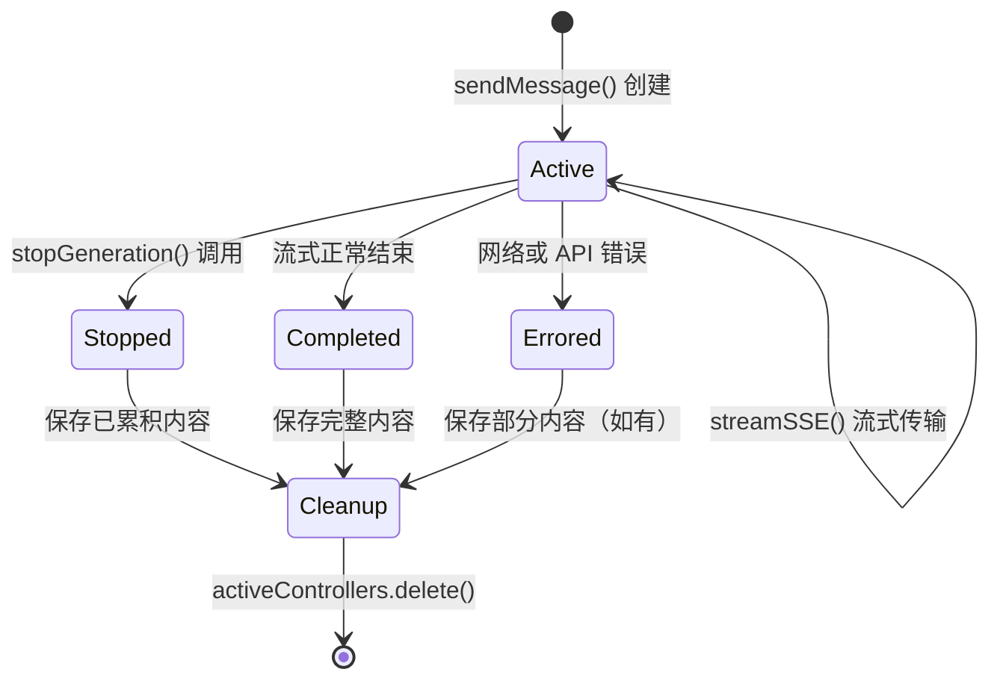

# Chat Service -- AI 聊天流式服务

> **代码位置**: `apps/electron/src/main/lib/chat/chat-service.ts`
> **行数**: ~614 行
> **相关模块**: [chat-tool-registry](#关键文件), [chat-tool-executor](#关键文件), [channel-manager](#依赖关系), [conversation-manager](#依赖关系)

## 概述

`chat-service.ts` 是 Chat 模式的流式调用编排层，运行在 Electron 主进程中。它负责将用户消息通过 `@proma/core` 的 Provider 适配器系统发送给 AI 模型，并以 SSE（Server-Sent Events）流式方式接收响应，同时通过 IPC 实时推送到渲染进程。

该服务承担三项核心职责。第一，Electron 平台相关的操作：查找渠道配置、解密 API Key、管理 AbortController 生命周期。第二，消息持久化：将用户消息和助手回复追加到 JSONL 文件，并更新对话索引。第三，模块化工具的 function calling 循环：通过 `ChatToolRegistry` 获取启用的工具定义，在模型返回 `tool_use` 停止原因时，自动调用 `ChatToolExecutor` 执行工具并将结果回传给模型，形成多轮工具调用直到获得最终文本回复。

纯逻辑（消息格式转换、SSE 解析、HTTP 请求构建）已抽象到 `@proma/core/providers`，`chat-service.ts` 仅负责编排和桥接。

## 架构图

```mermaid
flowchart TB
    subgraph ChatService["chat-service.ts"]
        direction TB

        Send["sendMessage()"]
        Stop["stopGeneration()"]
        StopAll["stopAllGenerations()"]
        GenTitle["generateTitle()"]

        subgraph Helpers["辅助函数"]
            GetImg["getImageAttachmentData()<br/>图片 base64 读取"]
            EnrichMsg["enrichMessageWithDocuments()<br/>文档文本提取"]
            EnrichHist["enrichHistoryWithDocuments()<br/>历史消息文档注入"]
            FilterHist["filterHistory()<br/>上下文过滤"]
        end

        subgraph State["运行时状态"]
            Controllers["activeControllers<br/>Map&lt;convId, AbortController&gt;"]
        end
    end

    subgraph Core["@proma/core"]
        GetAdapter["getAdapter()<br/>Provider 注册表"]
        StreamSSE["streamSSE()<br/>SSE 流读取器"]
        FetchTitle["fetchTitle()<br/>标题获取"]
    end

    subgraph Tools["工具子系统"]
        Registry["chat-tool-registry.ts<br/>getEnabledTools()"]
        Executor["chat-tool-executor.ts<br/>executeToolCalls()"]
    end

    subgraph External["外部服务"]
        ChannelMgr["channel-manager.ts<br/>listChannels / decryptApiKey"]
        ConvMgr["conversation-manager.ts<br/>appendMessage / getConversationMessages"]
        AttachSvc["attachment-service.ts<br/>readAttachmentAsBase64"]
        DocParser["document-parser.ts<br/>extractTextFromAttachment"]
        ProxySvc["proxy-settings-service.ts<br/>getEffectiveProxyUrl"]
        ProxyFetch["proxy-fetch.ts<br/>getFetchFn"]
    end

    Send --> GetAdapter
    Send --> StreamSSE
    Send --> Registry
    Send --> Executor
    Send --> ChannelMgr
    Send --> ConvMgr
    Send --> GetImg
    Send --> EnrichMsg
    Send --> EnrichHist
    Send --> FilterHist

    GetImg --> AttachSvc
    EnrichMsg --> DocParser
    GenTitle --> GetAdapter
    GenTitle --> FetchTitle

    Tools --> ChannelMgr
    Executor --> ConvMgr
```



## 核心流程

### Chat 消息发送和流式响应



### AbortController 生命周期



## 关键文件

| 文件 | 行数 | 作用 | 关键导出 |
|------|------|------|---------|
| `chat/chat-service.ts` | ~614 | Chat 流式调用编排主文件 | `sendMessage()`, `stopGeneration()`, `stopAllGenerations()`, `generateTitle()` |
| `chat/chat-tool-registry.ts` | ~100 | 工具注册表，管理内置工具和自定义工具 | `getEnabledTools()`, `getAllToolInfos()` |
| `chat/chat-tool-executor.ts` | ~80 | 工具统一执行器，分发到各工具模块 | `executeToolCalls()`, `ToolExecutionContext` |
| `chat/chat-tool-config.ts` | ~80 | 工具配置持久化（`~/.proma/chat-tools.json`） | `getChatToolsConfig()`, `updateToolState()`, `updateToolCredentials()` |
| `chat-tools/memory-tool.ts` | ~150 | 记忆工具实现 | `MEMORY_TOOL_DEFINITIONS`, `executeMemoryTool()` |
| `chat-tools/web-search-tool.ts` | ~100 | 联网搜索工具（Tavily API） | `WEB_SEARCH_TOOL_DEFINITIONS`, `executeWebSearchTool()` |
| `chat-tools/nano-banana-tool.ts` | ~200 | 生图工具 | `NANO_BANANA_TOOL_DEFINITIONS`, `executeNanoBananaTool()` |
| `chat-tools/agent-recommend-tool.ts` | ~80 | Agent 模式推荐工具 | `AGENT_RECOMMEND_TOOL_DEFINITIONS`, `executeAgentRecommendTool()` |
| `chat-tools/http-tool-executor.ts` | ~100 | 自定义 HTTP 工具执行器 | `executeHttpTool()` |

## 核心代码解析

### 1. 工具续接循环（Function Calling Loop）

**文件位置**: `chat-service.ts:270-409`

这是 `sendMessage()` 中最复杂的部分。当模型返回 `stopReason === 'tool_use'` 时，服务进入多轮工具调用循环：

1. 调用 `ChatToolRegistry.getEnabledTools()` 获取工具定义和系统提示词追加
2. 通过 `adapter.buildStreamRequest()` 构建包含 `tools` 的请求
3. `streamSSE()` 执行流式请求，通过 `handleStreamEvent` 实时推送 chunk/reasoning/tool_call_start 事件
4. 检查返回的 `toolCalls` 和 `stopReason`，若非 `tool_use` 则退出循环
5. 调用 `ChatToolExecutor.executeToolCalls()` 执行工具，收集结果和生成的附件
6. 构建 `continuationMessages`，保留 `thinkingBlocks`（含签名）以便 Anthropic 协议家族回传
7. 安全上限 `MAX_TOOL_ROUNDS = 999`，达到上限时发起不带 tools 的最终响应轮

```typescript
// 关键逻辑：续接消息结构
continuationMessages = [
  ...continuationMessages,
  { role: 'assistant', content, reasoning, thinkingBlocks, toolCalls },
  { role: 'tool', results: toolResults },
]
```

**关键点**:
- `accumulatedContent` 和 `accumulatedReasoning` 跨轮次持续累积，不会重置
- `thinkingBlocks` 保留服务端原始签名结构，Anthropic/DeepSeek/Kimi 协议要求回传
- 工具生成的附件（如生图结果）在 `accumulatedGeneratedAttachments` 中收集，最终附加到助手消息

### 2. 上下文过滤（filterHistory）

**文件位置**: `chat-service.ts:138-179`

三层过滤机制确保发送给模型的历史消息准确且受控：

1. **空消息过滤**：移除空内容的助手消息，避免发送无效内容给 API
2. **分隔线过滤**：仅保留最后一个上下文分隔线之后的消息，实现上下文分割
3. **轮数裁剪**：从后往前收集 N 轮对话（每遇到一条 user 消息计一轮），支持 `contextLength` 数值限制或 `'infinite'` 保留全部

```typescript
// 从后往前收集指定轮数
for (let i = filtered.length - 1; i >= 0; i--) {
  collected.unshift(msg)
  if (msg.role === 'user') {
    roundCount++
    if (roundCount >= contextLength) break
  }
}
```

### 3. 文档附件文本注入

**文件位置**: `chat-service.ts:71-126`

当用户上传文档附件（PDF/Office/文本）时，`chat-service.ts` 在发送给模型之前将文档文本提取并注入到消息内容中：

- `enrichMessageWithDocuments()` -- 处理当前用户消息的文档附件
- `enrichHistoryWithDocuments()` -- 遍历历史消息，对包含文档附件的用户消息进行文本增强
- 文档内容以 `<file name="...">` XML 标签包裹，方便模型理解文件边界
- 提取失败时以 `[文件内容提取失败: ...]` 标注，不中断主流程

### 4. 中止与错误处理

**文件位置**: `chat-service.ts:441-513`

中止（abort）和错误（error）场景下，服务都会保存已累积的部分内容，防止用户丢失已生成的文本：

- **中止场景**：用户主动停止时，保存已累积内容并标记 `stopped: true`
- **错误场景**：API/网络错误时，同样保存部分内容并附带 `error` 信息
- 两种场景均通过 `STREAM_COMPLETE` 事件通知前端（中止时无 messageId 表示空内容）

## IPC 通道

### chat-service 使用的 IPC 通道

| 通道名称 | 方向 | 触发条件 | 作用 |
|---------|------|---------|------|
| `chat:stream:chunk` | 主 -> 渲染 | 流式文本片段 | 推送 AI 生成的文本 delta |
| `chat:stream:reasoning` | 主 -> 渲染 | 流式推理片段 | 推送模型思考过程（thinking） |
| `chat:stream:complete` | 主 -> 渲染 | 流式结束 | 通知生成完成，携带 messageId |
| `chat:stream:error` | 主 -> 渲染 | 错误发生 | 通知生成失败，携带错误信息 |
| `chat:stream:tool-activity` | 主 -> 渲染 | 工具调用/结果 | 推送工具执行活动事件 |

### chat-service 被 IPC 调用的入口

| 通道名称 | 方向 | 对应函数 |
|---------|------|---------|
| `chat:send-message` | 渲染 -> 主 | `sendMessage()` |
| `chat:stop-generation` | 渲染 -> 主 | `stopGeneration()` |
| `chat:generate-title` | 渲染 -> 主 | `generateTitle()` |

## 数据流向

```
用户输入（ChatInput 组件）
  → IPC: chat:send-message
  → chat-handlers.ts（IPC Handler）
  → chat-service.sendMessage()
    → channel-manager: 查找渠道 + 解密 API Key
    → conversation-manager: 读取历史消息
    → document-parser: 提取文档附件文本
    → filterHistory(): 上下文过滤
    → @proma/core getAdapter(): 获取 Provider 适配器
    → chat-tool-registry: 获取启用的工具定义
    → adapter.buildStreamRequest(): 构建 HTTP 请求
    → streamSSE(): 发起流式请求
      → handleStreamEvent(): 实时推送 chunk/reasoning/tool_call
    → [循环] chat-tool-executor: 执行工具调用
    → conversation-manager: 追加助手消息 + 更新索引
  → IPC: chat:stream:complete
  → React UI 更新（消息列表）
```

## 依赖关系

### 依赖的模块

| 模块 | 路径 | 依赖原因 |
|------|------|---------|
| `@proma/core` providers | `packages/core/src/providers/` | Provider 适配器注册表、SSE 流读取器、标题获取 |
| `channel-manager` | `main/lib/channel/channel-manager.ts` | 渠道查找、API Key 解密 |
| `conversation-manager` | `main/lib/conversation/conversation-manager.ts` | 消息读取/追加、对话索引更新 |
| `attachment-service` | `main/lib/file/attachment-service.ts` | 图片附件 base64 读取、附件类型判断 |
| `document-parser` | `main/lib/file/document-parser.ts` | PDF/Office 文档文本提取 |
| `proxy-settings-service` | `main/lib/network/proxy-settings-service.ts` | 代理 URL 获取 |
| `proxy-fetch` | `main/lib/network/proxy-fetch.ts` | 代理感知的 fetch 函数工厂 |
| `chat-tool-registry` | `main/lib/chat/chat-tool-registry.ts` | 获取启用的工具定义和系统提示词 |
| `chat-tool-executor` | `main/lib/chat/chat-tool-executor.ts` | 统一执行工具调用 |

### 被依赖的模块

| 模块 | 路径 | 被依赖原因 |
|------|------|---------|
| `chat-handlers.ts` | `main/ipc/chat-handlers.ts` | IPC Handler 调用 `sendMessage`/`stopGeneration`/`generateTitle` |
| `feishu-bridge.ts` | `main/lib/feishu/feishu-bridge.ts` | 飞书消息桥接使用 Provider 适配器生成标题 |
| `bridge-command-handler.ts` | `main/lib/bridge/bridge-command-handler.ts` | 第三方消息桥接通过标题生成功能复用渠道/适配器 |

## 标题生成

`generateTitle()` 函数（第 559-614 行）为首次对话自动生成简短标题：

- **短消息短路**：用户消息 <= 4 字符时直接使用原文作为标题，避免 AI 幻觉
- **非流式请求**：通过 `adapter.buildTitleRequest()` 构建请求，`fetchTitle()` 获取结果
- **后处理**：截断到 20 字符，清理引号和书名号
- **容错**：任何环节失败返回 `null`，不阻塞主流程
