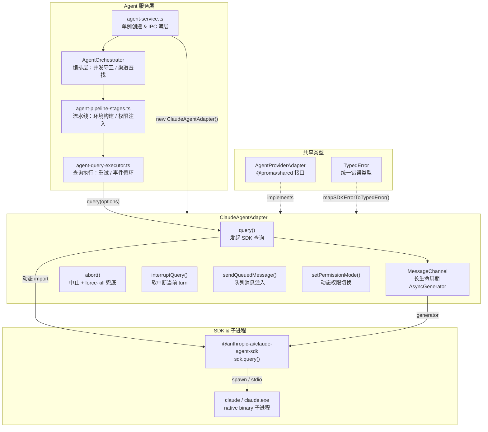
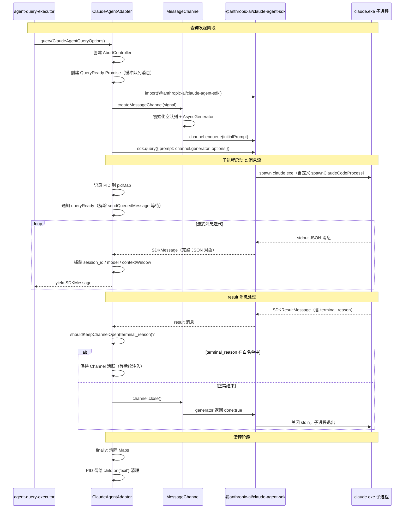
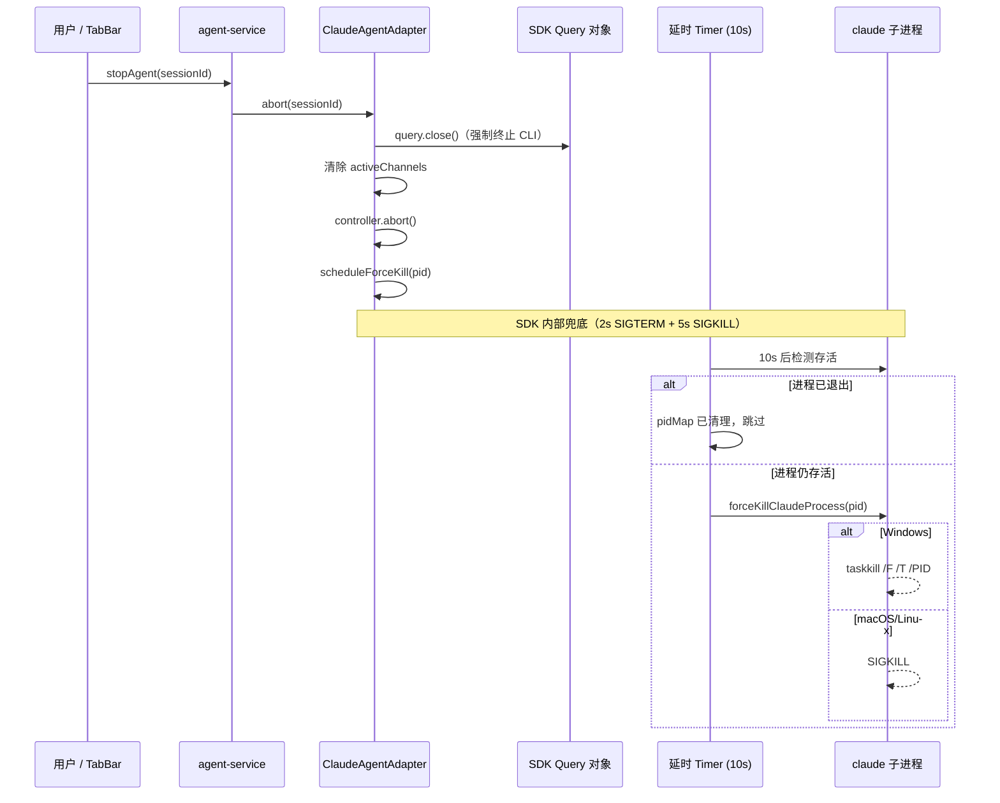

# Claude Agent SDK 适配器

> **代码位置**: `apps/electron/src/main/lib/adapters/claude-agent-adapter.ts`
> **行数**: ~978 行 | **复杂度**: 高
> **相关模块**: [agent-query-executor](../agent/agent-query-executor.ts)、[agent-pipeline-stages](../agent/agent-pipeline-stages.ts)、[agent-service](../agent/agent-service.ts)

## 📋 概述

`ClaudeAgentAdapter` 是 Proma Agent 模式与 `@anthropic-ai/claude-agent-sdk` 之间的核心桥梁。它实现了 `AgentProviderAdapter` 接口（定义在 `@proma/shared`），将 SDK 的原生 `SDKMessage` 流直接透传给上层编排层，不做格式翻译。这种设计让上层代码与 SDK 消息格式强绑定，但消除了中间层转换的复杂度和性能开销。

适配器的核心职责分为三块：**查询生命周期管理**（发起、中断、中止、资源释放）、**长生命周期消息通道**（支持多轮工具权限注入而不关闭 CLI stdin）、**子进程安全兜底**（跨平台 force-kill 孤儿进程）。这三个方面共同保证了 Agent 会话在高频交互（权限审批、队列消息注入、Exit Plan）和异常退出（用户关闭 Tab、应用崩溃）场景下的健壮性。

在系统架构中，`ClaudeAgentAdapter` 处于 Agent 编排流水线的最底层。`agent-service.ts` 创建它的单例，注入到 `AgentOrchestrator`，由流水线阶段（`agent-pipeline-stages.ts`）构建 `ClaudeAgentQueryOptions`，再交由 `agent-query-executor.ts` 执行查询。适配器不关心业务逻辑（重试、事件转换、权限策略），只负责 SDK 调用和子进程管理。

## 🏗️ 架构图



## 🔄 核心流程

### SDK query 完整调用时序



### abort & force-kill 流程



## 📁 关键文件

| 文件 | 行数 | 作用 | 关键函数/类 |
|------|------|------|------------|
| `adapters/claude-agent-adapter.ts` | ~978 | SDK 适配器核心实现 | `ClaudeAgentAdapter`、`createMessageChannel()`、`forceKillClaudeProcess()`、`scanAndKillOrphanedClaudeSubprocesses()` |
| `types/agent-provider.ts` (@proma/shared) | ~64 | Provider 适配器接口定义 | `AgentProviderAdapter`、`AgentQueryInput`、`SDKUserMessageInput` |
| `agent/agent-query-executor.ts` | ~300 | 查询执行器（重试/事件循环） | `executeQuery()`、`QueryExecutorDeps` |
| `agent/agent-pipeline-stages.ts` | ~750 | 流水线阶段（构建查询选项） | `stageInitSdk()`、`stageBuildSdkEnv()` |
| `agent/agent-orchestrator-utils.ts` | ~200 | 工具函数（SDK 路径解析等） | `resolveSDKCliPath()` |
| `agent/agent-service.ts` | ~100 | 服务入口（单例创建） | `new ClaudeAgentAdapter()` |

## 💡 核心代码解析

### 长生命周期消息通道 (MessageChannel)

**文件位置**: `claude-agent-adapter.ts:41-111`

**作用**: 解决 SDK 的 `streamInput()` 在消费完 `AsyncGenerator` 后会调用 `endInput()` 关闭 CLI stdin 的问题。如果使用单次 yield 的 generator，第一轮对话结束后 stdin 即关闭，导致后续所有工具权限请求因 `inputClosed=true` 而抛出 "Stream closed"。

```typescript
interface MessageChannel {
  /** 向队列推送消息（非阻塞） */
  enqueue: (msg: SDKUserMessage) => void
  /** 供 SDK streamInput() 消费的长生命周期 AsyncGenerator */
  generator: AsyncGenerator<SDKUserMessage>
  /** 优雅关闭：标记 generator 结束，排空剩余消息后返回 */
  close: () => void
}
```

**关键点**:
- Generator 在会话期间保持活跃，支持工具权限注入、Exit Plan 等多轮交互
- 收到 `result` 后由适配器调用 `close()`，让 SDK 自然调用 `endInput()` 关闭 stdin
- 内部使用 Promise + resolver 模式实现阻塞等待，收到新消息或 abort 信号时唤醒
- `CONTINUABLE_TERMINAL_REASONS` 白名单控制哪些 `terminal_reason` 不关闭通道（如 `aborted_streaming`、`tool_deferred`、`hook_stopped`）

### SDK 查询 & 子进程管理

**文件位置**: `claude-agent-adapter.ts:666-853`

**作用**: 发起 SDK 查询的核心方法，构建 SDK Options、创建消息通道、捕获会话元数据、管理子进程生命周期。

```typescript
// 自定义 spawn：记录 PID 以供 abort/dispose 做 force-kill 兜底（Issue #357）
// 注意：一旦提供 spawnClaudeCodeProcess，SDK 会完全绕过 spawnLocalProcess，
// 因此 stderr 回调需要在这里手动转发
spawnClaudeCodeProcess: (spawnOpts) => {
  const child = spawnChild(spawnOpts.command, spawnOpts.args, { ... })
  if (child.pid) {
    pidMap.set(options.sessionId, child.pid)
    child.once('exit', () => { /* 清理 pidMap */ })
  }
  return child
}
```

**关键点**:
- 使用 `includePartialMessages: false` 获取完整 JSON 对象，上层直接透传无需逐 chunk 翻译
- `toolUseConcurrency: 1` 强制顺序执行工具，防止并发 tool_use 导致 400 错误
- 通过 `spawnClaudeCodeProcess` 自定义 spawn 以捕获 PID，stderr 必须手动转发（否则 `extractApiError` 和重试判断全部失效）
- 即使上层不关心 stderr，也必须 `resume()` 流，否则 64KB 缓冲区满会导致子进程挂起
- 捕获 `session_id`、`model`、`contextWindow` 等元数据通过回调上送给编排层

### 跨平台子进程终止

**文件位置**: `claude-agent-adapter.ts:539-562, 934-978`

**作用**: 三层兜底机制确保 claude 子进程不残留：SDK 内部 2s+5s 清理 -> 10s 延时 force-kill -> 应用退出时孤儿扫描。

```typescript
// 平台差异化：macOS/Linux 用 SIGKILL，Windows 用 taskkill /F /T 级联杀子孙
export function forceKillClaudeProcess(pid: number): void {
  if (process.platform === 'win32') {
    execFileSync('taskkill', ['/F', '/T', '/PID', String(pid)], { stdio: 'ignore' })
  } else {
    process.kill(pid, 'SIGKILL')
  }
}
```

**关键点**:
- Windows 上 `process.kill` 对原生 binary 只发 `TerminateProcess` 且不级联子进程，必须用 `taskkill /T` 杀掉 claude.exe 下挂的 bash/MCP 等孙进程
- `scheduleForceKill` 使用 `timer.unref()` 避免阻止 Node.js 事件循环退出
- `scanAndKillOrphanedClaudeSubprocesses` 在 `before-quit` 时扫描所有父进程为当前进程且命令行含 `claude-agent-sdk` 的子进程（Windows 用 PowerShell + CimInstance，macOS/Linux 用 pgrep + ps）
- 所有 `execFileSync` 加 3s timeout 防止异常进程表挂死退出流程

### 错误映射

**文件位置**: `claude-agent-adapter.ts:248-467`

**作用**: 将 SDK 原始错误字符串映射为结构化 `TypedError`，供 `agent-query-executor` 判断是否自动重试和向用户展示友好提示。

**映射逻辑**:
1. 优先检测 thinking signature 错误（SDK 特有）
2. 匹配已知 `errorCode`（`authentication_failed`、`rate_limit`、`prompt_too_long` 等）
3. 兜底匹配瞬时网络错误（`TRANSIENT_NETWORK_PATTERN`）
4. 从错误文本提取 HTTP 状态码（429/500+）
5. 未匹配的归为 `unknown_error`

## 🔗 依赖关系

### 依赖的模块

- **`@anthropic-ai/claude-agent-sdk`** — Claude Agent SDK，通过动态 `import()` 按需加载。适配器使用 `sdk.query()` 发起查询，`query.close()` 终止，`query.interrupt()` 软中断，`query.setPermissionMode()` 切换权限。SDK 的 native binary（`claude`/`claude.exe`，214-252 MB）通过 `optionalDependencies` 按平台分发
- **`@proma/shared`** — 提供 `AgentProviderAdapter` 接口、`SDKMessage`/`TypedError`/`ErrorCode`/`ThinkingConfig` 等类型定义、`isThinkingSignatureError()` 工具函数
- **`agent-permission-service.ts`** — 提供 `CanUseToolOptions`、`PermissionResult` 类型（用于 `ClaudeAgentQueryOptions.canUseTool` 回调签名）
- **`agent/error-patterns.ts`** — 提供 `TRANSIENT_NETWORK_PATTERN` 正则（瞬时网络错误匹配）
- **`node:child_process`** — 使用 `spawn` 自定义子进程启动（记录 PID），使用 `execFileSync` 执行 `taskkill`/`pgrep`/`ps` 等平台命令

### 被依赖的模块

- **`agent-service.ts`** — 创建 `ClaudeAgentAdapter` 单例，注入到 `AgentOrchestrator`；在 `before-quit` 时调用 `scanAndKillOrphanedClaudeSubprocesses()`
- **`agent-query-executor.ts`** — 调用 `adapter.query()` 发起查询；导入 `isPromptTooLongError`、`isThinkingSignatureError`、`mapSDKErrorToTypedError`、`extractErrorDetails`、`shouldKeepChannelOpen` 等错误处理函数
- **`agent-pipeline-stages.ts`** — 构建 `ClaudeAgentQueryOptions`（环境变量、SDK 路径、权限模式、MCP 配置等），传入 executor
- **`agent-orchestrator.ts`** — 通过 `AgentProviderAdapter` 接口调用 `abort()`、`interruptQuery()`、`sendQueuedMessage()`、`setPermissionMode()`、`dispose()`

## 📊 数据流向

```
用户输入
  → agent-service (IPC)
    → AgentOrchestrator.sendMessage()
      → agent-pipeline-stages (构建 ClaudeAgentQueryOptions)
        → agent-query-executor.executeQuery()
          → ClaudeAgentAdapter.query()
            → MessageChannel (排队 prompt)
              → sdk.query({ prompt: channel.generator, options })
                → spawn claude.exe (记录 PID)
                  ← SDKMessage 流 (text / tool_use / thinking / result)
            ← yield SDKMessage
          ← AsyncIterable<SDKMessage>
        ← 事件转发 / 重试 / 持久化
      ← 完成 / 错误
    ← webContents.send() → 渲染进程
```

## 🧩 ClaudeAgentQueryOptions 关键字段

| 字段 | 类型 | 说明 |
|------|------|------|
| `sdkCliPath` | `string` | SDK native binary 路径（`resolveSDKCliPath()` 解析） |
| `env` | `Record<string, string \| undefined>` | 环境变量（含 API Key、Base URL、代理、Shell 配置） |
| `sdkPermissionMode` | `PromaPermissionMode` | SDK 权限模式（safe / ask / allow-all / plan / bypassPermissions） |
| `canUseTool` | `(toolName, input, options) => Promise<PermissionResult>` | 自定义权限处理器，匹配 SDK `CanUseTool` 签名 |
| `systemPrompt` | `string \| { type: 'preset'; preset: 'claude_code' }` | 系统提示词 |
| `resumeSessionId` | `string?` | 恢复已有 SDK 会话 |
| `mcpServers` | `Record<string, unknown>?` | MCP 服务器配置 |
| `thinking` | `ThinkingConfig?` | 思考模式配置（SDK 0.2.52+） |
| `effort` | `AgentEffort?` | 推理深度等级 |
| `betas` | `SdkBeta[]?` | Beta 特性（如 `context-1m-2025-08-07`） |
| `onSessionId` | `(sdkSessionId: string) => void` | SDK session ID 捕获回调 |
| `onModelResolved` | `(model: string) => void` | 模型确认回调 |
| `onContextWindow` | `(contextWindow: number) => void` | 上下文窗口缓存回调 |
| `enableFileCheckpointing` | `boolean?` | 启用文件检查点（支持 rewindFiles 回退） |
| `forkSession` | `boolean?` | resume 时是否 fork 为新会话 |

## 🐛 已知问题与设计决策

| 问题 | 设计决策 |
|------|---------|
| SDK `streamInput()` 消费完 generator 后关闭 stdin | 使用长生命周期 `MessageChannel`，只在 `result` 时调用 `close()` |
| 并发 tool_use 导致 400 错误 | `toolUseConcurrency: 1` 强制顺序执行 |
| 子进程残留（Issue #357） | 三层兜底：SDK 内部清理 -> 10s 延时 force-kill -> before-quit 孤儿扫描 |
| Windows 不级联杀孙进程 | 使用 `taskkill /F /T` 代替 `process.kill` |
| stderr 缓冲区满导致子进程挂起 | 即便上层不关心也要 `resume()` stderr 流 |
| `terminal_reason` 不等于会话结束 | `CONTINUABLE_TERMINAL_REASONS` 白名单控制通道是否保持活跃 |
| SDK 0.2.113+ `env` 语义为"替换" | 流水线阶段 `stageBuildSdkEnv` 基于 `process.env` 合并后剥离敏感变量 |
