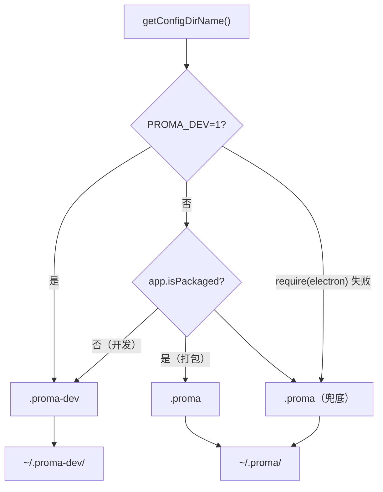
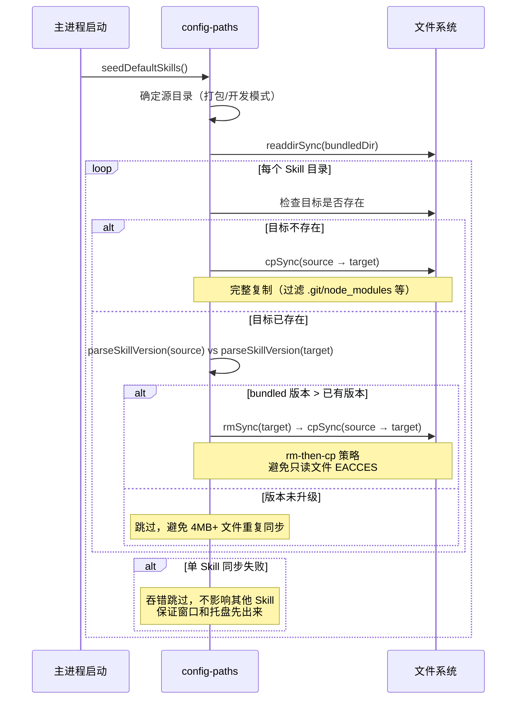

# config-paths.ts

> **代码位置**: `apps/electron/src/main/lib/storage/config-paths.ts`
> **代码行数**: ~606 行
> **复杂度**: 中
> **相关模块**: [agent-session-manager](agent-session-manager.md) | [agent-workspace-manager](agent-workspace-manager.md) | [migration-service](migration-service.md) | [conversation-manager](conversation-manager.md)

## 概述

配置路径工具是 Proma 整个本地存储体系的基石模块。它统一管理 `~/.proma/` 目录下所有配置文件、消息文件、工作区目录的路径解析，并提供自动创建缺失目录的能力。几乎所有需要读写本地文件的主进程服务都直接或间接依赖此模块。

模块的核心设计原则是"路径函数即约定"：每个路径获取函数（如 `getAgentSessionsIndexPath()`）既是一个路径解析器，也是该文件存储格式的隐式契约。通过集中管理路径，避免了路径硬编码散落在各个服务中，也为数据迁移和配置隔离（开发/生产模式）提供了统一的切换点。

此外，模块承担了"默认 Skills 种子同步"（`seedDefaultSkills`）这一启动期关键任务：在应用启动时，从 app bundle 或源码目录将内置 Skills 按版本比较策略同步到用户的 `~/.proma/default-skills/` 目录，确保老用户也能自动获得新增和升级的内置 Skill。

## 架构图

```mermaid
flowchart TB
    subgraph root["~/.proma/（或 ~/.proma-dev/）"]
        config_files["配置文件<br/>channels.json<br/>settings.json<br/>user-profile.json<br/>proxy-settings.json<br/>system-prompts.json<br/>memory.json<br/>chat-tools.json<br/>wechat.json / wechat-sync.json<br/>dingtalk.json<br/>feishu.json<br/>feishu-bindings.json<br/>feishu-bindings-{botId}.json<br/>feishu-metadata-{botId}.json<br/>scratch-pad.md"]

        subgraph conversations["conversations/"]
            conv_jsonl["{id}.jsonl"]
        end

        subgraph agent_sessions["agent-sessions/"]
            sess_jsonl["{id}.jsonl"]
        end

        subgraph attachments_dir["attachments/"]
            att_files["{conversationId}/{uuid}.ext"]
        end

        subgraph workspaces["agent-workspaces/"]
            ws_index["agent-workspaces.json"]
            subgraph ws_dir["{slug}/"]
                mcp["mcp.json"]
                subgraph skills["skills/"]
                    skill_dir["{skill-name}/<br/>SKILL.md + 文件"]
                end
                skills_inactive["skills-inactive/"]
                ws_files["workspace-files/"]
                subgraph session_cwd["{sessionId}/"]
                    claude[".claude/settings.json"]
                    context[".context/"]
                end
            end
        end

        subgraph default_skills["default-skills/"]
            ds_dir["{skill-name}/<br/>SKILL.md + 文件"]
        end

        subgraph sdk_config["sdk-config/"]
            subgraph sdk_projects["projects/{hash}/"]
                sdk_jsonl["{sdkSessionId}.jsonl"]
            end
            subgraph file_history["file-history/{sdkSessionId}/"]
                backups["备份文件"]
            end
        end
    end

    subgraph functions["路径获取函数"]
        get_config["getConfigDir()"]
        get_conv["getConversationsDir()"]
        get_sess["getAgentSessionsDir()"]
        get_ws["getAgentWorkspacePath(slug)"]
        get_sdk["getSdkConfigDir()"]
        get_ds["getDefaultSkillsDir()"]
    end

    get_config --> root
    get_conv --> conversations
    get_sess --> agent_sessions
    get_ws --> workspaces
    get_sdk --> sdk_config
    get_ds --> default_skills
```



## 核心流程

### 开发/生产模式切换



### 默认 Skills 种子同步流程



## 关键文件

| 文件 | 行数 | 作用 | 关键函数/类 |
|------|------|------|------------|
| `config-paths.ts` | ~606 | 配置路径管理与默认 Skills 种子同步 | `getConfigDir()`, `seedDefaultSkills()`, `parseSkillVersion()` |
| `agent-session-manager.ts` | ~1499 | Agent 会话管理，重度依赖路径函数 | `getAgentSessionsIndexPath()`, `getAgentSessionsDir()`, `getAgentSessionMessagesPath()` |
| `agent-workspace-manager.ts` | ~1130 | 工作区管理，调用 `seedDefaultSkills` 的下游升级函数 | `getAgentWorkspacePath()`, `getWorkspaceSkillsDir()`, `upgradeDefaultSkillsInWorkspaces()` |
| `conversation-manager.ts` | ~480 | Chat 对话管理 | `getConversationsIndexPath()`, `getConversationsDir()` |
| `migration-service.ts` | ~1360 | 数据导入导出 | 几乎所有路径函数 |
| `safe-file.ts` | ~60 | 原子 JSON 读写 | `writeJsonFileAtomic()`, `readJsonFileSafe()` |

## 核心代码解析

### 1. 配置目录名称解析与缓存

**文件位置**: `config-paths.ts:22-57`

配置目录名称在首次调用时解析并缓存到模块级变量 `_configDirName`，后续调用直接返回缓存值。开发模式使用 `.proma-dev`，生产模式使用 `.proma`，实现配置数据的完全隔离。

```typescript
let _configDirName: string | undefined

export function getConfigDirName(): string {
  if (_configDirName === undefined) {
    if (process.env.PROMA_DEV === '1') {
      _configDirName = '.proma-dev'          // 环境变量显式覆盖
    } else {
      const { app } = require('electron')
      _configDirName = app.isPackaged ? '.proma' : '.proma-dev'  // Electron 打包状态
    }
  }
  return _configDirName
}

export function getConfigDir(): string {
  const configDir = join(homedir(), getConfigDirName())
  if (!existsSync(configDir)) {
    mkdirSync(configDir, { recursive: true })  // 自动创建
  }
  return configDir
}
```

**关键点**:
- `getConfigDirName()` 使用惰性初始化 + 模块级缓存，避免重复调用 `require('electron')`
- `getConfigDir()` 附加自动创建目录的逻辑，调用方无需预先检查目录存在性
- `PROMA_DEV=1` 环境变量优先级最高，方便 CI/CD 或特定场景强制切换

### 2. 默认 Skills 版本比较同步

**文件位置**: `config-paths.ts:376-489`

`seedDefaultSkills()` 是应用启动期的关键同步函数。它从 app bundle（打包模式）或源码目录（开发模式）将内置 Skills 同步到用户本地的 `~/.proma/default-skills/`。同步策略基于 semver 版本比较：bundled 版本更高时才覆盖，避免每次启动同步 4MB+ 文件阻塞主进程。

```typescript
export function seedDefaultSkills(): void {
  const { app } = require('electron')
  // 打包模式: process.resourcesPath/default-skills
  // 开发模式: 源码 default-skills/ 目录
  const bundledDir = app.isPackaged
    ? join(process.resourcesPath, 'default-skills')
    : join(__dirname, '../default-skills')

  for (const entry of readdirSync(bundledDir, { withFileTypes: true })) {
    if (!entry.isDirectory()) continue

    const source = join(bundledDir, entry.name)
    const target = join(userDir, entry.name)

    if (!existsSync(target)) {
      cpSync(source, target, { recursive: true, filter: defaultSkillCopyFilter })
      continue
    }

    // 版本比较：bundled > existing 时才升级
    const bundledVer = parseSkillVersion(source)
    const existingVer = parseSkillVersion(target)
    if (compareSemver(bundledVer, existingVer) > 0) {
      rmSync(target, { recursive: true, force: true })  // rm-then-cp 策略
      cpSync(source, target, { recursive: true, filter: defaultSkillCopyFilter })
    }
  }
}
```

**关键点**:
- `parseSkillVersion()` 从 `SKILL.md` 的 YAML frontmatter 中解析 `version` 字段，无版本字段返回 `'0.0.0'`，确保旧 Skill 会被更新
- 使用 rm-then-cp 而非 cpSync({ force: true })：只读文件（如 `.git/objects/` 0444 权限）用 `force: true` 无法覆盖会 EACCES，但 `rmSync({ force: true })` 只需父目录可写即可
- `DEFAULT_SKILL_COPY_BLOCKLIST` 防御性跳过 `.git`、`node_modules`、`dist` 等目录，避免将无关文件同步到用户目录
- 单 Skill 同步失败被 try-catch 捕获并吞错，不影响其他 Skill 和应用启动

### 3. SKILL.md 版本解析

**文件位置**: `config-paths.ts:376-397`

从 Skill 目录下的 `SKILL.md` 文件中解析 YAML frontmatter 的 `version` 字段。使用简单的正则匹配而非完整的 YAML 解析器，减少依赖。

```typescript
export function parseSkillVersion(skillDir: string): string {
  const skillMdPath = join(skillDir, 'SKILL.md')
  if (!existsSync(skillMdPath)) return '0.0.0'

  const content = readFileSync(skillMdPath, 'utf-8')
  const fmMatch = content.match(/^---\s*\n([\s\S]*?)\n---/)
  if (!fmMatch?.[1]) return '0.0.0'

  for (const line of fmMatch[1].split('\n')) {
    // 手动解析 key: value
    if (key === 'version' && value) return value
  }
  return '0.0.0'
}
```

**关键点**:
- 无 `SKILL.md` 或无 `version` 字段时返回 `'0.0.0'`，这是一个设计意图：旧格式 Skill 会被视为最低版本，确保升级覆盖
- 解析失败（格式错误、IO 错误）同样返回 `'0.0.0'`，保证同步流程不会中断

## 依赖关系

### 依赖的模块

| 模块 | 路径 | 依赖原因 |
|------|------|----------|
| `node:fs` | Node.js 内置 | 目录创建、文件读取 |
| `node:path` | Node.js 内置 | 路径拼接 `join()`、`basename()` |
| `node:os` | Node.js 内置 | 获取用户主目录 `homedir()` |
| `electron` | 外部依赖 | `app.isPackaged` 检测打包状态（惰性 require） |

### 被依赖的模块

| 模块 | 路径 | 使用的函数 |
|------|------|-----------|
| `agent-session-manager` | `lib/agent/agent-session-manager.ts` | `getAgentSessionsIndexPath()`, `getAgentSessionsDir()`, `getAgentSessionMessagesPath()`, `getAgentSessionWorkspacePath()`, `getAgentWorkspacePath()`, `getSdkConfigDir()` |
| `agent-workspace-manager` | `lib/agent/agent-workspace-manager.ts` | `getAgentWorkspacesIndexPath()`, `getAgentWorkspacePath()`, `getWorkspaceMcpPath()`, `getWorkspaceSkillsDir()`, `getInactiveSkillsDir()`, `getDefaultSkillsDir()`, `parseSkillVersion()` |
| `agent-orchestrator-utils` | `lib/agent/agent-orchestrator-utils.ts` | `getConfigDirName()`, `getWorkspaceFilesDir()` |
| `conversation-manager` | `lib/conversation/conversation-manager.ts` | `getConversationsIndexPath()`, `getConversationsDir()`, `getConversationMessagesPath()` |
| `channel-manager` | `lib/channel/channel-manager.ts` | `getChannelsPath()` |
| `settings-service` | `lib/storage/settings-service.ts` | `getSettingsPath()` |
| `migration-service` | `lib/storage/migration-service.ts` | 几乎所有路径函数（导入/导出需要定位所有数据文件） |
| `feishu-bridge` / `feishu-bridge-manager` | `lib/feishu/` | `getFeishuConfigPath()`, `getFeishuBindingsPath()`, `getFeishuBotBindingsPath()`, `getFeishuBotMetadataPath()` |
| `user-profile-service` | `lib/storage/user-profile-service.ts` | `getUserProfilePath()` |
| `attachment-service` | `lib/attachment-service.ts` | `getAttachmentsDir()`, `getConversationAttachmentsDir()`, `resolveAttachmentPath()` |
| 主进程入口 `index.ts` | `main/index.ts` | `seedDefaultSkills()`（启动时调用） |
| IPC 处理器 `ipc.ts` | `main/ipc.ts` | `getConfigDir()` |

## 完整路径函数索引

### 根目录

| 函数 | 返回路径 | 自动创建 |
|------|---------|---------|
| `getConfigDirName()` | `.proma` 或 `.proma-dev` | - |
| `getConfigDir()` | `~/.proma/` | 是 |

### Chat 对话

| 函数 | 返回路径 | 自动创建 |
|------|---------|---------|
| `getChannelsPath()` | `~/.proma/channels.json` | 否 |
| `getConversationsIndexPath()` | `~/.proma/conversations.json` | 否 |
| `getConversationsDir()` | `~/.proma/conversations/` | 是 |
| `getConversationMessagesPath(id)` | `~/.proma/conversations/{id}.jsonl` | 否 |
| `getAttachmentsDir()` | `~/.proma/attachments/` | 是 |
| `getConversationAttachmentsDir(id)` | `~/.proma/attachments/{id}/` | 是 |
| `resolveAttachmentPath(local)` | `~/.proma/attachments/{local}` | 否 |

### Agent 会话

| 函数 | 返回路径 | 自动创建 |
|------|---------|---------|
| `getAgentSessionsIndexPath()` | `~/.proma/agent-sessions.json` | 否 |
| `getAgentSessionsDir()` | `~/.proma/agent-sessions/` | 是 |
| `getAgentSessionMessagesPath(id)` | `~/.proma/agent-sessions/{id}.jsonl` | 否 |

### Agent 工作区

| 函数 | 返回路径 | 自动创建 |
|------|---------|---------|
| `getAgentWorkspacesIndexPath()` | `~/.proma/agent-workspaces.json` | 否 |
| `getAgentWorkspacesDir()` | `~/.proma/agent-workspaces/` | 是 |
| `getAgentWorkspacePath(slug)` | `~/.proma/agent-workspaces/{slug}/` | 是 |
| `getWorkspaceMcpPath(slug)` | `~/.proma/agent-workspaces/{slug}/mcp.json` | 否 |
| `getWorkspaceSkillsDir(slug)` | `~/.proma/agent-workspaces/{slug}/skills/` | 是 |
| `getInactiveSkillsDir(slug)` | `~/.proma/agent-workspaces/{slug}/skills-inactive/` | 是 |
| `getWorkspaceFilesDir(slug)` | `~/.proma/agent-workspaces/{slug}/workspace-files/` | 是 |
| `getAgentSessionWorkspacePath(slug, sessionId)` | `~/.proma/agent-workspaces/{slug}/{sessionId}/` | 是 |

### 默认 Skills 与 SDK

| 函数 | 返回路径 | 自动创建 |
|------|---------|---------|
| `getDefaultSkillsDir()` | `~/.proma/default-skills/` | 是 |
| `getSdkConfigDir()` | `~/.proma/sdk-config/` | 是 |

### 应用设置

| 函数 | 返回路径 | 自动创建 |
|------|---------|---------|
| `getSettingsPath()` | `~/.proma/settings.json` | 否 |
| `getUserProfilePath()` | `~/.proma/user-profile.json` | 否 |
| `getProxySettingsPath()` | `~/.proma/proxy-settings.json` | 否 |
| `getSystemPromptsPath()` | `~/.proma/system-prompts.json` | 否 |
| `getMemoryConfigPath()` | `~/.proma/memory.json` | 否 |
| `getChatToolsConfigPath()` | `~/.proma/chat-tools.json` | 否 |
| `getScratchPadPath()` | `~/.proma/scratch-pad.md` | 否 |

### 第三方集成

| 函数 | 返回路径 | 自动创建 |
|------|---------|---------|
| `getWeChatConfigPath()` | `~/.proma/wechat.json` | 否 |
| `getWeChatSyncPath()` | `~/.proma/wechat-sync.json` | 否 |
| `getDingTalkConfigPath()` | `~/.proma/dingtalk.json` | 否 |
| `getFeishuConfigPath()` | `~/.proma/feishu.json` | 否 |
| `getFeishuBindingsPath()` | `~/.proma/feishu-bindings.json` | 否 |
| `getFeishuBotBindingsPath(botId)` | `~/.proma/feishu-bindings-{botId}.json` | 否 |
| `getFeishuBotMetadataPath(botId)` | `~/.proma/feishu-metadata-{botId}.json` | 否 |

### 辅助函数

| 函数 | 作用 |
|------|------|
| `parseSkillVersion(skillDir)` | 从 SKILL.md 的 YAML frontmatter 解析 version 字段 |
| `compareSemver(a, b)` | 比较两个 semver 版本字符串 |
| `seedDefaultSkills()` | 从 app bundle 同步默认 Skills 到用户目录 |

## 数据流向

```
主进程启动
    ↓
seedDefaultSkills()
    ├→ 读取 bundled Skills 目录（源码/resourcesPath）
    ├→ 比较 SKILL.md version（parseSkillVersion + compareSemver）
    └→ 同步到 ~/.proma/default-skills/（cpSync + blocklist filter）
         ↓
upgradeDefaultSkillsInWorkspaces()（agent-workspace-manager）
    ├→ 读取 ~/.proma/default-skills/ 中所有 Skill
    └→ 同步到每个工作区的 skills/ 或 skills-inactive/

其他模块调用路径函数
    ↓
getConfigDir() / getXxxPath()
    ├→ 返回确定路径（纯计算，不创建）
    └→ 部分函数自动创建目录（带 existsSync + mkdirSync）
```

## 已知设计决策

1. **路径函数即约定**: 每个路径获取函数既做路径解析也做目录创建（部分函数），调用方无需关心目录是否存在。这是"约定优于配置"的体现。

2. **惰性 require('electron')**: `getConfigDirName()` 内部使用 `require('electron')` 而非顶层 import，避免模块在非 Electron 环境（如单元测试）中加载失败。`try-catch` 兜底返回 `.proma`。

3. **模块级缓存**: `_configDirName` 使用模块级变量缓存，首次解析后不再重复。这是 Electron 单进程主线程模型下的安全做法。

4. **rm-then-cp 策略**: Skills 升级时先 `rmSync` 再 `cpSync`，而非直接 `cpSync({ force: true })`。原因：只读文件（如 `.git/objects/`）用 `force: true` 会 EACCES，而 `rmSync({ force: true })` 只需父目录可写。

5. **单 Skill 失败不影响启动**: `seedDefaultSkills()` 中每个 Skill 的同步都在独立 try-catch 中执行，失败时仅 console.warn 然后跳过。设计意图：窗口和托盘必须先出来，Skill 同步不应阻塞启动。

6. **BLOCKLIST 防御**: `DEFAULT_SKILL_COPY_BLOCKLIST` 过滤 `.git`、`node_modules`、`dist` 等目录，避免将无关文件（可能含 0444 只读文件）同步到用户目录导致后续 rmSync 失败。
