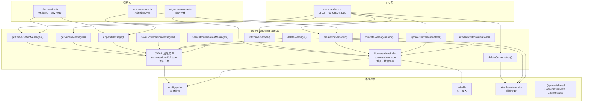
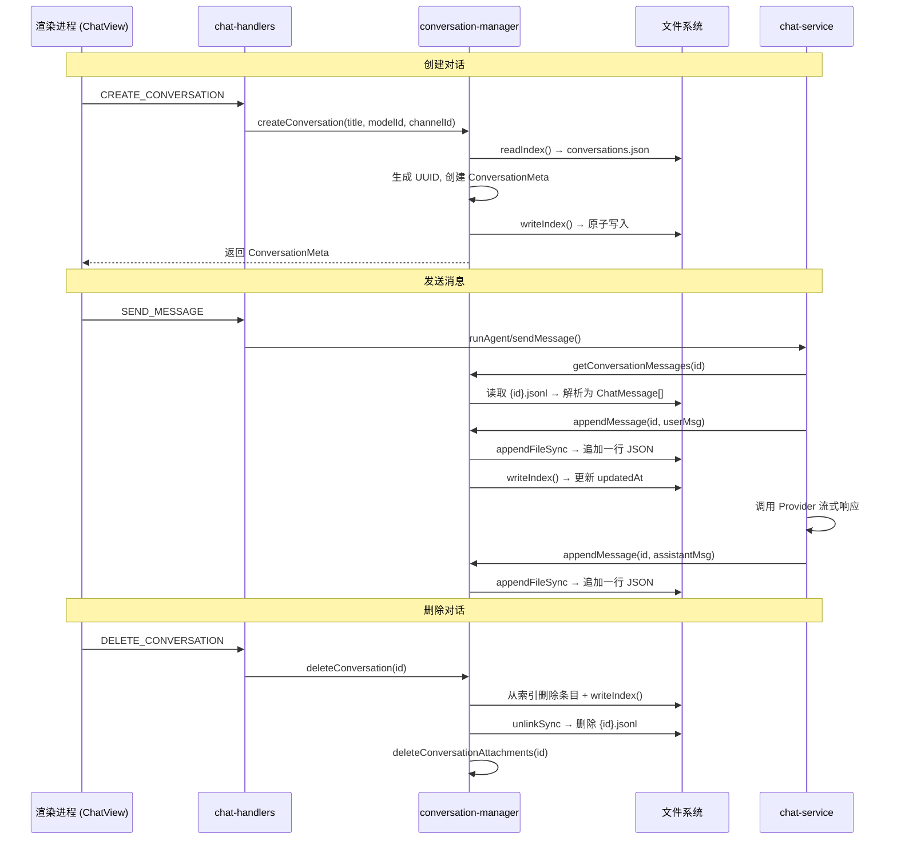
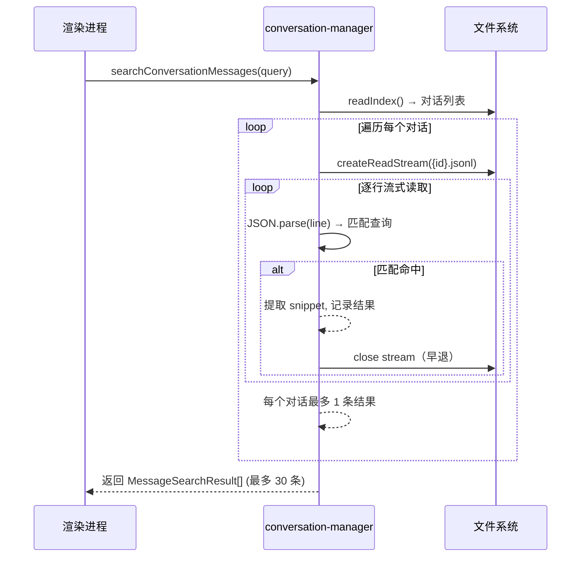

# conversation-manager.ts — 对话管理器

> **代码位置**: `apps/electron/src/main/lib/conversation/conversation-manager.ts`
> **代码行数**: ~483 行
> **复杂度**: 中（P1）
> **相关模块**: [chat-service](./chat-service.md)、[config-paths](../storage/config-paths.md)、[attachment-service](../file/attachment-service.md)

## 概述

`conversation-manager.ts` 是 Chat 模式的对话持久化层，负责对话的 CRUD 操作和消息存储。它管理两种文件：对话索引（`~/.proma/conversations.json`，存储轻量元数据列表）和消息文件（`~/.proma/conversations/{id}.jsonl`，每条消息一行 JSON，追加写入）。

该模块是 Chat 消息流转的关键中间层。`chat-service.ts` 在流式响应过程中通过 `appendMessage()` 追加用户和助手消息，通过 `getConversationMessages()` 读取历史消息作为上下文传入 Provider。IPC 层（`chat-handlers.ts`）则将所有对话管理操作暴露给渲染进程。

存储设计上采用"索引 + JSONL"分离架构：索引文件只存元数据（标题、模型、渠道、置顶、归档状态等），用于快速加载侧边栏对话列表；消息内容用 JSONL 逐行追加，避免每次追加都需要读取整个文件。索引文件的写入通过 `writeJsonFileAtomic` 保证崩溃安全（write-to-temp + rename 原子操作 + .bak 备份回退）。

## 架构图



## 核心流程

### 主要流程图 — 对话生命周期



### 消息搜索流程



## 关键文件

| 文件 | 行数 | 作用 | 关键函数/类 |
|------|------|------|------------|
| `conversation-manager.ts` | ~483 | 对话 CRUD + 消息持久化 | `listConversations()`, `createConversation()`, `getConversationMessages()`, `appendMessage()`, `searchConversationMessages()` |
| `chat-service.ts` | ~614 | Chat 流式调用编排，调用本模块读写消息 | `sendMessage()` |
| `chat-handlers.ts` | ~数百 | IPC 层，暴露对话管理通道给渲染进程 | `CHAT_IPC_CHANNELS` |
| `config-paths.ts` | ~数百 | 路径管理，提供对话相关文件路径 | `getConversationsIndexPath()`, `getConversationsDir()`, `getConversationMessagesPath()` |
| `safe-file.ts` | ~数十 | 崩溃安全的 JSON 读写工具 | `writeJsonFileAtomic()`, `readJsonFileSafe()` |
| `attachment-service.ts` | ~数百 | 附件文件管理 | `deleteConversationAttachments()`, `deleteAttachment()` |
| `@proma/shared` (chat.ts) | ~数百 | 类型定义 | `ConversationMeta`, `ChatMessage`, `RecentMessagesResult`, `MessageSearchResult` |

## 核心代码解析

### 关键代码片段 1 — JSONL 追加写入与索引同步

**文件位置**: `conversation-manager.ts:173-193`

**作用**: 追加一条消息到对话的 JSONL 文件，同时更新索引中的 `updatedAt` 时间戳。若对话已归档，自动恢复为活跃状态。

```typescript
export function appendMessage(id: string, message: ChatMessage): void {
  const filePath = getConversationMessagesPath(id)

  try {
    const line = JSON.stringify(message) + '\n'
    appendFileSync(filePath, line, 'utf-8')

    // 追加消息时更新 updatedAt，若已归档则自动恢复活跃
    const index = readIndex()
    const idx = index.conversations.findIndex((c) => c.id === id)
    if (idx !== -1) {
      const conv = index.conversations[idx]!
      conv.updatedAt = Date.now()
      if (conv.archived) conv.archived = false
      writeIndex(index)
    }
  } catch (error) {
    console.error(`[对话管理] 追加消息失败 (${id}):`, error)
    throw new Error('追加消息失败')
  }
}
```

**关键点**:
- 使用 `appendFileSync` 逐行追加，无需读取整个 JSONL 文件，时间复杂度 O(1)
- 每次追加都会同步更新索引文件的 `updatedAt`，确保侧边栏排序正确
- 自动取消归档（`archived = false`），保证已归档对话收到新消息时自动回到活跃列表
- 索引写入通过 `writeJsonFileAtomic` 保证崩溃安全

### 关键代码片段 2 — 消息截断与附件清理

**文件位置**: `conversation-manager.ts:327-357`

**作用**: 从指定消息开始截断对话（包含该消息）。常用于"重新发送"场景，删除目标消息及其后的所有消息，让对话从该点重新分叉。

```typescript
export function truncateMessagesFrom(
  conversationId: string,
  messageId: string,
  preserveFirstMessageAttachments = false,
): ChatMessage[] {
  const messages = getConversationMessages(conversationId)
  const startIndex = messages.findIndex((msg) => msg.id === messageId)

  if (startIndex === -1) {
    console.warn(`[对话管理] 截断起点消息不存在: ${messageId}`)
    return messages
  }

  const kept = messages.slice(0, startIndex)
  const removed = messages.slice(startIndex)

  // 删除被截断消息关联的附件文件
  removed.forEach((msg, idx) => {
    if (!msg.attachments || msg.attachments.length === 0) return
    // 允许保留起点消息的附件（用于"重发"复用）
    if (idx === 0 && preserveFirstMessageAttachments) return

    msg.attachments.forEach((attachment) => {
      deleteAttachment(attachment.localPath)
    })
  })

  saveConversationMessages(conversationId, kept)
  return kept
}
```

**关键点**:
- `preserveFirstMessageAttachments` 参数用于"重发"场景：截断起点消息的附件文件会被保留，以便用户重发时复用
- 截断操作需要全量读取消息 → 截取 → 覆写，时间复杂度 O(n)，但对于对话级别操作可以接受
- 附件清理与消息删除联动，避免孤立文件占用磁盘空间

### 关键代码片段 3 — 流式消息搜索

**文件位置**: `conversation-manager.ts:407-482`

**作用**: 搜索对话消息内容。按行流式读取每个对话的 JSONL 文件，命中即早退，避免一次性加载大文件到内存。

```typescript
export async function searchConversationMessages(query: string): Promise<MessageSearchResult[]> {
  if (!query || query.length < 2) return []

  const index = readIndex()
  const results: MessageSearchResult[] = []
  const maxResults = 30

  for (const conv of index.conversations) {
    if (results.length >= maxResults) break
    const filePath = getConversationMessagesPath(conv.id)
    if (!existsSync(filePath)) continue

    const hit = await findFirstMatchInJsonl(filePath, queryLower, query.length)
    if (hit) {
      results.push({
        conversationId: conv.id,
        conversationTitle: conv.title,
        messageId: hit.messageId,
        role: hit.role,
        snippet: hit.snippet,
        matchStart: hit.matchStart,
        matchLength: query.length,
        archived: conv.archived,
      })
    }
  }
  return results
}
```

**关键点**:
- `findFirstMatchInJsonl` 使用 `createReadStream` + `readline` 逐行读取，单行 GC 友好，命中后立即关闭 stream（早退优化）
- 每个对话最多返回 1 条匹配结果，总计最多 30 条，避免搜索结果过多
- snippet 截取匹配位置前后各 40 个字符，并用 `...` 标记截断

### 关键代码片段 4 — 索引文件读写与崩溃安全

**文件位置**: `conversation-manager.ts:37-56`

**作用**: 读写对话索引文件。写入时使用 `writeJsonFileAtomic` 保证崩溃安全，读取时使用 `readJsonFileSafe` 进行多层容错。

```typescript
function readIndex(): ConversationsIndex {
  const indexPath = getConversationsIndexPath()
  const data = readJsonFileSafe<ConversationsIndex>(indexPath)
  if (data) return data
  return { version: INDEX_VERSION, conversations: [] }
}

function writeIndex(index: ConversationsIndex): void {
  const indexPath = getConversationsIndexPath()
  try {
    writeJsonFileAtomic(indexPath, index)
  } catch (error) {
    console.error('[对话管理] 写入索引文件失败:', error)
    throw new Error('写入对话索引失败')
  }
}
```

**关键点**:
- `readJsonFileSafe` 的容错链路：主文件 → `.tmp` 残留 → `.bak` 回退，三层容错
- `writeJsonFileAtomic` 的写入流程：先备份当前文件为 `.bak` → 写入 `.tmp` 临时文件 → rename 原子替换（POSIX 原子操作）
- 文件不存在时 `readIndex` 返回空索引（`{ version: 1, conversations: [] }`），不抛异常

## 依赖关系

### 依赖的模块

| 模块 | 路径 | 依赖原因 |
|------|------|---------|
| **config-paths** | `../storage/config-paths` | 获取对话索引文件路径、消息目录路径、消息文件路径 |
| **safe-file** | `../safe-file` | 崩溃安全的 JSON 读写（`writeJsonFileAtomic`、`readJsonFileSafe`） |
| **attachment-service** | `../file/attachment-service` | 删除对话时清理附件目录、删除消息时清理附件文件 |
| **@proma/shared** | `packages/shared` | 类型定义（`ConversationMeta`、`ChatMessage`、`RecentMessagesResult`、`MessageSearchResult`） |

### 被依赖的模块

| 模块 | 路径 | 被依赖原因 |
|------|------|-----------|
| **chat-service** | `../chat/chat-service` | 流式响应过程中读写消息（核心调用方） |
| **chat-handlers** | `../../ipc/chat-handlers` | IPC 层暴露对话管理操作给渲染进程 |
| **tutorial-service** | `../tutorial-service` | 首次启动时创建教程对话并追加初始消息 |
| **migration-service** | `../storage/migration-service` | 数据导入导出时读写对话数据 |

## 导出函数索引

| 函数 | 行号 | 职责 |
|------|------|------|
| `listConversations()` | 61-64 | 获取所有对话（按 updatedAt 降序） |
| `createConversation()` | 74-99 | 创建新对话，生成 UUID，写入索引 |
| `getConversationMessages()` | 109-125 | 读取对话的所有消息（全量 JSONL） |
| `getRecentMessages()` | 137-163 | 读取对话最近 N 条消息（尾部切片，分页加载） |
| `appendMessage()` | 173-193 | 追加一条消息到 JSONL + 更新索引 updatedAt |
| `saveConversationMessages()` | 203-213 | 全量覆写对话消息（编辑/删除场景） |
| `updateConversationMeta()` | 222-248 | 更新对话元数据（标题/模型/渠道/置顶/归档等） |
| `deleteConversation()` | 257-283 | 删除对话（索引 + JSONL + 附件） |
| `deleteMessage()` | 294-314 | 删除指定消息（过滤 + 覆写 + 清理附件） |
| `truncateMessagesFrom()` | 327-357 | 从指定消息截断对话（重发场景） |
| `updateContextDividers()` | 366-368 | 更新对话的上下文分隔线 |
| `autoArchiveConversations()` | 378-396 | 自动归档超过指定天数未更新的对话 |
| `searchConversationMessages()` | 407-437 | 搜索对话消息内容（流式读取 + 早退） |

## 数据流向

```
对话索引 (~/.proma/conversations.json)
  │
  ├─ listConversations() ──→ 读取全部元数据 → 排序 → 渲染进程侧边栏
  │
  ├─ createConversation() ──→ 生成 UUID + ConversationMeta → 追加到索引
  │
  ├─ updateConversationMeta() ──→ 合并更新字段 → 覆写索引条目
  │
  ├─ deleteConversation() ──→ 移除索引条目 → 删除 JSONL → 清理附件
  │
  └─ autoArchiveConversations() ──→ 批量标记 archived=true

消息文件 (~/.proma/conversations/{id}.jsonl)
  │
  ├─ getConversationMessages() ──→ 全量读取 → ChatMessage[]
  │
  ├─ getRecentMessages(id, limit) ──→ 尾部切片 → RecentMessagesResult
  │
  ├─ appendMessage() ──→ JSON.stringify + appendFileSync → O(1)
  │
  ├─ saveConversationMessages() ──→ 全量覆写（编辑/删除后）
  │
  ├─ deleteMessage() ──→ 读取 → 过滤 → 覆写 → 清理附件
  │
  ├─ truncateMessagesFrom() ──→ 读取 → 截取前半 → 覆写 → 清理后半附件
  │
  └─ searchConversationMessages() ──→ 流式逐行读取 → 匹配 → snippet
```

## IPC 通道

| 通道名称 | 方向 | 作用 |
|---------|------|------|
| `chat:list-conversations` | 渲染 → 主 | 获取对话列表（侧边栏） |
| `chat:create-conversation` | 渲染 → 主 | 创建新对话 |
| `chat:get-messages` | 渲染 → 主 | 获取对话全部消息 |
| `chat:get-recent-messages` | 渲染 → 主 | 获取最近 N 条消息（分页加载） |
| `chat:update-title` | 渲染 → 主 | 更新对话标题 |
| `chat:update-conversation-model` | 渲染 → 主 | 更新对话使用的模型/渠道 |
| `chat:delete-conversation` | 渲染 → 主 | 删除对话 |
| `chat:delete-message` | 渲染 → 主 | 删除指定消息 |
| `chat:truncate-messages-from` | 渲染 → 主 | 从指定消息截断 |
| `chat:update-context-dividers` | 渲染 → 主 | 更新上下文分隔线 |

## 设计要点

1. **索引与消息分离**: `conversations.json` 只存元数据（KB 级），用于快速加载侧边栏列表；消息内容存在独立的 JSONL 文件中，避免加载对话列表时读取大量消息数据。

2. **JSONL 追加写入**: `appendMessage()` 使用 `appendFileSync` 逐行追加，无需读取整个文件。这是 O(1) 操作，适合高频的消息追加场景。只有在编辑/删除消息时才需要全量读取和覆写。

3. **崩溃安全写入**: 索引文件通过 `writeJsonFileAtomic` 写入（write-to-temp + rename + .bak 备份），防止系统崩溃导致 JSON 截断。读取时 `readJsonFileSafe` 有三层容错（主文件 → .tmp 残留 → .bak 回退）。

4. **自动归档与恢复**: `autoArchiveConversations()` 定期归档不活跃对话；`appendMessage()` 和 `updateConversationMeta()` 在非手动归档操作时自动将已归档对话恢复为活跃。

5. **流式搜索**: `searchConversationMessages()` 使用 `createReadStream` + `readline` 逐行流式读取，命中即关闭 stream，未命中也按行 GC，避免大文件一次性加载到内存。

6. **附件联动清理**: `deleteConversation()`、`deleteMessage()`、`truncateMessagesFrom()` 在删除消息时同步清理关联的附件文件，避免孤立文件占用磁盘。截断操作支持 `preserveFirstMessageAttachments` 参数，保留起点消息的附件用于重发复用。
