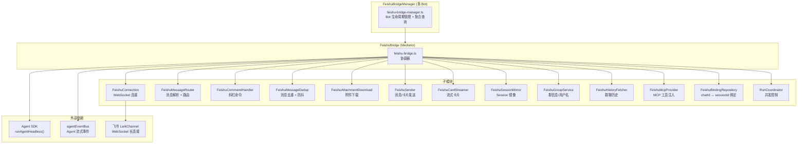
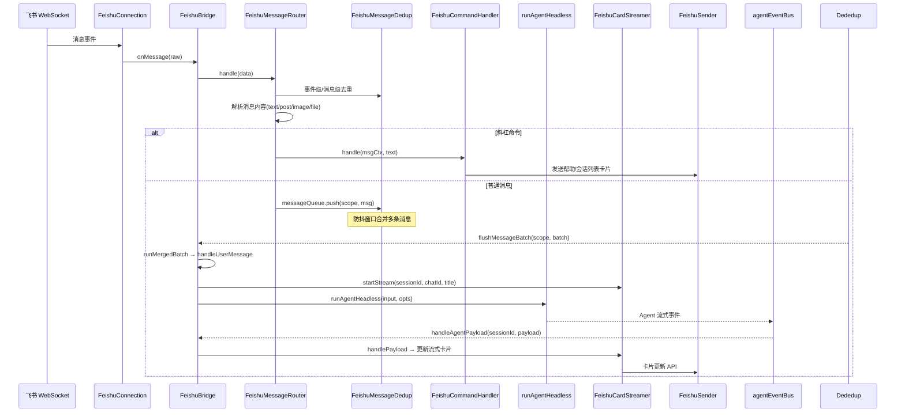
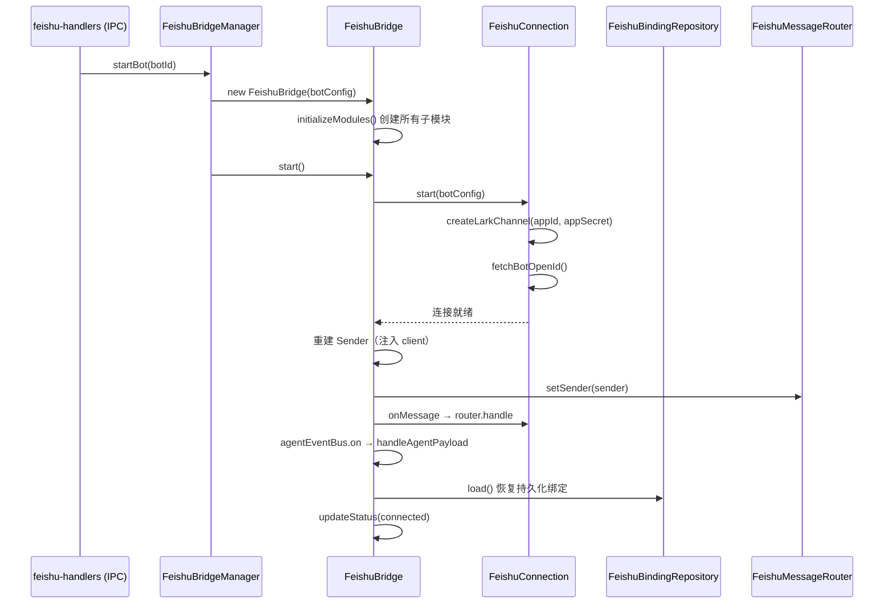
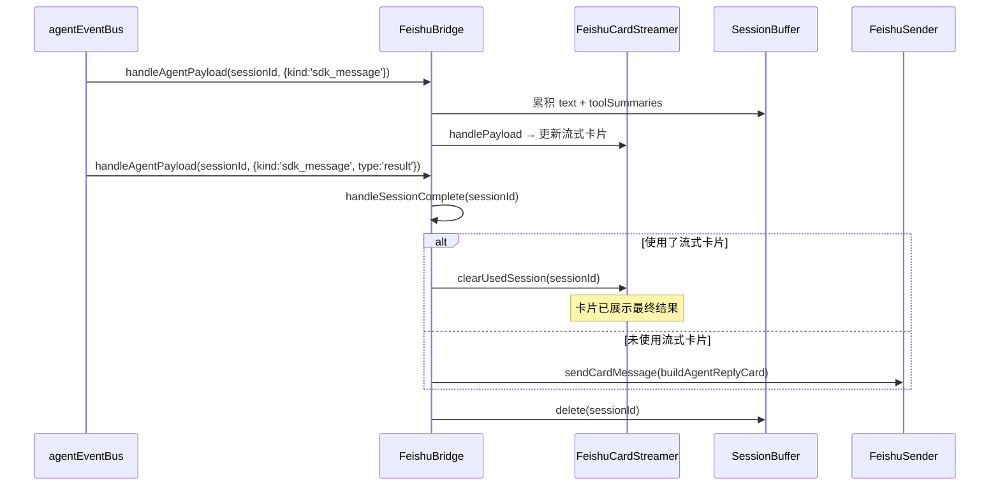

# feishu-bridge.ts

> **代码位置**: `apps/electron/src/main/lib/feishu/feishu-bridge.ts`
> **代码行数**: ~714 行
> **复杂度**: 高
> **相关模块**: [feishu-bridge-manager](feishu-bridge-manager.md) | [agent-service](agent-service.md) | [ipc-handlers](ipc-handlers.md) | [agent-session-manager](agent-session-manager.md)

## 概述

飞书 Bridge 是 Proma 与飞书 IM 的双向消息桥接核心，采用 Mediator 协调器模式。单个 `FeishuBridge` 实例代表一个飞书 Bot 应用，协调 12 个子模块完成 WebSocket 消息接收、命令路由、Agent 调用、流式卡片回复、附件处理和 Session 镜像等功能。

模块架构为三层结构：

1. **FeishuBridgeManager**（`feishu-bridge-manager.ts`）— 管理多个 FeishuBridge 实例的生命周期，提供聚合查询和 IPC 路由
2. **FeishuBridge**（本文件）— 单 Bot 的 Mediator 协调器，协调子模块间的交互
3. **子模块** — 各司其职的独立模块（Connection、Router、Sender、Binding 等）

FeishuBridge 通过飞书 LarkChannel（WebSocket 长连接）接收用户消息，解析后委托给 Agent SDK 的 `runAgentHeadless()` 执行无头 Agent 调用，最终通过飞书卡片 API 回复结果。支持流式卡片实时更新、群聊上下文注入、MCP 工具动态注册、引用消息解析等高级功能。

## 架构图



## 核心流程

### 消息接收到 Agent 回复完整流程



### Bridge 启动流程



### Agent 完成后的回复路径



## 关键文件

| 文件 | 行数 | 作用 | 关键类/函数 |
|------|------|------|------------|
| `feishu-bridge.ts` | ~714 | Mediator 协调器 | `FeishuBridge` |
| `feishu-bridge-manager.ts` | ~204 | 多 Bot 管理 | `FeishuBridgeManager` |
| `connection/FeishuConnection.ts` | ~135 | WebSocket 连接 | `FeishuConnection` |
| `bindings/FeishuBindingRepository.ts` | ~184 | chatId↔sessionId 绑定 CRUD | `FeishuBindingRepository` |
| `messages/FeishuMessageRouter.ts` | ~449 | 消息解析、路由、附件管理 | `FeishuMessageRouter` |
| `messages/FeishuCommandHandler.ts` | ~300+ | 斜杠命令处理 | `FeishuCommandHandler` |
| `messages/FeishuMessageDedup.ts` | ~100+ | 事件/消息去重 + 防抖队列 | `FeishuMessageDedup` |
| `messages/FeishuAttachmentDownload.ts` | ~100+ | 图片/文件附件下载 | `FeishuAttachmentDownload` |
| `FeishuSender.ts` | ~150+ | 消息/卡片发送 | `FeishuSender` |
| `streaming/FeishuCardStreamer.ts` | ~200+ | 流式卡片生命周期 | `FeishuCardStreamer` |
| `streaming/FeishuSessionMirror.ts` | ~100+ | 桌面 Session 镜像到飞书群 | `FeishuSessionMirror` |
| `group/FeishuGroupService.ts` | ~150+ | 群信息/成员缓存 | `FeishuGroupService` |
| `history/FeishuHistoryFetcher.ts` | ~100+ | 群聊消息历史拉取 | `FeishuHistoryFetcher` |
| `mcp/FeishuMcpProvider.ts` | ~100+ | 动态 MCP Server 注入 | `FeishuMcpProvider` |
| `run-coordinator.ts` | ~95 | 并发控制（per-scope 串行 + 全局上限） | `RunCoordinator` |
| `prompt-builder.ts` | ~200+ | Agent 用户消息构造（引用/上下文） | `buildAgentUserMessage()` |
| `feishu-message.ts` | ~300+ | 卡片模板构建 | `buildAgentReplyCard()` `buildErrorCard()` |
| `context.ts` | ~50+ | 绑定上下文前缀解析 | `resolveContextPrefix()` |

## 核心代码解析

### 子模块初始化（feishu-bridge.ts:98-185）

Mediator 模式的核心：所有子模块在构造函数中创建，通过闭包和回调互相引用。

```typescript
private initializeModules(): void {
  // Connection — WebSocket 管理
  this.connection = new FeishuConnection()

  // Binding — chatId ↔ sessionId 双向映射
  this.bindings = new FeishuBindingRepository(botConfig.id)

  // Sender — 飞书消息发送（连接后重建，注入 client）
  this.sender = new FeishuSender({
    client: null,  // start() 后用真实 client 重建
    getBinding: (chatId) => this.bindings.get(chatId),
    trackSentMessage: (messageId) => this.dedup?.trackSentMessage(messageId),
  })

  // RunCoordinator — 并发控制：per-scope 串行 + 全局 3 并发上限
  this.runCoordinator = new RunCoordinator(MAX_CONCURRENT_RUNS)

  // Dedup — 去重 + 防抖，flush 回调触发 runMergedBatch
  this.dedup = new FeishuMessageDedup(MESSAGE_DEBOUNCE_MS, (scope, batch) => {
    this.flushMessageBatch(scope, batch)
  })

  // Router — 消息解析路由，接收 connection 的 onMessage 回调
  this.router = new FeishuMessageRouter(
    this.bindings, this.dedup, this.attachmentDownload,
    this.commandHandler, this.groupService, botConfig, this.sender,
    (partial) => this.updateStatus(partial),
    () => this.connection.client, () => this.connection.botOpenId,
    async (sessionId, chatId, headerTitle) =>
      this.cardStreamer.startStream(sessionId, chatId, headerTitle),
    async (input) => this.runAgent(input),
  )
}
```

关键点：
- 子模块通过 `() => this.connection.client` 等惰性 getter 获取共享状态
- `FeishuMessageDedup` 的 flush 回调直接调用 `flushMessageBatch`，实现防抖后的批量处理
- `FeishuMessageRouter` 的 `onStartStream` 和 `onAgentRun` 回调让路由可以触发流式卡片和 Agent 运行

### 消息防抖合并处理（feishu-bridge.ts:410-438）

多条快速消息先入队防抖，超时后合并为一条发给 Agent。

```typescript
private async runMergedBatch(scope: string, batch: QueuedFeishuMessage[]): Promise<void> {
  const mergedText = batch.map((m) => m.text.trim()).filter((t) => t.length > 0).join('\n\n')
  const mergedImages = batch.flatMap((m) => m.imageAttachments)
  const mergedFiles = batch.flatMap((m) => m.fileAttachments)

  const release = await this.runCoordinator.acquire(scope, first.msgCtx.chatId)
  this.dedup.messageQueue.block(scope)
  try {
    await this.handleUserMessage(msgCtx, mergedText, mergedImages, mergedFiles, parentMessageId)
  } finally {
    release()
    this.dedup.messageQueue.unblock(scope)
  }
}
```

关键点：
- 文本用 `\n\n` 拼接，附件用 `flatMap` 合并
- `RunCoordinator.acquire()` 保证同一 scope（chatId）串行执行，全局不超过 3 并发
- `block/unblock` 防止防抖队列在 Agent 运行中继续 flush

### Agent 无头调用（feishu-bridge.ts:488-587）

构造完整的 Agent 输入，包含群聊上下文、引用消息、MCP 工具注入。

```typescript
// 群聊上下文：群名 + 发送者 + 成员列表 + 历史消息
if (msgCtx.chatType === 'group') {
  const chatHistory = await this.historyFetcher.fetch(chatId)
  const historyContext = this.historyFetcher.formatContext(chatHistory)
  // groupExtraBlock = [群聊: xxx] [发送者: xxx] [群成员: ...] 历史摘要
}

// 群聊时注入飞书 MCP 工具（发消息、读消息等）
if (msgCtx.chatType === 'group') {
  const mcpServer = await this.mcpProvider.createServer(chatId)
  if (mcpServer) customMcpServers = { feishu_chat: mcpServer }
}

const input: AgentSendInput = {
  sessionId: binding.sessionId,
  userMessage: agentMessage,
  channelId, modelId, workspaceId,
  permissionModeOverride: 'bypassPermissions',  // 飞书端跳过权限检查
  ...(customMcpServers && { customMcpServers }),
}

await runAgentHeadless(input, { source: 'feishu', onError, onComplete, onTitleUpdated })
```

关键点：
- `permissionModeOverride: 'bypassPermissions'` — 飞书端 Agent 跳过所有权限弹窗
- 群聊自动注入 `feishu_chat` MCP Server，赋予 Agent 发消息/读消息的能力
- `buildAgentUserMessage()` 构造包含 `<bridge_context>`、`<quoted_message>`、`<attached_files>` 等 XML 块的完整用户消息

### EventBus 流式事件处理（feishu-bridge.ts:349-406）

通过全局 `agentEventBus` 监听 Agent 流式输出，实时更新飞书卡片。

```typescript
private handleAgentPayload(sessionId: string, payload: AgentStreamPayload): void {
  // 1. 流式卡片更新
  this.cardStreamer.handlePayload(sessionId, payload)

  // 2. 累积文本 + 工具摘要（用于降级回复路径）
  if (payload.kind === 'sdk_message' && msg.type === 'assistant') {
    for (const block of aMsg.message.content) {
      if (block.type === 'text') buffer.text += block.text
      if (block.type === 'tool_use') accumulateToolStart(buffer.toolSummaries, block.name)
    }
  }

  // 3. result 终态处理
  if (payload.kind === 'sdk_message' && payload.message.type === 'result') {
    this.handleSessionComplete(sessionId)  // 降级路径：如果没用到流式卡，发卡片回复
  }

  // 4. 标题更新 → Session Mirror 群名更新
  if (payload.kind === 'proma_event' && payload.event.type === 'title_updated') {
    this.sessionMirror.updateGroupName(sessionId, payload.event.title)
  }
}
```

关键点：
- `SessionBuffer` 累积文本和工具摘要，作为流式卡片不可用时的降级回复
- `handleSessionComplete` 判断是否使用了流式卡片：是则仅清理，否则发送完整回复卡片
- 标题更新事件自动同步到 Session Mirror 群名

### WebSocket 连接建立（connection/FeishuConnection.ts:46-90）

使用 `@larksuiteoapi/node-sdk` 的 `createLarkChannel` 建立 WebSocket 长连接。

```typescript
async start(botConfig: FeishuBotConfig): Promise<void> {
  const plainSecret = getDecryptedBotAppSecret(botConfig.id)  // safeStorage 解密
  const lark = await import('@larksuiteoapi/node-sdk')

  this._channel = lark.createLarkChannel({
    appId,
    appSecret: plainSecret,
    domain: lark.Domain.Feishu,
    policy: { dmMode: 'open', requireMention: false },
    includeRawEvent: true,
  })
  this._client = this._channel.rawClient

  await this.fetchBotOpenId()  // 获取 Bot 自身 open_id（用于群聊 @ 检测）

  this._channel.on({ message: (msg) => this.messageHandler?.(msg.raw) })
  await this._channel.connect()
}
```

关键点：
- `dmMode: 'open'` — 接受所有私聊消息，无需用户先关注 Bot
- `requireMention: false` — 群聊中不需要 @Bot 即可响应（仅限已绑定群）
- `includeRawEvent: true` — 获取原始事件数据（含 `event_id` 用于去重）
- App Secret 通过 Electron safeStorage 解密，不在内存中保留明文

## 并发控制机制

### RunCoordinator（run-coordinator.ts）

两层并发控制：

1. **per-scope 串行**：同一 `chatId` 任一时刻只允许一个 Agent run
2. **全局上限**：跨 scope 同时运行的 Agent 数不超过 `MAX_CONCURRENT_RUNS`（默认 3）

```
消息A (chatId=xxx) → acquire(xxx) → 运行中
消息B (chatId=xxx) → acquire(xxx) → 等待 A 释放
消息C (chatId=yyy) → acquire(yyy) → 运行中（不同 scope）
消息D (chatId=zzz) → 全局已满  → 等待任一完成
```

- `acquire()` 返回 `release` 函数，调用方必须在 `finally` 中释放
- `abortAll()` 在 Bridge 停止时清空所有运行中的任务

### FeishuMessageDedup（messages/FeishuMessageDedup.ts）

三层去重 + 防抖：

1. **事件级去重**：相同 `event_id` 不重复处理
2. **消息级去重**：相同 `message_id` 不重复处理（包括自己发的消息）
3. **防抖队列**：同一 `scope`（chatId）的短时间多条消息合并为一条 Agent 请求

## 绑定管理

### FeishuBindingRepository（bindings/FeishuBindingRepository.ts）

维护 `chatId ↔ sessionId` 的双向映射：

- **内存结构**：`chatBindings`（Map）+ `sessionToChat`（反向索引 Map）
- **持久化**：绑定列表写入 `~/.proma/feishu/{botId}-bindings.json`
- **元数据**：最近交互用户 open_id 写入 `~/.proma/feishu/{botId}-metadata.json`
- **启动恢复**：`load()` 读取持久化绑定，校验 session 是否仍存在

### FeishuChatBinding 结构

| 字段 | 类型 | 说明 |
|------|------|------|
| `chatId` | string | 飞书 chat_id |
| `botId` | string | 所属 Bot ID |
| `userId` | string | 飞书用户 open_id |
| `sessionId` | string | 绑定的 Proma Agent 会话 ID |
| `workspaceId` | string | 绑定的工作区 ID |
| `mode` | 'agent' / 'chat' | 会话模式 |
| `source` | 'feishu' / 'session-mirror' | 绑定来源 |
| `chatType` | 'p2p' / 'group' | 聊天类型 |

## 斜杠命令列表

| 命令 | 作用 |
|------|------|
| `/help` | 显示帮助卡片 |
| `/new` | 创建新会话 |
| `/agent` | 切换到 Agent 模式 |
| `/chat` | 切换到 Chat 模式 |
| `/list` | 列出所有会话 |
| `/stop` | 停止当前 Agent 运行 |
| `/switch` | 切换到指定会话 |
| `/workspace` | 列出/切换工作区 |
| `/now` | 显示当前绑定信息 |

## IPC 通道

飞书 IPC 通道定义在 `packages/shared/src/types/feishu.ts` 的 `FEISHU_IPC_CHANNELS`，由 `apps/electron/src/main/ipc/feishu-handlers.ts` 注册。

| 通道常量 | 通道名 | 方向 | 作用 |
|---------|--------|------|------|
| `GET_CONFIG` | `feishu:get-config` | 渲染 -> 主 | 获取飞书配置（旧格式） |
| `SAVE_CONFIG` | `feishu:save-config` | 渲染 -> 主 | 保存飞书配置（旧格式） |
| `GET_DECRYPTED_SECRET` | `feishu:get-decrypted-secret` | 渲染 -> 主 | 获取解密后的 App Secret |
| `TEST_CONNECTION` | `feishu:test-connection` | 渲染 -> 主 | 测试飞书连接 |
| `START_BRIDGE` | `feishu:start-bridge` | 渲染 -> 主 | 启动所有 Bot Bridge |
| `STOP_BRIDGE` | `feishu:stop-bridge` | 渲染 -> 主 | 停止所有 Bot Bridge |
| `GET_STATUS` | `feishu:get-status` | 渲染 -> 主 | 获取第一个 Bot 的状态 |
| `STATUS_CHANGED` | `feishu:status-changed` | 主 -> 渲染 | Bridge 状态变化推送 |
| `LIST_BINDINGS` | `feishu:list-bindings` | 渲染 -> 主 | 获取所有 Bot 的绑定列表 |
| `UPDATE_BINDING` | `feishu:update-binding` | 渲染 -> 主 | 更新绑定 |
| `REMOVE_BINDING` | `feishu:remove-binding` | 渲染 -> 主 | 移除绑定 |
| `REPORT_PRESENCE` | `feishu:report-presence` | 渲染 -> 主 | 上报用户在场状态 |
| `GET_MULTI_CONFIG` | `feishu:get-multi-config` | 渲染 -> 主 | 获取多 Bot 配置 |
| `SAVE_BOT_CONFIG` | `feishu:save-bot-config` | 渲染 -> 主 | 保存单个 Bot 配置 |
| `REMOVE_BOT` | `feishu:remove-bot` | 渲染 -> 主 | 删除 Bot |
| `GET_BOT_DECRYPTED_SECRET` | `feishu:get-bot-decrypted-secret` | 渲染 -> 主 | 获取 Bot 解密密钥 |
| `START_BOT` | `feishu:start-bot` | 渲染 -> 主 | 启动单个 Bot |
| `STOP_BOT` | `feishu:stop-bot` | 渲染 -> 主 | 停止单个 Bot |
| `GET_MULTI_STATUS` | `feishu:get-multi-status` | 渲染 -> 主 | 获取所有 Bot 状态 |
| `MULTI_STATUS_CHANGED` | `feishu:multi-status-changed` | 主 -> 渲染 | 多 Bot 状态变化推送 |
| `REGISTER_APP_START` | `feishu:register-app-start` | 渲染 -> 主 | 启动扫码注册流程 |
| `REGISTER_APP_QRCODE` | `feishu:register-app-qrcode` | 主 -> 渲染 | 二维码 URL 推送 |
| `REGISTER_APP_STATUS` | `feishu:register-app-status` | 主 -> 渲染 | 注册状态变化推送 |
| `REGISTER_APP_CANCEL` | `feishu:register-app-cancel` | 渲染 -> 主 | 取消扫码注册 |

## 依赖关系

### 依赖的模块

| 模块 | 路径 | 依赖原因 |
|------|------|---------|
| `agent-service` | `main/lib/agent/` | `runAgentHeadless()` 无头 Agent 调用、`agentEventBus` 事件监听 |
| `agent-session-manager` | `main/lib/agent/` | 会话创建、元数据查询 |
| `agent-workspace-manager` | `main/lib/agent/` | 工作区查询、文件保存路径 |
| `settings-service` | `main/lib/storage/` | 读取渠道/模型/镜像设置 |
| `config-paths` | `main/lib/storage/` | 绑定文件路径 |
| `bridge-attachment-utils` | `main/lib/bridge/` | 图片/文件保存到 session 工作目录 |
| `@larksuiteoapi/node-sdk` | 外部依赖 | LarkChannel WebSocket、Client API、registerApp |
| `@proma/shared` | workspace 依赖 | 飞书类型定义、IPC 通道常量 |

### 被依赖的模块

| 模块 | 路径 | 被依赖原因 |
|------|------|---------|
| `feishu-bridge-manager` | `main/lib/feishu/` | 创建和管理 FeishuBridge 实例 |
| `feishu-handlers` | `main/ipc/` | IPC 层调用 Bridge 的公共方法 |

## 数据流向

```
飞书消息 → LarkChannel WebSocket
  → FeishuConnection (onMessage)
  → FeishuBridge (Mediator)
  → FeishuMessageRouter (解析/路由)
    → FeishuMessageDedup (去重 + 防抖)
    → FeishuCommandHandler (斜杠命令)
    → flushMessageBatch → handleUserMessage
      → FeishuBindingRepository (查找/创建绑定)
      → FeishuAttachmentDownload → bridge-attachment-utils (保存附件)
      → FeishuCardStreamer (启动流式卡片)
      → buildAgentUserMessage (构造 prompt)
      → runAgentHeadless (Agent SDK)
        → agentEventBus → handleAgentPayload
          → FeishuCardStreamer (更新卡片)
          → SessionBuffer (累积文本)
          → handleSessionComplete → FeishuSender (降级回复)
```

---

> **创建时间**: 2026-05-31
> **最后更新**: 2026-05-31
> **版本**: 1.0
