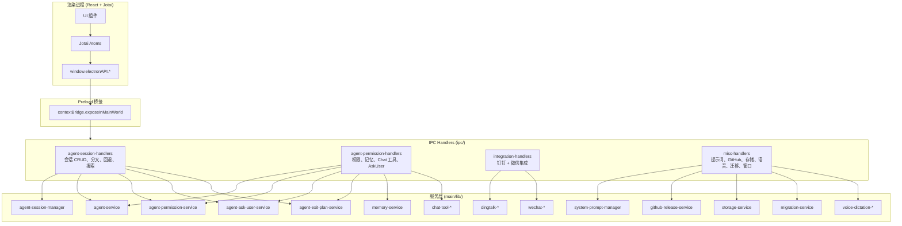
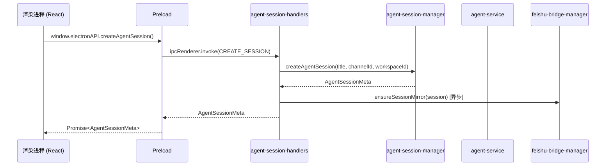
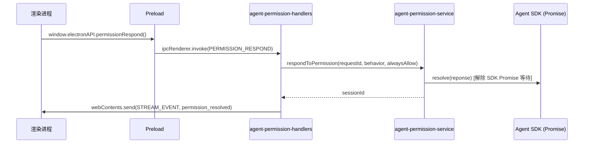
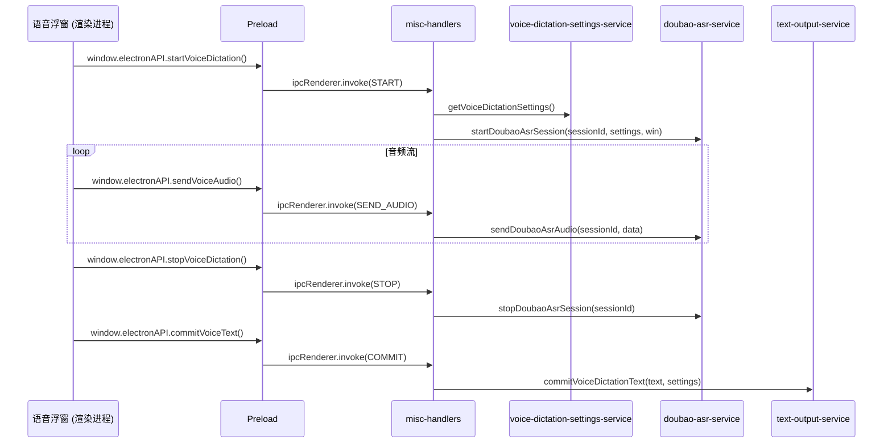
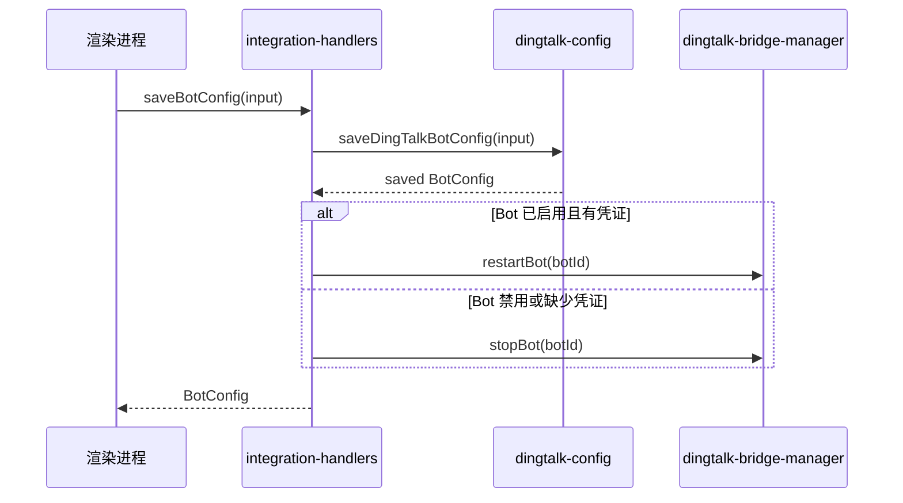

# IPC Handlers 合并文档

> **代码位置**: `apps/electron/src/main/ipc/`
> **包含文件**: 4 个 handler 文件（共 ~1060 行）
> **复杂度**: 中
> **相关模块**: [agent-session-manager](agent-session-manager.md) | [agent-workspace-manager](agent-workspace-manager.md) | [chat-service](chat-service.md) | [agent-permission-service](../main/lib/agent/agent-permission-service.md)

## 概述

IPC Handlers 是 Electron 主进程中连接渲染进程与服务层的桥梁层。Proma 采用 `ipcMain.handle()` / `ipcRenderer.invoke()` 的请求-响应模式，渲染进程通过 `window.electronAPI.*` 发起调用，主进程 handler 接收请求后委托给对应的服务层模块执行，最后返回结果。

本文档覆盖 `apps/electron/src/main/ipc/` 目录下的 4 个核心 handler 文件，合计注册约 70 个 IPC 通道处理器。这些 handler 涵盖 Agent 会话管理、权限/记忆/Chat 工具、第三方集成（钉钉/微信）、系统提示词、GitHub Release、存储管理、语音输入、数据迁移和窗口控制等功能。

**设计原则**：handler 层只做参数透传和结果返回，不含业务逻辑。所有业务逻辑委托给 `main/lib/` 下的服务层模块。这使得 handler 可以被看作服务层 API 的"IPC 薄封装"。

## 架构图



## 文件清单

| 文件 | 行数 | 注册函数 | 职责 |
|------|------|---------|------|
| `agent-session-handlers.ts` | ~212 | `registerAgentSessionHandlers` | Agent 会话 CRUD、置顶/归档、搜索、迁移/分叉/回退 |
| `agent-permission-handlers.ts` | ~346 | `registerAgentPermissionHandlers` | 权限响应、权限模式热切换、记忆配置、Chat 工具管理、AskUser、ExitPlanMode、待处理请求恢复 |
| `integration-handlers.ts` | ~186 | `registerIntegrationHandlers` | 钉钉集成（旧 API + 多 Bot v2）和微信集成 |
| `misc-handlers.ts` | ~383 | `registerMiscHandlers` | 系统提示词、GitHub Release、存储管理、快速任务、语音输入、数据迁移、窗口控制 |

## IPC 通道完整列表

### 1. agent-session-handlers.ts

所有通道来自 `AGENT_IPC_CHANNELS`（`@proma/shared`）。

| 通道常量 | 通道名 | 方向 | 触发条件 | 作用 |
|---------|--------|------|---------|------|
| `LIST_SESSIONS` | `agent:list-sessions` | 渲染 -> 主 | 打开 Agent 面板时 | 获取 Agent 会话列表，启动已有附加目录的文件监听 |
| `CREATE_SESSION` | `agent:create-session` | 渲染 -> 主 | 用户创建新会话 | 创建 Agent 会话，同时创建飞书会话镜像 |
| `GET_SDK_MESSAGES` | `agent:get-sdk-messages` | 渲染 -> 主 | 用户打开会话详情 | 获取会话的 SDKMessage 列表 |
| `UPDATE_TITLE` | `agent:update-title` | 渲染 -> 主 | 用户手动编辑标题 | 更新会话标题 |
| `GENERATE_TITLE` | `agent:generate-title` | 渲染 -> 主 | 首次对话完成后 | 调用 AI 生成会话标题 |
| `DELETE_SESSION` | `agent:delete-session` | 渲染 -> 主 | 用户删除会话 | 删除会话并清理权限/AskUser/ExitPlan 缓存 |
| `MIGRATE_CHAT_TO_AGENT` | `agent:migrate-chat-to-agent` | 渲染 -> 主 | 用户从 Chat 迁移到 Agent | 迁移 Chat 对话记录到 Agent 会话 |
| `TOGGLE_PIN` | `agent:toggle-pin` | 渲染 -> 主 | 用户点击置顶 | 切换会话置顶状态（置顶时自动解归档） |
| `TOGGLE_MANUAL_WORKING` | `agent:toggle-manual-working` | 渲染 -> 主 | 用户标记手动工作中 | 切换会话手动工作中状态（标记时自动解归档） |
| `TOGGLE_ARCHIVE` | `agent:toggle-archive` | 渲染 -> 主 | 用户点击归档 | 切换会话归档状态（归档时自动取消置顶） |
| `SEARCH_MESSAGES` | `agent:search-messages` | 渲染 -> 主 | 用户在搜索框输入 | 搜索所有会话的消息内容 |
| `SEARCH_SESSION_REFERENCES` | `agent:search-session-references` | 渲染 -> 主 | 用户在 Agent 输入框 @ 引用 | 搜索当前工作区可引用的 Agent 会话 |
| `MOVE_SESSION_TO_WORKSPACE` | `agent:move-session-to-workspace` | 渲染 -> 主 | 用户拖拽会话到其他工作区 | 迁移会话到另一个工作区（运行中禁止迁移） |
| `FORK_SESSION` | `agent:fork-session` | 渲染 -> 主 | 用户从指定消息处分叉 | 分叉会话，创建新的独立会话 |
| `REWIND_SESSION` | `agent:rewind-session` | 渲染 -> 主 | 用户回退到指定消息 | 快照回退，恢复文件 + 截断对话 |

### 2. agent-permission-handlers.ts

通道来自 `AGENT_IPC_CHANNELS`、`MEMORY_IPC_CHANNELS`、`CHAT_TOOL_IPC_CHANNELS`。

#### Agent 权限与任务管理

| 通道常量 | 通道名 | 方向 | 触发条件 | 作用 |
|---------|--------|------|---------|------|
| `GET_TASK_OUTPUT` | `agent:get-task-output` | 渲染 -> 主 | 获取后台任务输出 | 当前版本暂未实现，返回空输出 |
| `PERMISSION_RESPOND` | `agent:permission:respond` | 渲染 -> 主 | 用户批准/拒绝权限请求 | 响应权限请求，解除 SDK Promise 等待 |
| `STOP_TASK` | `agent:stop-task` | 渲染 -> 主 | 用户停止后台任务 | 停止指定任务（Shell/Agent 类型） |
| `UPDATE_SESSION_PERMISSION_MODE` | `agent:update-session-permission-mode` | 渲染 -> 主 | 用户切换权限模式 | 热切换运行中会话的权限模式，持久化 + 实时生效 |
| `ASK_USER_RESPOND` | `agent:ask-user:respond` | 渲染 -> 主 | 用户回答 AskUser 问题 | 响应交互式问答请求 |
| `EXIT_PLAN_MODE_RESPOND` | `agent:exit-plan-mode:respond` | 渲染 -> 主 | 用户批准/拒绝计划 | 响应 ExitPlanMode 请求，可自动切换权限模式 |
| `GET_PENDING_REQUESTS` | `agent:get-pending-requests` | 渲染 -> 主 | 渲染进程重载后恢复 | 获取所有待处理的权限/AskUser/ExitPlan 请求快照 |

#### 记忆配置

| 通道常量 | 通道名 | 方向 | 触发条件 | 作用 |
|---------|--------|------|---------|------|
| `GET_CONFIG` (MEMORY) | `memory:get-config` | 渲染 -> 主 | 打开记忆设置 | 获取全局记忆配置 |
| `SET_CONFIG` (MEMORY) | `memory:set-config` | 渲染 -> 主 | 用户保存记忆设置 | 保存全局记忆配置 |
| `TEST_CONNECTION` (MEMORY) | `memory:test-connection` | 渲染 -> 主 | 用户点击测试连接 | 测试 Memos 服务连接（调用 searchMemory 验证） |

#### Chat 工具管理

| 通道常量 | 通道名 | 方向 | 触发条件 | 作用 |
|---------|--------|------|---------|------|
| `GET_ALL_TOOLS` | `chat-tool:get-all-tools` | 渲染 -> 主 | 打开 Chat 工具设置 | 获取所有工具信息（元数据 + 开关 + 可用性） |
| `GET_TOOL_CREDENTIALS` | `chat-tool:get-credentials` | 渲染 -> 主 | 打开工具凭据编辑 | 获取指定工具的凭据 |
| `UPDATE_TOOL_STATE` | `chat-tool:update-state` | 渲染 -> 主 | 用户切换工具开关 | 更新工具启用/禁用状态 |
| `UPDATE_TOOL_CREDENTIALS` | `chat-tool:update-credentials` | 渲染 -> 主 | 用户保存凭据 | 更新工具凭据（API Key 等） |
| `CREATE_CUSTOM_TOOL` | `chat-tool:create-custom` | 渲染 -> 主 | 用户创建自定义工具 | 添加自定义 HTTP 工具 |
| `DELETE_CUSTOM_TOOL` | `chat-tool:delete-custom` | 渲染 -> 主 | 用户删除自定义工具 | 删除自定义工具 |
| `TEST_TOOL` | `chat-tool:test` | 渲染 -> 主 | 用户点击测试工具 | 测试工具连接（memory 用 Memos、web-search 用 Tavily、nano-banana 用 Gemini） |

### 3. integration-handlers.ts

#### 钉钉集成 — 旧 API（向后兼容）

| 通道常量 | 通道名 | 方向 | 触发条件 | 作用 |
|---------|--------|------|---------|------|
| `GET_CONFIG` | `dingtalk:get-config` | 渲染 -> 主 | 打开钉钉设置 | 获取钉钉配置 |
| `GET_DECRYPTED_SECRET` | `dingtalk:get-decrypted-secret` | 渲染 -> 主 | 编辑页面显示密钥 | 获取解密后的 Client Secret |
| `SAVE_CONFIG` | `dingtalk:save-config` | 渲染 -> 主 | 用户保存配置 | 保存钉钉配置 |
| `TEST_CONNECTION` | `dingtalk:test-connection` | 渲染 -> 主 | 用户点击测试连接 | 测试钉钉 API 连接 |
| `START_BRIDGE` | `dingtalk:start-bridge` | 渲染 -> 主 | 用户启动 Bridge | 启动所有钉钉 Bot 的 Stream 连接 |
| `STOP_BRIDGE` | `dingtalk:stop-bridge` | 渲染 -> 主 | 用户停止 Bridge | 停止所有钉钉 Bot 连接 |
| `GET_STATUS` | `dingtalk:get-status` | 渲染 -> 主 | 轮询/页面加载 | 获取第一个 Bot 的 Bridge 状态 |

#### 钉钉多 Bot v2 API

| 通道常量 | 通道名 | 方向 | 触发条件 | 作用 |
|---------|--------|------|---------|------|
| `GET_MULTI_CONFIG` | `dingtalk:get-multi-config` | 渲染 -> 主 | 打开多 Bot 管理页 | 获取多 Bot 配置 |
| `SAVE_BOT_CONFIG` | `dingtalk:save-bot-config` | 渲染 -> 主 | 用户保存单个 Bot | 保存/创建 Bot 配置，自动重启已启用的 Bot |
| `REMOVE_BOT` | `dingtalk:remove-bot` | 渲染 -> 主 | 用户删除 Bot | 删除 Bot 配置并停止 Bridge |
| `GET_BOT_DECRYPTED_SECRET` | `dingtalk:get-bot-decrypted-secret` | 渲染 -> 主 | 编辑 Bot 密钥 | 获取单个 Bot 的解密 Client Secret |
| `START_BOT` | `dingtalk:start-bot` | 渲染 -> 主 | 用户启动单个 Bot | 启动指定 Bot 的 Stream 连接 |
| `STOP_BOT` | `dingtalk:stop-bot` | 渲染 -> 主 | 用户停止单个 Bot | 停止指定 Bot |
| `GET_MULTI_STATUS` | `dingtalk:get-multi-status` | 渲染 -> 主 | 轮询多 Bot 状态 | 获取所有 Bot 的 Bridge 状态 |

#### 微信集成

| 通道常量 | 通道名 | 方向 | 触发条件 | 作用 |
|---------|--------|------|---------|------|
| `GET_CONFIG` | `wechat:get-config` | 渲染 -> 主 | 打开微信设置 | 获取微信配置 |
| `START_LOGIN` | `wechat:start-login` | 渲染 -> 主 | 用户扫码登录 | 启动 iLink 扫码登录流程 |
| `LOGOUT` | `wechat:logout` | 渲染 -> 主 | 用户退出登录 | 清除微信登录状态 |
| `START_BRIDGE` | `wechat:start-bridge` | 渲染 -> 主 | 用户启动 Bridge | 用已有凭证启动微信消息桥接 |
| `STOP_BRIDGE` | `wechat:stop-bridge` | 渲染 -> 主 | 用户停止 Bridge | 停止微信消息桥接 |
| `GET_STATUS` | `wechat:get-status` | 渲染 -> 主 | 轮询/页面加载 | 获取微信 Bridge 连接状态 |

### 4. misc-handlers.ts

#### 系统提示词管理

| 通道常量 | 通道名 | 方向 | 触发条件 | 作用 |
|---------|--------|------|---------|------|
| `GET_CONFIG` (SP) | `system-prompt:get-config` | 渲染 -> 主 | 打开提示词设置 | 获取完整提示词配置 |
| `CREATE` (SP) | `system-prompt:create` | 渲染 -> 主 | 用户新建提示词 | 创建自定义提示词 |
| `UPDATE` (SP) | `system-prompt:update` | 渲染 -> 主 | 用户编辑提示词 | 更新提示词内容/名称 |
| `DELETE` (SP) | `system-prompt:delete` | 渲染 -> 主 | 用户删除提示词 | 删除自定义提示词 |
| `UPDATE_APPEND_SETTING` | `system-prompt:update-append-setting` | 渲染 -> 主 | 用户切换日期/用户名追加 | 开关提示词末尾追加日期时间和用户名 |
| `SET_DEFAULT` | `system-prompt:set-default` | 渲染 -> 主 | 用户设置默认提示词 | 设置默认提示词 ID |

#### GitHub Release

| 通道常量 | 通道名 | 方向 | 触发条件 | 作用 |
|---------|--------|------|---------|------|
| `GET_LATEST_RELEASE` | `github-release:get-latest` | 渲染 -> 主 | 检查更新 | 获取最新 GitHub Release |
| `LIST_RELEASES` | `github-release:list` | 渲染 -> 主 | 打开版本历史 | 获取 Release 列表 |
| `GET_RELEASE_BY_TAG` | `github-release:get-by-tag` | 渲染 -> 主 | 查看指定版本 | 获取指定 tag 的 Release |

#### 存储管理

| 通道常量 | 通道名 | 方向 | 触发条件 | 作用 |
|---------|--------|------|---------|------|
| `GET_STATS` | `storage:get-stats` | 渲染 -> 主 | 打开存储设置 | 计算各目录存储统计 |
| `CLEANUP` | `storage:cleanup` | 渲染 -> 主 | 用户执行清理 | 按选项清理存储 |
| `CLEANUP_TEMP` | `storage:cleanup-temp` | 渲染 -> 主 | 启动时自动执行 | 清理临时文件 |

#### 快速任务窗口

| 通道常量 | 通道名 | 方向 | 触发条件 | 作用 |
|---------|--------|------|---------|------|
| `SUBMIT` | `quick-task:submit` | 渲染 -> 主 | 用户提交快速任务 | 隐藏浮窗，通知主窗口打开会话 |
| `HIDE` (QT) | `quick-task:hide` | 渲染 -> 主 | Esc 关闭浮窗 | 隐藏快速任务窗口 |
| `REREGISTER_GLOBAL_SHORTCUTS` | `quick-task:reregister-global-shortcuts` | 渲染 -> 主 | 快捷键设置变更后 | 重新注册所有全局快捷键 |

#### 语音输入

| 通道常量 | 通道名 | 方向 | 触发条件 | 作用 |
|---------|--------|------|---------|------|
| `GET_SETTINGS` | `voice-dictation:get-settings` | 渲染 -> 主 | 打开语音设置 | 获取语音输入设置 |
| `UPDATE_SETTINGS` | `voice-dictation:update-settings` | 渲染 -> 主 | 用户保存语音设置 | 更新语音输入设置 |
| `TEST_CONNECTION` (VD) | `voice-dictation:test-connection` | 渲染 -> 主 | 用户点击测试连接 | 测试豆包 ASR 连接 |
| `TOGGLE` | `voice-dictation:toggle` | 渲染 -> 主 | 全局快捷键触发 | 唤起或停止语音输入浮窗 |
| `START` | `voice-dictation:start` | 渲染 -> 主 | 浮窗显示后开始录音 | 启动豆包 ASR 会话 |
| `SEND_AUDIO` | `voice-dictation:send-audio` | 渲染 -> 主 | 音频分片就绪 | 发送音频分片到 ASR 服务 |
| `STOP` (VD) | `voice-dictation:stop` | 渲染 -> 主 | 用户停止录音 | 停止 ASR 会话 |
| `CANCEL` | `voice-dictation:cancel` | 渲染 -> 主 | 用户取消录音 | 取消 ASR 会话（丢弃结果） |
| `COMMIT` | `voice-dictation:commit` | 渲染 -> 主 | 转写完成确认 | 将最终文本输出到目标输入框 |
| `HIDE` (VD) | `voice-dictation:hide` | 渲染 -> 主 | 关闭语音浮窗 | 隐藏语音输入窗口 |
| `RESIZE` | `voice-dictation:resize` | 渲染 -> 主 | 转写文本变长 | 调整语音输入窗口高度 |
| `CHECK_MIC_PERMISSION` | `voice-dictation:check-mic-permission` | 渲染 -> 主 | 打开语音浮窗前 | 检查麦克风权限状态 |
| `REQUEST_MIC_PERMISSION` | `voice-dictation:request-mic-permission` | 渲染 -> 主 | 用户授权麦克风 | 请求系统麦克风权限 |

#### 数据迁移

| 通道名 | 方向 | 触发条件 | 作用 |
|--------|------|---------|------|
| `migration:cancelImport` | 渲染 -> 主 | 用户取消导入 | 清理导入临时目录 |
| `migration:getExportPreview` | 渲染 -> 主 | 用户预览导出 | 获取导出预览（按工作区） |
| `migration:getShareExportPreview` | 渲染 -> 主 | 用户预览分享包 | 获取分享包导出预览 |
| `migration:export` | 渲染 -> 主 | 用户导出 v1 | 导出数据（v1 格式） |
| `migration:exportV2` | 渲染 -> 主 | 用户导出 v2 | 导出数据（v2 格式） |
| `migration:parseImportFile` | 渲染 -> 主 | 用户选择导入文件 | 解析导入文件内容 |
| `migration:confirmImport` | 渲染 -> 主 | 用户确认导入 | 执行数据导入 |
| `migration:openFileDialog` | 渲染 -> 主 | 用户选择导入文件 | 打开文件选择对话框（`.proma-backup` / `.proma-share`） |
| `migration:saveFileDialog` | 渲染 -> 主 | 用户选择导出路径 | 打开保存文件对话框 |

#### 窗口控制

| 通道常量 | 通道名 | 方向 | 触发条件 | 作用 |
|---------|--------|------|---------|------|
| `WINDOW_MINIMIZE` | `window:minimize` | 渲染 -> 主 | 点击最小化按钮 | 最小化窗口 |
| `WINDOW_MAXIMIZE` | `window:maximize` | 渲染 -> 主 | 点击最大化/还原按钮 | 切换窗口最大化状态 |
| `WINDOW_CLOSE` | `window:close` | 渲染 -> 主 | 点击关闭按钮 | 关闭窗口 |
| `WINDOW_IS_MAXIMIZED` | `window:is-maximized` | 渲染 -> 主 | 渲染进程初始化时 | 查询窗口是否最大化 |

## 调用链路图

### Agent 会话 CRUD 链路



### 权限响应链路



### 语音输入链路



### 钉钉集成链路



## 关键代码解析

### 删除会话时的资源清理（agent-session-handlers.ts:99-108）

handler 在删除会话时必须清理主进程中缓存的权限/交互请求状态，否则内存泄漏。

```typescript
ipcMain.handle(AGENT_IPC_CHANNELS.DELETE_SESSION, async (_, id: string) => {
  permissionService.clearSessionWhitelist(id)
  permissionService.clearSessionPending(id)
  askUserService.clearSessionPending(id)
  exitPlanService.clearSessionPending(id)
  return deleteAgentSession(id)
})
```

关键点：
- 权限白名单、待处理权限请求、AskUser 请求、ExitPlan 请求全部按 sessionId 隔离
- 清理顺序：先清缓存，再删持久化数据

### 权限模式热切换（agent-permission-handlers.ts:87-108）

支持在 Agent 运行中切换权限模式（safe/ask/allow-all），无需重启会话。

```typescript
ipcMain.handle(AGENT_IPC_CHANNELS.UPDATE_SESSION_PERMISSION_MODE, ...)
  // 1. 校验权限模式合法性
  // 2. 持久化到 session 元数据（即使切换失败也先落盘）
  // 3. 若会话正在运行，调用 agent-service 热切换
```

关键点：
- 持久化与运行时切换解耦：持久化失败只 warn 不阻塞
- 运行中切换失败则向上抛出异常

### ExitPlanMode 联动权限模式切换（agent-permission-handlers.ts:300-329）

当用户批准计划退出时，SDK 可指定目标权限模式，handler 自动持久化并推送事件。

```typescript
// ExitPlanMode 响应处理
const result = exitPlanService.respondToExitPlanMode(response)
if (result.targetMode) {
  updateAgentSessionMeta(sessionId, { permissionMode: targetMode })
  event.sender.send(STREAM_EVENT, { type: 'permission_mode_changed', mode: targetMode })
}
```

关键点：
- 一次用户操作可触发两个事件：`exit_plan_mode_resolved` + `permission_mode_changed`
- 权限模式变更通过 IPC 推送通知渲染进程更新 UI

### 动态 import 模式（misc-handlers.ts）

misc-handlers 大量使用动态 `import()` 延迟加载服务模块，减少启动时的内存占用。

```typescript
ipcMain.handle(VOICE_DICTATION_IPC_CHANNELS.START, async (event, input) => {
  const { getVoiceDictationSettings } = await import('../lib/integration/voice-dictation-settings-service')
  const { startDoubaoAsrSession } = await import('../lib/integration/doubao-asr-service')
  // ...
})
```

关键点：
- 语音输入、迁移、快速任务等非核心功能使用动态加载
- 避免启动时加载所有集成服务的依赖

### 钉钉 Bot 保存自动重启（integration-handlers.ts:93-103）

保存 Bot 配置时根据启用状态自动重启或停止 Bridge 连接。

```typescript
const saved = saveDingTalkBotConfig(input)
if (saved.enabled && saved.clientId && saved.clientSecret) {
  dingtalkBridgeManager.restartBot(saved.id).catch(...)
} else {
  dingtalkBridgeManager.stopBot(saved.id)
}
```

关键点：
- `restartBot` 失败不阻塞配置保存（仅 catch 打印错误）
- 启用但缺少凭证的 Bot 会被停止

## 依赖的服务层模块

### agent-session-handlers 依赖

| 服务模块 | 路径 | 依赖原因 |
|---------|------|---------|
| `agent-session-manager` | `main/lib/agent/` | 会话 CRUD、分叉、回退、搜索 |
| `agent-service` | `main/lib/agent/` | 运行中会话检测、标题生成、回退执行 |
| `agent-permission-service` | `main/lib/agent/` | 删除时清理权限缓存 |
| `agent-ask-user-service` | `main/lib/agent/` | 删除时清理 AskUser 缓存 |
| `agent-exit-plan-service` | `main/lib/agent/` | 删除时清理 ExitPlan 缓存 |
| `workspace-watcher` | `main/lib/file/` | 列表时启动附加目录文件监听 |
| `feishu-bridge-manager` | `main/lib/feishu/` | 创建会话时创建飞书会话镜像 |

### agent-permission-handlers 依赖

| 服务模块 | 路径 | 依赖原因 |
|---------|------|---------|
| `agent-service` | `main/lib/agent/` | 运行中检测、权限模式热切换 |
| `agent-session-manager` | `main/lib/agent/` | 会话元数据查询和更新 |
| `agent-permission-service` | `main/lib/agent/` | 权限请求响应和查询 |
| `agent-ask-user-service` | `main/lib/agent/` | AskUser 请求响应和查询 |
| `agent-exit-plan-service` | `main/lib/agent/` | ExitPlan 请求响应和查询 |
| `memory-service` | `main/lib/memory/` | 记忆配置读写 |
| `memos-client` | `main/lib/memory/` | 记忆连接测试（动态 import） |
| `chat-tool-registry` | `main/lib/chat/` | 工具信息获取 |
| `chat-tool-config` | `main/lib/chat/` | 工具开关/凭据/自定义工具管理 |

### integration-handlers 依赖

| 服务模块 | 路径 | 依赖原因 |
|---------|------|---------|
| `dingtalk-config` | `main/lib/dingtalk/` | 钉钉配置读写、密钥解密 |
| `dingtalk-bridge-manager` | `main/lib/dingtalk/` | 钉钉 Bot Bridge 生命周期管理 |
| `wechat-config` | `main/lib/wechat/` | 微信配置读取 |
| `wechat-bridge` | `main/lib/wechat/` | 微信 Bridge 生命周期管理 |

### misc-handlers 依赖

| 服务模块 | 路径 | 依赖原因 |
|---------|------|---------|
| `system-prompt-manager` | `main/lib/agent/` | 提示词 CRUD |
| `github-release-service` | `main/lib/integration/` | GitHub Release 查询 |
| `storage-service` | `main/lib/storage/` | 存储统计和清理 |
| `migration-service` | `main/lib/storage/` | 数据导入导出（动态 import） |
| `quick-task-window` | `main/lib/window/` | 快速任务窗口控制（动态 import） |
| `voice-dictation-window` | `main/lib/window/` | 语音浮窗控制（动态 import） |
| `voice-dictation-settings-service` | `main/lib/integration/` | 语音设置读写（动态 import） |
| `doubao-asr-service` | `main/lib/integration/` | 豆包 ASR 会话管理（动态 import） |
| `text-output-service` | `main/lib/text/` | 文本输出到目标窗口（动态 import） |
| `microphone-permission-service` | `main/lib/system/` | 麦克风权限管理（动态 import） |
| `global-shortcut-service` | `main/lib/system/` | 全局快捷键重新注册（动态 import） |

## 通道常量定义位置索引

| 常量名 | 定义文件 |
|--------|---------|
| `AGENT_IPC_CHANNELS` | `packages/shared/src/types/agent.ts` |
| `MEMORY_IPC_CHANNELS` | `packages/shared/src/types/agent.ts` |
| `CHAT_TOOL_IPC_CHANNELS` | `packages/shared/src/types/chat-tool.ts` |
| `SYSTEM_PROMPT_IPC_CHANNELS` | `packages/shared/src/types/system-prompt.ts` |
| `GITHUB_RELEASE_IPC_CHANNELS` | `packages/shared/src/types/github.ts` |
| `DINGTALK_IPC_CHANNELS` | `packages/shared/src/types/dingtalk.ts` |
| `WECHAT_IPC_CHANNELS` | `packages/shared/src/types/wechat.ts` |
| `IPC_CHANNELS`（窗口控制） | `packages/shared/src/types/runtime.ts` |
| `QUICK_TASK_IPC_CHANNELS` | `apps/electron/src/types/settings.ts` |
| `VOICE_DICTATION_IPC_CHANNELS` | `apps/electron/src/types/settings.ts` |
| `STORAGE_IPC_CHANNELS` | `apps/electron/src/types/settings.ts` |

---

> **创建时间**: 2026-05-31
> **最后更新**: 2026-05-31
> **版本**: 1.0
