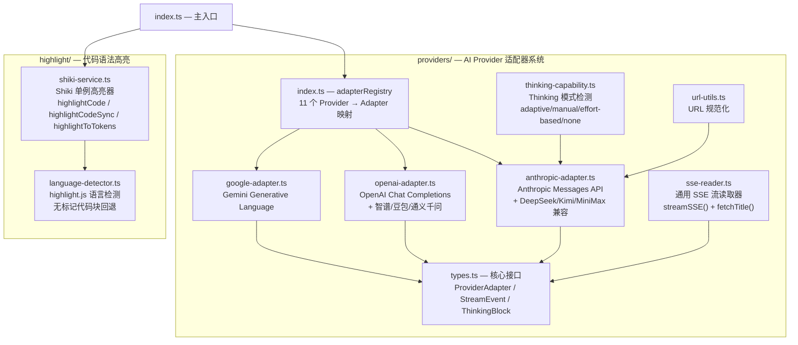
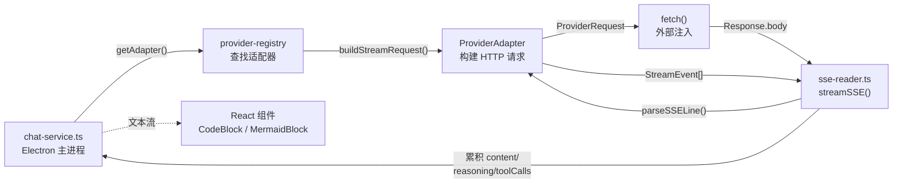
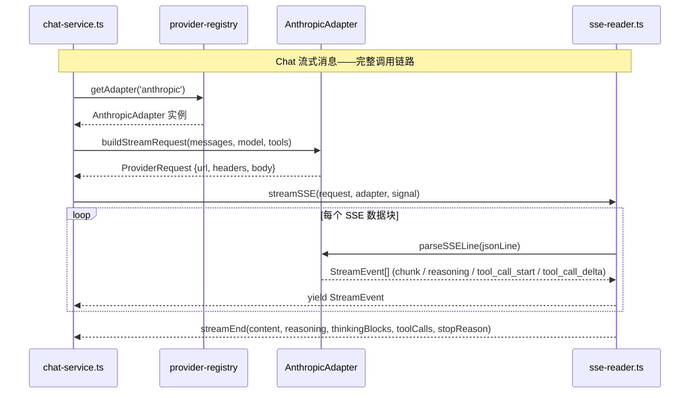

# @proma/core

AI Provider 适配器层 + Shiki 代码高亮服务。纯逻辑包，不访问文件系统和网络（由外部注入 fetchFn 和 ImageAttachmentReader）。

## 架构图

## 数据流向图

## 关键时序图

## 重要代码文件导航

| 文件 | 职责 |
|------|------|
| `src/index.ts` | 主入口，聚合导出 providers + highlight |
| `src/providers/types.ts` | 核心接口：`ProviderAdapter`、`StreamEvent`（9 种变体）、`ToolDefinition`、`ThinkingBlock` |
| `src/providers/index.ts` | Provider 注册表，11 个渠道 → 适配器映射，`getAdapter()` 查找函数 |
| `src/providers/anthropic-adapter.ts` | Anthropic 协议适配器（~497 行）：5 种 thinking 模式、3 种 URL 策略、Kimi Coding 特殊 Header |
| `src/providers/openai-adapter.ts` | OpenAI 协议适配器（~291 行）：流式 tool_calls 关联、reasoning_content、图片 data: URI |
| `src/providers/google-adapter.ts` | Gemini 适配器（~316 行）：角色映射、thought 标记、API Key URL 参数 |
| `src/providers/sse-reader.ts` | 通用 SSE 流读取器（~263 行）：`streamSSE()` 流式解析 + `fetchTitle()` 标题生成 |
| `src/providers/thinking-capability.ts` | Thinking 模式检测（~109 行）：根据 modelId 返回 adaptive/manual/effort-based/none |
| `src/providers/url-utils.ts` | URL 规范化：`normalizeAnthropicBaseUrl`、`normalizeBaseUrl` 等 4 个函数 |
| `src/highlight/shiki-service.ts` | Shiki 高亮器单例（~276 行）：`highlightCode`（异步）、`highlightCodeSync`（同步）、`highlightToTokens`（逐行 Token） |
| `src/highlight/language-detector.ts` | 语言检测（~97 行）：highlight.js `highlightAuto` + 置信度阈值，无语言标记的代码块回退方案 |
