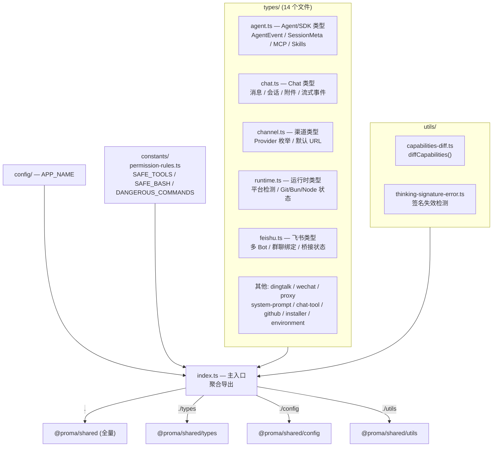
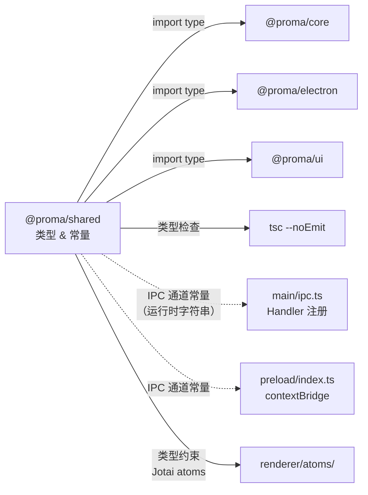
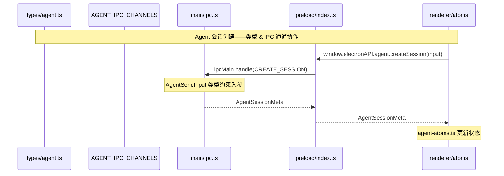

# @proma/shared

共享类型、IPC 通道常量、配置和工具函数库。零运行时依赖，仅 TypeScript 类型和常量。

## 架构图

## 数据流向图

## 关键时序图

## 重要代码文件导航

| 文件 | 职责 |
|------|------|
| `src/index.ts` | 主入口，聚合导出 types/config/utils/constants |
| `src/types/index.ts` | 类型汇总导出，含内联 `Workspace` 接口定义 |
| `src/types/agent.ts` | Agent/SDK 类型（~1472 行，最大文件）：AgentEvent 联合、SessionMeta、MCP、Skills、权限、IPC 通道 |
| `src/types/chat.ts` | Chat 模式类型：消息、会话、附件、流式事件、30+ IPC 通道 |
| `src/types/channel.ts` | AI 渠道类型：Provider 枚举、默认 URL、Agent 兼容列表 |
| `src/types/runtime.ts` | 运行时检测类型：平台/架构、Git/Bun/Node 状态、文件变更、截图限制 |
| `src/types/agent-provider.ts` | AgentProviderAdapter 接口：query/abort/dispose/setPermissionMode |
| `src/types/feishu.ts` | 飞书集成类型：多 Bot 配置、群聊绑定、桥接状态、25+ IPC 通道 |
| `src/types/dingtalk.ts` | 钉钉集成类型：多 Bot 配置、桥接状态、15 个 IPC 通道 |
| `src/types/wechat.ts` | 微信 iLink 集成类型：凭证、桥接状态机、消息协议 |
| `src/types/system-prompt.ts` | 系统提示词类型 + `BUILTIN_DEFAULT_PROMPT`（107 行中文） |
| `src/types/chat-tool.ts` | Chat 工具函数调用类型：HTTP 执行器、工具元数据、凭证 |
| `src/types/proxy.ts` | 代理配置类型：手动/系统模式 |
| `src/types/environment.ts` | 环境检查结果类型 |
| `src/types/installer.ts` | 第三方安装器类型（Windows Git/Node 一键安装） |
| `src/types/github.ts` | GitHub Release API 类型 |
| `src/utils/capabilities-diff.ts` | `diffCapabilities()`：比较两个 WorkspaceCapabilities，返回变更列表 |
| `src/utils/capabilities-diff.test.ts` | capabilities-diff 的 bun:test 单元测试 |
| `src/utils/thinking-signature-error.ts` | 思考签名失效错误检测与格式化（模型切换场景） |
| `src/config/index.ts` | `APP_NAME = 'Proma'` |
| `src/constants/permission-rules.ts` | Agent 权限规则：SAFE_TOOLS、SAFE_BASH_PATTERNS、DANGEROUS_COMMANDS |
