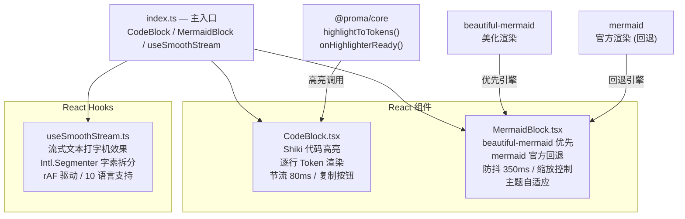
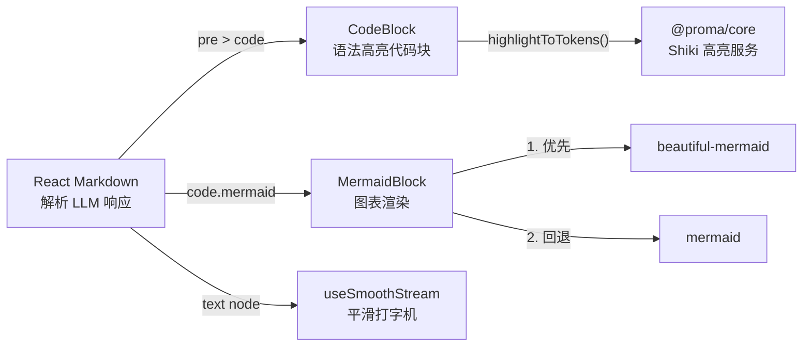
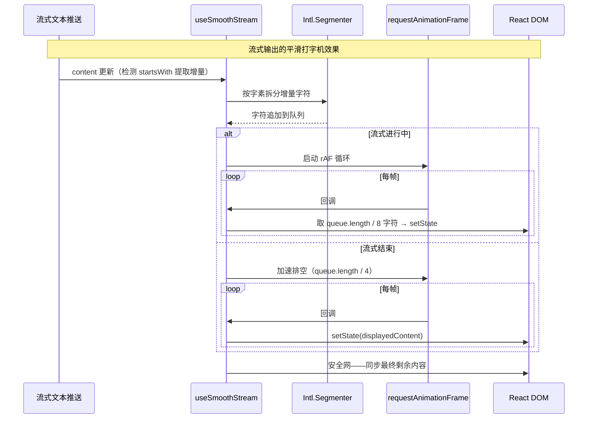

# @proma/ui

共享 React UI 组件库。为 Chat 和 Agent 模式的 Markdown 渲染提供语法高亮代码块、Mermaid 图表渲染和流式文本平滑动画。

## 架构图

## 数据流向图

## 关键时序图

## 重要代码文件导航

| 文件 | 职责 |
|------|------|
| `src/index.ts` | 主入口，导出 CodeBlock、MermaidBlock、useSmoothStream |
| `src/code-block/CodeBlock.tsx` | Shiki 语法高亮代码块组件：逐行 Token 渲染、节流 80ms、异步初始化兜底、复制按钮 |
| `src/mermaid-block/MermaidBlock.tsx` | Mermaid 图表组件：beautiful-mermaid 优先 + 官方 mermaid 回退、防抖 350ms、防竞态 generationRef、缩放 0.25-3.0、MutationObserver 主题监听 |
| `src/hooks/useSmoothStream.ts` | 流式文本平滑 Hook：Intl.Segmenter 字素拆分（10 语言）、rAF 驱动、动态每帧输出量（流式中 /8、结束后 /4）、安全网直接同步 |
